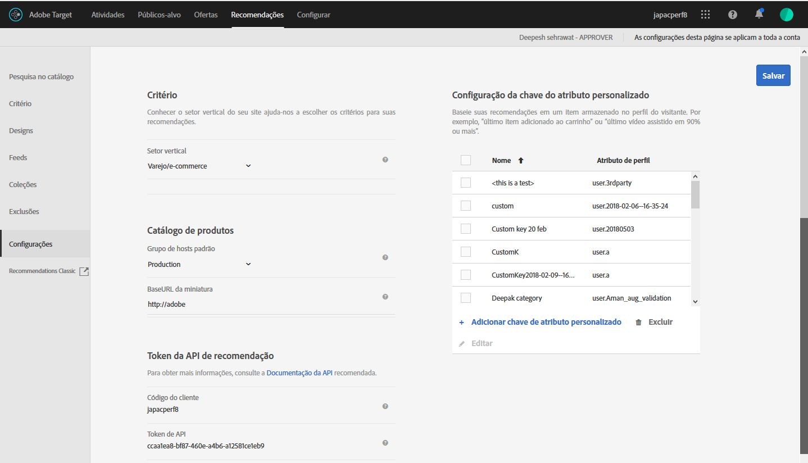

#  Planeje e implemente a Recommendations {#plan-and-implement-recommendations}

O que é necessário saber antes de criar uma atividade do Recommendations.

## Planejar e implementar o Recommendations {#concept_02AA644A4C7D4D5CB1D9CADA208CF8D1}

O que é necessário saber antes de criar uma atividade do [!DNL Recommendations].

[!DNL Recommendations] exige que você configure a seguinte hierarquia de informações:

| Etapa | Informações | Detalhes |
|--- |--- |--- |
|  | Biblioteca de JavaScript | Cada página requer uma referência à at.js versão 0.9.1 (ou posterior) ou mbox.js versão 55 (ou posterior). Essa etapa de implementação é necessária em todas as páginas em que uma atividade do Target será usada, e pode incluir chaves como um produto ou ID de categoria.<BR>Para obter informações sobre at.js, consulte [Implementação de at.js](/help/c-implementing-target/c-implementing-target-for-client-side-web/t-mbox-download/c-target-atjs-implementation/target-atjs-implementation.md).<br>Para obter mais informações sobre a mbox.js, consulte [Implementação da mbox.js](/help/c-implementing-target/c-implementing-target-for-client-side-web/t-mbox-download/mbox-download.md). |
|  | Teclas | A tecla determina o tipo de produto ou de conteúdo exibido nas suas recomendações. Por exemplo, a tecla pode ser uma categoria de produto. Consulte [Basear a recomendação em uma Chave de recomendação](/help/c-recommendations/c-algorithms/base-the-recommendation-on-a-recommendation-key.md). |
|  | Atributos | Os atributos fornecem informações mais específicas sobre os produtos que você deseja exibir. Por exemplo, você pode querer mostrar produtos dentro de uma faixa de preço específica ou itens que atendam a um limite de inventário. Os atributos podem ser fornecidos na mbox ou através de um  [feed](/help/c-recommendations/c-products/feeds.md).<br>Consulte [Especificar regras](/help/c-recommendations/c-algorithms/create-new-algorithm.md#inclusion)de inclusão. |
|  | Exclusões | As exclusões determinam quais itens específicos não serão exibidos nas recomendações.<br>Consulte [Exclusões](/help/c-recommendations/c-products/exclusions.md). |
|  | Detalhes da compra | Os detalhes da compra oferecem informações sobre os itens comprados e o pedido quando a compra foi concluída. |

## Implementação base {#concept_D1154A3FB0FB4467A29AD2BDD21C82D5}

A implementação base requer que você passe para sua página parâmetros que determinem quais produtos ou serviços aparecem em suas recomendações.

Antes de você começar a configurar uma atividade do [!DNL Recommendations], deverá entender como os dados do produto são fornecidos para o [!DNL Recommendations], e decidir qual método funciona melhor para suas necessidades.

Há dois métodos para fornecer informações sobre produtos e serviços para o [!DNL Recommendations]:

| Método | Descrição |
|--- |--- |
| Passar parâmetros diretamente para a página | Esse método funciona bem para itens que mudam com frequência. No entanto, como isso requer que as alterações sejam feitas diretamente para a página, em muitas organizações, esse método requer o envolvimento dos profissionais de TI e das pessoas que implementa as páginas. |
| Passar parâmetros por meio de um feed do Google ou CSV | Esse método funciona bem para coleções que não mudam com frequência. Em geral, não é necessário alterar sua implementação da ou outro código de página para fornecer informações de produto por meio de um feed. No entanto, a lista de produtos permanece estática, de modo que alterações rápidas são mais difíceis. Para obter mais informações, consulte  [Feeds](/help/c-recommendations/c-products/feeds.md). |

Esses métodos podem ser usados separadamente ou juntos, como nos exemplos a seguir.

## Exemplo um: combinar página e feeds  {#section_DF6BAE4BF11548BD9C44D0A426BCF5A7}

Uma opção comum de implementação do [!DNL Recommendations] usa tanto parâmetros de página quanto feeds.

Esse método pode ser preferido por um varejista que tem um catálogo de produtos relativamente estabelecido, mas que deseja enfatizar itens sazonais específicos ou itens que estejam à venda. A maioria dos clientes pode fornecer suas informações basicamente pelo feed, fazendo apenas ajustes ocasionais na página.

Use um feed para fornecer informações que não mudam com frequência. Se você estiver usando um arquivo CSV ou feed do Google, utilize os seguintes parâmetros:

* Parâmetros obrigatórios

   * `entity.id`

* Parâmetros úteis

   * `entity.name`
   * `entity.categoryId`
   * `entity.brand`
   * `entity.pageUrl`
   * `entity.thumbnailUrl`
   * `entity.message`
   * Todos os atributos personalizados

Depois de configurar o feed e passá-lo para o [!DNL Recommendations], passe os parâmetros na página para os atributos que mudam com frequência, ou seja, com maior frequência do que diariamente.

* Parâmetros obrigatórios

   * `entity.id`
   * `entity.categoryId`

* Parâmetros úteis

   * `entity.inventory`
   * `entity.value`

A prioridade será dada ao último conjunto de dados que tiver sido executado. Se você passar o feed primeiro e, em seguida, atualizar os parâmetros da página, as alterações feitas nos parâmetros da página serão mostradas, substituindo as informações do item transmitidas no feed.

## Exemplo dois: passar todos os parâmetros na página Detalhes do produto (ou Conteúdo){#section_D5A4F69457604CA7AACFD7BFF79B58A9}

Se você passar todos os parâmetros na página, poderá fazer atualizações rapidamente atualizando a página. Em algumas organizações, isso requer o envolvimento do pessoal de TI ou da sua equipe de Web Design.

Este exemplo pode ser especialmente útil para uma empresa de mídia, com conteúdo que muda o tempo todo.

* Parâmetros obrigatórios

   * `entity.id`
   * `entity.categoryId`
   * Todos os outros atributos

## Código de exemplo  {#section_6E8A73376F30468BB549F337C4C220B1}

Por exemplo, você pode usar o seguinte código na seção de cabeçalho das páginas de produto ou conteúdo:

```
function targetPageParams() {
 return {
    "entity": {
       "id": "32323",
       "categoryId": "My Category",
       "value": 105.56,
       "inventory": 329
    }
 }
}
```

Para obter mais exemplos do código que você pode usar em diferentes tipos de páginas, consulte  [Implementação de acordo com tipo de página](/help/c-recommendations/plan-implement.md#reference_DE38BB07BD3C4511B176CDAB45E126FC).

## Implementação de acordo com tipo de página {#reference_DE38BB07BD3C4511B176CDAB45E126FC}

O tipo de página influenciará sua implementação do [!DNL Recommendations].

Por exemplo, os tipos de recomendações que deseja apresentar podem ser diferentes em uma página de produto do que em uma página de categoria ou na página inicial. Para cada página, é possível executar funções específicas antes da chamada da mbox para mostrar as recomendações apropriadas.

Para obter informações sobre os atributos nos exemplos, consulte  [Atributos da entidade](/help/c-recommendations/c-products/entity-attributes.md#reference_3BCC1383FB3F44F4A2120BB36270387F).

É necessária uma formatação de JSON válida.

A função `targetPageParams` mostrada abaixo é especialmente útil se estiver usando uma solução de gerenciamento de tags para implementar suas páginas. O [!DNL Adobe Launch] ou o [!DNL Adobe Dynamic Tag Manager] (DTM) adiciona a referência da at.js/mbox.js e a função `targetPageParams` na página e permite configurar os valores. Você deve colocar essa função antes da chamada de at.js/mbox.js ou colocá-la na seção JavaScript adicional da at.js/mbox.js.

## Todas as páginas {#section_A22061788BAB42BB82BA087DEC3AA4AD}

Todas as páginas que contêm recomendações exigem uma referência à [!DNL at.js] ou à [!DNL mbox.js]. Adicione uma das seguintes referências a todas as páginas com recomendações:

```
<script src="/help/at.js /></script>
```

```
<script src="/help/mbox.js /></script>
```

Esta implementação exige:

* [!DNL at.js] versão 0.9.2 (ou posterior) ou [!DNL mbox.js] versão 55 (ou posterior)

* A [!DNL mbox.js] deve incluir referência à [!DNL target.js] (a [!DNL at.js] não exige referência à [!DNL target.js])

Para obter mais informações sobre como implementar a [!DNL at.js], consulte [Como implantar a at.js](/help/c-implementing-target/c-implementing-target-for-client-side-web/how-to-deployatjs/how-to-deployatjs.md#topic_ECF2D3D1F3384E2386593A582A978556).

Para obter mais informações sobre como implementar a [!DNL mbox.js], consulte [Como implantar a at.js](/help/c-implementing-target/c-implementing-target-for-client-side-web/t-mbox-download/mbox-download.md#task_4EAE26BB84FD4E1D858F411AEDF4B420).

Para obter mais informações sobre as diferenças entre as duas bibliotecas JavaScript do Target, consulte [Vantagens da at.js](/help/c-implementing-target/c-implementing-target-for-client-side-web/t-mbox-download/c-target-atjs-implementation/target-atjs-implementation.md#benefits).

## Página de categoria {#section_F51A1AAEAC0E4B788582BBE1FEC3ABDC}

Em uma página de categoria, você provavelmente vai querer restringir as recomendações aos produtos ou conteúdo dentro dessa categoria. Para configurar uma página de categoria, configure as teclas usadas pela página. Para obter mais informações sobre as teclas, consulte [Basear a recomendação em uma Chave de recomendação](/help/c-recommendations/c-algorithms/base-the-recommendation-on-a-recommendation-key.md).

```
function targetPageParams() { 
   return { 
      "entity": { 
         "categoryId": "My Category" 
      } 
   } 
}
```

## Página do produto {#section_205B3953C9664125A17CA8574FA6B2A3}

Em uma página do produto, você pode querer recomendar itens específicos ou itens com preços determinados ou nível de estoque. Para uma página do produto, talvez seja necessário configurar os atributos que mudam frequentemente (como valor e estoque), além das teclas necessárias para uma página de categoria.

```
function targetPageParams() { 
   return { 
      "entity": { 
         "id": "32323", 
         "categoryId": "My Category", 
         "value": 105.56, 
         "inventory": 329 
      } 
   } 
}
```

## Página de carrinho {#section_D37E48700F074556B925D0CA0291405E}

Em uma página de carrinho, você provavelmente vai querer excluir alguns itens de suas recomendações, como os itens que já estão no carrinho.

```
<script type="text/javascript">
function targetPageParams() {
   return {
      "excludedIds": [352, 223, 23432, 432, 553]
      }
}
</script>
```

## Página de agradecimento  {#section_C6126A4517A1478693AB7EC2A1D4ACCA}

Na página de agradecimento, você pode querer mostrar o total e a ID do pedido e mostrar os produtos que foram comprados, sem recomendar itens adicionais. É possível implementar uma segunda mbox para capturar as informações do pedido.

* Se estiver usando at.js, consulte  [Rastrear conversas](/help/c-implementing-target/c-implementing-target-for-client-side-web/how-to-deployatjs/implementing-target-without-a-tag-manager.md#task_E85D2F64FEB84201A594F2288FABF053).
* Se estiver usando mbox.js, consulte [Criar uma mbox de confirmação de pedido - mbox.js](/help/c-implementing-target/c-implementing-target-for-client-side-web/t-mbox-download/orderconfirm-create.md#task_0036D5F6C062442788BB55E872816D82).

## Configurações {#concept_C1E1E2351413468692D6C21145EF0B84}

Use as configurações para gerenciar a sua implementação do [!DNL Recommendations].

To access the [!UICONTROL Recommendations Settings] options, open [!DNL Target] in the [!DNL Adobe Experience Cloud], then click **[!UICONTROL Recommendations]** > **[!UICONTROL Settings]**.



As opções disponíveis são as seguintes:

| Configuração | Descrição |
|--- |--- |
| Mbox global personalizada | (Opcional) especifique a mbox personalizada global usada para atender às atividades do [!DNL Target]. By default, the global mbox used by [!DNL Target] is used for [!DNL Recommendations].<br>Observação: Essa opção é definida na página [!DNL Target] Administração  . Abra [!DNL Target]e clique em [!UICONTROL Administração] > [!UICONTROL Visual Experience Composer]. |
| Vertical do setor | O vertical do setor é usado para ajudar a categorizar os critérios de recomendação. Isso ajuda os membros de sua equipe a encontrar critérios que façam sentido para uma página específica, como critérios que são melhores para a página do carrinho de compras ou para uma página de mídia. |
| Filtrar critérios incompatíveis | Ative essa opção para mostrar apenas os critérios pelos quais a página selecionada passa os dados solicitados. Nem todos os critérios serão executados corretamente em cada página. A página e a mbox precisam passar pela `entity.id` ou `entity.categoryId` para as recomendações do item atual/categoria atual para serem compatíveis. Em geral, é melhor mostrar apenas critérios compatíveis. No entanto, se você desejar que critérios incompatíveis estejam disponíveis para a atividade, desmarque essa opção.<br>É recomendável desativar esta opção se estiver usando uma solução de gerenciamento de tags.<br>Para obter mais informações sobre essa opção, consulte [Perguntas frequentes do Recommendations](/help/c-recommendations/c-recommendations-faq/recommendations-faq.md). |
| Grupo de host padrão | Selecione o seu grupo de hosts padrão.<br>O grupo de hosts pode ser usado para separar os itens disponíveis no catálogo para diferentes usos. Por exemplo, você pode usar grupos de hosts para os ambientes de Desenvolvimento e Produção, para diferentes marcas ou diferentes regiões. Por padrão, os resultados de visualização na Pesquisa no catálogo, nas Coleções e nas Exclusões estão baseados no grupo de hosts padrão. (Também é possível selecionar um grupo de hosts diferente para visualizar os resultados, usando o filtro Ambiente.) Por padrão, os itens recém adicionados ficam disponíveis em todos os grupos de hosts, a menos que uma ID de ambiente seja especificada ao criar ou atualizar o item. As recomendações entregues dependem do grupo de hosts especificado na solicitação.<br>Se você não visualiza seus produtos, certifique-se de que você esteja usando o grupo correto de hosts. Por exemplo, se você configurar sua recomendação para usar um ambiente de preparo e você definir o grupo de hosts para Armazenamento temporário, você pode necessitar recriar suas coleções no ambiente de preparo para serem mostradas pelos produtos. Para ver quais produtos estão disponíveis em cada ambiente, use a Pesquisa de catálogo com cada ambiente. Você também pode visualizar o conteúdo das coleções e exclusões do Recommendations para um ambiente selecionado (grupo de hosts).<br>**Observação:** depois de alterar o ambiente selecionado, você deve clicar em Pesquisar para atualizar os resultados retornados.<br>O filtro de [!UICONTROL Ambiente] está disponível nos seguintes locais na interface do usuário do [!DNL Target]:<ul><li>Pesquisa do catálogo (Recommendations> Pesquisa do catálogo)</li><li>Caixa de diálogo Criar coleção ([!UICONTROL Recommendations> Coleções > Criar nova])</li><li>Caixa de diálogo Atualizar coleção ([!UICONTROL Recommendations > Coleções > Editar])</li><li>Caixa de diálogo Criar exclusão ([!UICONTROL Recommendations > Exclusões > Criar novo])</li><li>Caixa de diálogo Atualizar exclusão ([!UICONTROL Recommendations > Exclusões > Editar])</li></ul>Para obter mais informações, consulte [Hosts](/help/administrating-target/hosts.md). |
| URL de base de miniatura | Definir um URL base para o seu catálogo de produtos possibilita o uso de URLs relativos ao especificar miniaturas dos produtos ao enviar no seu URL em miniatura.<br>Por exemplo:<br>`"entity.thumbnailURL=/Images/Homepage/product1.jpg"`<br>define um URL relativo ao URL de base de miniatura. |
| Token de API do Recommendations | Use esse token em chamadas de API do Recommendations, como Baixar API. |
