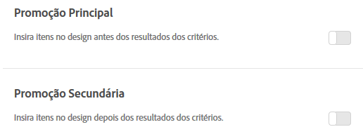

#  Adicionar promoções{#add-promotions}

Adicione itens promovidos e controle o posicionamento nos designs do Recommendations. É possível adicionar promoções estáticas e dinâmicas.

>[!IMPORTANT]
>
>As regras de exclusão estáticas e dinâmicas são recursos poderosos que podem ajudá-lo com seus esforços de marketing. Para obter informações detalhadas, exemplos e cenários de caso de uso, consulte [Usar as regras de inclusão estática e dinâmica](../../c-recommendations/c-algorithms/use-dynamic-and-static-inclusion-rules.md#concept_4CB5C0FA705D4E449BD0B37B3D987F9F).

Quando você cria uma atividade do [!DNL Recommendations], tem a opção de incluir itens promovidos no design do [!DNL Recommendations]. As promoções usam os espaços disponíveis em um design e têm precedência sobre as recomendações de back-up e os resultados de critérios. Por exemplo, se seu design tiver seis espaços e você usar dois deles para promoções, quatro espaços estarão disponíveis para os itens recomendados com base em critérios.

As promoções são deduplicadas em relação aos itens recomendados pelos critérios para a atividade; portanto, um determinado item não aparecerá duas vezes em uma bandeja de recomendação.

É possível promover itens específicos, promover itens dinamicamente, promover itens com base em atributos ou promover coleções.

>[!NOTE]
>
>O uso de promoções altera a estrutura e a saída do CSV. Essas alterações podem afetar qualquer processo externo que envolva CSV, como email.

1. Na página **[!UICONTROL Opções]**, clique no botão de alternância **[!UICONTROL Promoção principal]** ou **[!UICONTROL Promoção secundária]**.

   A ilustração a seguir mostra o botão [!UICONTROL Promoção principal] na posição &quot;Ligado&quot;.

   

   É possível inserir promoções antes *e* depois dos resultados dos seus critérios.
1. Defina o número de espaços de design a serem usados para os itens promovidos.

   É possível usar até 20 espaços, dependendo do design do [!DNL Recommendations]. Cada espaço usado fica indisponível para as recomendações retornadas com base nos seus critérios.

1. Defina uma data de início e uma data de término para os itens promovidos.

   Se você não definir uma data de início, a promoção começará imediatamente. Se você não definir uma data de término, a promoção será executada indefinidamente.

1. Selecione um **[!UICONTROL Tipo de promoção]**.

   * Selecione **[!UICONTROL Lista de itens]** e insira os valores de `entity.id`, separados por vírgulas, dos itens específicos que você deseja promover.

      Se sua lista incluir mais itens do que o número de espaços definido para as promoções, será possível marcar a caixa de seleção **[!UICONTROL Randomizar a ordem dos itens]** para variar os itens promovidos exibidos em seu design. Escolher esta opção fará com que o Target selecione aleatoriamente o número de itens ativados para as promoções no modelo de todo o conjunto de promoções para cada visita.

   * Selecione **[!UICONTROL Promover por atributo]** e adicione as regras para definir os atributos dos itens que deseja remover.

      Se você selecionar Promover por atributo, poderá criar correspondências dinâmicas. Para obter mais informações, consulte [Usar as regras de inclusão estática e dinâmica](../../c-recommendations/c-algorithms/use-dynamic-and-static-inclusion-rules.md#concept_4CB5C0FA705D4E449BD0B37B3D987F9F).

   * Selecione **[!UICONTROL Promover uma coleção]** e escolha a coleção de itens que deseja promover. É possível criar novas coleções para usar em promoções. Consulte [Criar uma coleção](../../c-recommendations/c-products/collections.md#task_1256DFF6842141FCAADD9E1428EF7F08) para obter mais informações.

1. Clique em **[!UICONTROL Salvar.]**.

As promoções são aplicadas a todas as experiências na atividade.
