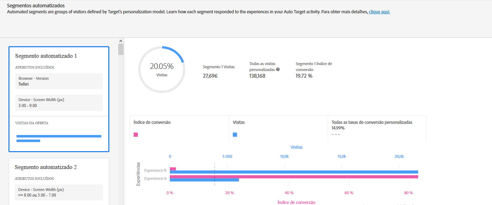
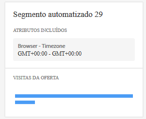
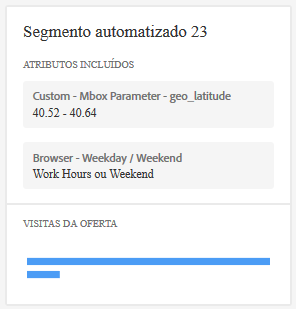

#  Relatório de segmentos automatizados{#automated-segments-report}

Informações sobre o relatório de Segmentos automatizados, um dos dois relatórios especializados disponíveis aos usuários de atividades de Automated Personalization (AP) e Direcionamento automático (AT).

>[!NOTE]
>
>Considere o seguinte ao usar relatórios de Insights de personalização:
>
>* As atividades de AP e AT estão disponíveis como parte da solução [!DNL Target Premium]. Não estão incluídos com o [!DNL Target Standard] sem uma licença do [!DNL Target Premium].
   >
   >
* [!UICONTROL Os relatórios de insights de personalização estão disponíveis apenas para atividades de AP e AT que usam uma meta de otimização de conversão. ] As atividades em que a meta de otimização foi alterada para a conversão da receita após a atividade já estar ativa também não são compatíveis.
   >
   >
* [!UICONTROL Os relatórios de ] Insightsde personalização estão disponíveis somente se o  [!UICONTROL Primary ] Goalis for selecionado na lista  [!UICONTROL do menu ] suspenso de métricas de relatório.
   >
   >
* Os relatórios de insights de personalização são suportados somente no [ambiente padrão](/help/administrating-target/hosts.md).
   >
   >
* [!UICONTROL Os relatórios de ] Insightssão gerados apenas para atividades que estão no   Livestatus e foram ativados e recebem tráfego por pelo menos 15 dias.

Visitantes diferentes respondem de forma distinta às ofertas/experiências na atividade de AP/AT. Este relatório mostra como diferentes segmentos automatizados, definidos pelos modelos de personalização do Target, responderam às ofertas/experiências na atividade.

## Acessar o relatório de Segmentos automatizados {#section_8E8F997AAAF44A1B9EE06EB6FB652801}

1. Clique em **[!UICONTROL Atividade]** e clique na atividade [Automated Personalization](/help/c-activities/t-automated-personalization/automated-personalization.md#task_8AAF837796D74CF893CA2F88BA1491C9) ou [Público alvo automático](/help/c-activities/auto-target/auto-target-to-optimize.md) desejada da lista.

   Se tiver muitas atividades, você pode filtrar a lista selecionando opções de [!UICONTROL Type], [!UICONTROL Status], [!UICONTROL Propriedade], [!UICONTROL Fonte do Relatórios], [!UICONTROL Experience Composer], [!UICONTROL Tipo de métrica] e [!UICONTROL listas suspensas da Origem da Atividade].

1. Clique em **[!UICONTROL Relatórios]**.

   O relatório [Resumo da Automated Personalization](/help/c-reports/reports-ap.md) ou [Resumo do Público alvo automático](/help/c-reports/auto-target-summary-report.md) é exibido, fornecendo informações sobre o desempenho das atividades, representado pelo ícone da primeira tela. Os dois ícones adicionais representam os dois relatórios dos Insights de personalização: Segmentos automatizados e Atributos importantes. Observe que o Direcionamento automático tem um ícone de gráfico adicional para a exibição em gráfico do relatório de [!UICONTROL Resumo].

   

   >[!IMPORTANT]
   >
   >O relatório de [!UICONTROL Segmentos automatizados] somente estará disponível em, no mínimo, 15 dias após você ter ativado a sua atividade. Durante esse período inicial, você não poderá acessar esse relatório ou clicar no ícone de [!UICONTROL Segmentos automatizados]. Após 15 dias, supondo que haja tráfego personalizado suficiente em sua atividade, o relatório de [!UICONTROL Segmentos automatizados] estará disponível.

1. Após 15 dias da ativação da atividade, você pode clicar no ícone de **[!UICONTROL Segmentos automatizados.]**

   

1. Selecione o intervalo de datas desejado.

   Ao contrário do relatório de [!UICONTROL Resumo] (relatórios de desempenho), os [!UICONTROL Insights de personalização], incluindo os [!UICONTROL Segmentos automatizados], estão disponíveis apenas para intervalos de datas fixos: 15 dias, 30 dias, 45 dias, 60 dias e 90 dias. Esses intervalos de datas fixos permitem que os [!UICONTROL Insights de personalização] usem um intervalo de dados grande o suficiente para reduzir a probabilidade de obter insights de um padrão de curta duração na atividade. As duas decisões que você pode fazer para o intervalo de datas é a &quot;Data final&quot; e a &quot;Duração&quot;. Você perceberá que a opção &quot;Iniciar&quot; está em cinza. A data inicial muda automaticamente com base nas seleções de data final e duração.

   

   Você pode acessar os intervalos de datas fixos disponíveis na lista suspensa [!UICONTROL Escolher duração].

   

1. Revise os dados do relatório de [!UICONTROL Segmentos automatizados].

   

1. (Opcional) [Baixe o relatório no formato CSV](/help/c-reports/c-report-settings/report-settings.md#section_77E65C50BAAF4AB79242DB3A8778ADEF) para análise no Excel e em outras ferramentas.

   >[!NOTE]
   >
   >O relatório de interface do usuário dos Insights de personalização contém informações selecionadas. O download do CSV para o relatório de Segmentos automatizados contém detalhes adicionais. O download do relatório de Segmentos automatizados contém Segmentos automatizados adicionais, além dos principais segmentos incluídos na interface do usuário, juntamente com a forma como esses segmentos são executados em relação às ofertas ou experiências.

## Interpretar o relatório de Segmentos automatizados

A tabela a seguir explica como interpretar o relatório e descreve seus elementos:

| Elemento | Detalhes |
|--- |--- |
| Painel lateral esquerdo | O painel lateral esquerdo lista os 20 maiores &quot;segmentos automatizados&quot; identificados pelos modelos de personalização do Target para esta atividade. Um &quot;segmento automatizado&quot; é como um público-alvo, mas é definido pelos modelos de personalização do Target, e não pelo profissional de marketing. Cada segmento automatizado é composto de valores específicos (ou intervalos de valores), de atributos específicos. Observe que os segmentos automatizados podem sobrepor. Os segmentos automatizados podem ser definidos por um, dois, três ou quatro atributos. Consulte os exemplos abaixo para obter mais detalhes. Para saber mais sobre os modelos de personalização do Target, consulte [Algoritmo Random Forest](/help/c-activities/t-automated-personalization/algo-random-forest.md). Para saber mais sobre os atributos que os modelos de personalização do Target usam para criar segmentos automatizados, consulte [Coleta de dados para os algoritmos de personalização do Target](/help/c-activities/t-automated-personalization/ap-data.md). |
| Gráfico central | Os gráficos centrais mostram como o conteúdo da atividade foi executado para o segmento automatizado destacado. Ao clicar em segmentos diferentes no painel esquerdo, os gráficos centrais são atualizados. |
| Gráficos de pizza | Os gráficos de pizza na parte superior do painel central mostram o tamanho do segmento automatizado, bem como o número total de visitas personalizadas na atividade (por exemplo, o tráfego para essa atividade que foi distribuído pelo modelo de personalização. Não inclui o tráfego de controle ou o tráfego distribuído pelo modelo vencedor global). Observe que o tamanho do segmento é baseado apenas nas visitas personalizadas.  |
| Gráfico de barras de dois eixos | O gráfico de barras de dois eixos inclui informações de visita e conversão por meio da oferta ou experiência para esse segmento automatizado específico. |
| Barra rosa | A barra rosa representa a taxa de conversão e usa o eixo inferior do gráfico. Você pode passar o mouse sobre a barra para obter mais informações |
| Barra azul | A barra azul representa o número de visitas e usa o eixo superior do gráfico. Você pode passar o mouse sobre a barra para obter mais informações. |
| Linha pontilhada cinza | A linha pontilhada cinza representa a taxa de conversão para todas as visitas personalizadas na atividade, em todas as ofertas/experiências e segmentos automatizados. |

**Exemplo de segmento automatizado 1**

Este segmento automatizado é definido com base em apenas um atributo. Os visitantes incluídos neste segmento automatizado viram esta atividade de AP em um dia de semana fora do horário normal de trabalho ou em um final de semana.

**Exemplo de segmento automatizado 2**

Este segmento automatizado é definido com base em dois atributos. Os visitantes incluídos neste segmento automatizado que viram esta atividade de AP tinham menos de três visualizações de página em sua visita atual e estavam geograficamente localizados na Latitude 42,57 e 47,29 (aproximadamente entre New Hampshire/Oregon e Washington/Maine para uma empresa com sede nos EUA).

## Perguntas frequentes de Segmentos automáticos {#section_740910A52FA646B4AC9452F98C2F5719}

**Relatórios de Insights de personalização não estão disponíveis ainda para minha atividade. Por que isso ocorre?**

Há diversos motivos pelos quais os relatórios dos [!UICONTROL Insights de personalização] ainda não estão disponíveis para a sua atividade:

* O prazo de 15 dias desde que a atividade foi ativada não decorreu. Os relatórios de Segmentos automatizados e Atributos importantes não estarão disponíveis até pelo menos 15 dias após o início da atividade. Durante esse período inicial, você não poderá acessar esses relatórios ou clicar nos ícones de Segmentos automatizados e Atributos personalizados do modelo.
* Sua atividade não teve tráfego suficiente durante o intervalo de tempo especificado. Após 15 dias, supondo que haja tráfego personalizado suficiente na atividade para criar modelos de personalização, os relatórios de Segmentos automatizados e Atributos importantes ficarão disponíveis.
* Sua atividade tem uma meta de otimização de receita. No momento, os [!UICONTROL Insights de personalização] estão disponíveis apenas para atividades com meta de otimização de conversão. O suporte será adicionado para atividades com meta de otimização de receita em uma versão futura.

**O que é um atributo?**

Um atributo é a informação sobre um visitante ou sua visita específica usada pelos algoritmos de personalização para saber como personalizar o tráfego. Por exemplo, um atributo pode ser o tipo de navegador, a localização, a hora do dia da visita e assim por diante.

Para obter mais informações sobre quais atributos o [!DNL Target] usa em seus modelos de personalização, consulte [Coleta de dados para os algoritmos de personalização do Target](/help/c-activities/t-automated-personalization/ap-data.md). Para obter mais informações sobre como fazer upload de novos atributos no Target para usar nos modelos de personalização do Target, consulte [Métodos para colocar os dados no Target](/help/c-implementing-target/c-considerations-before-you-implement-target/c-methods-to-get-data-into-target/methods-to-get-data-into-target.md#concept_0069C0EFB56C4700BB33F2F35C2B9B17).

**O que é um segmento automatizado?**

Um &quot;segmento automatizado&quot; é como um público-alvo, mas é definido pelos modelos de personalização do Target, e não pelo profissional de marketing.

Um segmento automatizado é composto de valores específicos (ou intervalos de valores), de atributos específicos. Consulte a Etapa 5 acima para obter exemplos de segmentos automatizados. Observe que os segmentos podem se sobrepor.

Para saber mais sobre o algoritmo de personalização random forest, que é a base para os modelos de personalização do Target, consulte  [Algoritmo Random Forest](/help/c-activities/t-automated-personalization/algo-random-forest.md).

**O que decide a ordem dos segmentos automatizados? **

Uma pontuação é calculada para cada segmento, com base no seu tamanho e desempenho diferenciado no conteúdo da sua atividade. A combinação dessas informações determina a ordem dos segmentos automatizados, de modo que os segmentos maiores, com maiores diferenças na forma como responderam ao conteúdo distinto, aparecerão mais perto do topo da lista de segmentos.

**Por que apenas algumas das minhas ofertas/experiências são exibidas no relatório dos Segmentos automatizados?**

As atividades de AP e de AT criam um modelo por oferta (no caso de AP) e um modelo por experiência (no caso de AT). Essas atividades começam distribuindo o tráfego personalizado e criam seus [!UICONTROL Insights de personalização] com apenas dois modelos elaborados. Se não visualizar todas as suas ofertas/experiências nos [!UICONTROL Insights de personalização], é provável que você não tenha modelos criados para essas ofertas/experiências específicas. Você pode verificar o relatório de [!UICONTROL Resumo] da atividade e ver se há um ícone de relógio ao lado dessa oferta/experiência. Esse ícone indica que os modelos ainda não foram criados para essa oferta/experiência.

**Por que algumas ofertas/experiências com uma taxa de conversão mais baixa recebem uma quantidade maior de tráfego em comparação a outras ofertas/experiências para um determinado segmento automatizado?**

Há vários motivos possíveis pelos quais você pode ver mais visitas para uma oferta ou experiência de conversão mais baixa em um segmento automatizado, incluindo:

* Um pequeno número de visualizações para algumas ou todas as ofertas/experiências de um determinado segmento automatizado.
* Atividades com volume menor, nas quais determinadas ofertas/experiências não têm modelos criados ou os modelos foram criados antes para algumas ofertas/experiências do que para outras.
* Regras de direcionamento em uma oferta específica que limitam quais visitantes podem ver quais ofertas/experiências.

**As informações nos relatórios dos [!UICONTROL Segmentos automatizados] e [!UICONTROL Atributos importantes] são as mesmas que no download do CSV?**

Não, o relatório da interface do usuário contém informações selecionadas. O download do CSV contém detalhes adicionais. O download do relatório de Insights do segmento automatizado contém Segmentos automatizados adicionais, além dos principais segmentos incluídos na interface do usuário, juntamente com a forma como esses segmentos são executados em relação às ofertas ou experiências. O relatório de Atributos importantes inclui os 100 principais atributos de visitantes e sua importância relativa, enquanto a interface do usuário inclui apenas os 10 principais atributos de visitantes.

**Posso ver[!UICONTROL  os ]Insights de personalização para um intervalo de datas personalizado?**

Os relatórios dos Insights de personalização (os [!UICONTROL Segmentos automatizados] e [!UICONTROL Atributos importantes]) estão disponíveis apenas para intervalos de datas fixos: 15 dias, 30 dias, 45 dias, 60 dias e 90 dias. Esses intervalos de datas fixos permitem que os [!UICONTROL Insights de personalização] usem um intervalo de dados grande o suficiente para reduzir a probabilidade de obter insights de um padrão de curta duração na atividade. Você pode selecionar essas durações para qualquer data final (onde esses dados são suficientes na atividade para atender a duração).

**Como os [!UICONTROL Insights de personalização] são criados?**

Os [!UICONTROL Insights de personalização] são criados usando uma técnica de patente pendente da Adobe chamada MAGIX (Model Agnostic Globally Interpretable Explanations). Você pode saber mais sobre o MAGIX no paper publicado pela equipe de pesquisa da Adobe disponível no [site da arXiv.org](https://arxiv.org/abs/1706.07160).

**Por que o total de dados de tráfego dos visitantes no relatório de [!UICONTROL Segmentos automatizados] não corresponde ao meu relatório de resumo/desempenho de AP ou AT?**

Os relatórios de [!UICONTROL Insights de personalização] incluem apenas visitantes que viram uma parte do conteúdo selecionado por modelos de personalização do Target (isto é, não considera o tráfego de controle ou o tráfego distribuído pelo modelo vencedor global). Este tipo de tráfego é chamado de tráfego &quot;personalizado&quot;. O relatório de resumo/desempenho em AP/AT inclui controle versus tráfego &quot;direcionado&quot;. O tráfego direcionado inclui o tráfego personalizado, bem como o distribuído usando o modelo vencedor global e algum tráfego distribuído aleatoriamente para continuar o aprendizado.

**Os segmentos automatizados são mutuamente exclusivos?**

Não, há uma sobreposição entre os segmentos automatizados.

**Os [!UICONTROL Insights de personalização] estão disponíveis para metas de modelagem baseadas em receita/meta principal?**

No momento, os [!UICONTROL Insights de personalização] estão disponíveis apenas para atividades com meta de otimização de conversão. O suporte será adicionado para atividades com meta de otimização de receita em uma versão futura.

**Quais são as diferentes formas de usar as informações nos Insights de personalização?**

* Descubra novos públicos-alvo para direcionar: se visualizar um segmento automatizado específico com um desempenho particularmente bom, considere criar um público-alvo para que seja possível reutilizá-lo em outros relatórios.
* Teste suas hipóteses de que tipo de visitantes responderá a quais experiências.
* Obtenha informações sobre o conteúdo que funcionou para que tipo de visitantes: quais ofertas foram responsáveis pelo aumento de visitantes.
* Identifique o conteúdo com baixo desempenho.
* Entenda quais atributos foram mais importantes para a forma como o modelo aprendeu.
* Veja quais atributos são usados nos modelos de personalização e qual a importância deles.
* Identifique as oportunidades para os pontos de dados adicionais que você pode passar para o Target para informar ainda mais a sua personalização.

**Há alguma lógica na ordem de exibição dos atributos em um cartão de segmento?**

Não, a ordem dos cartões é baseada apenas em uma classificação descrita acima. A ordem dos atributos em um cartão não se baseia em nenhuma lógica.