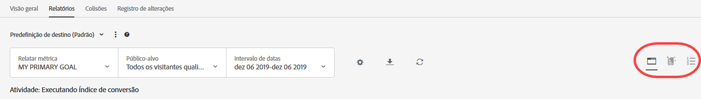
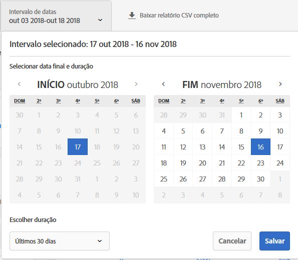
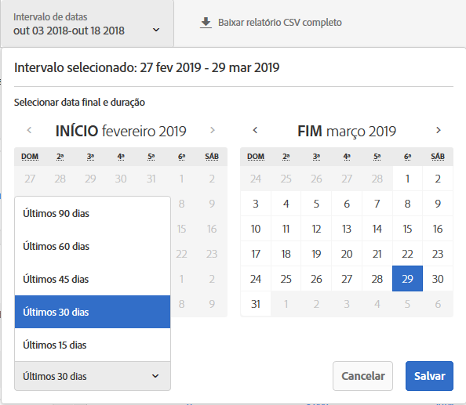
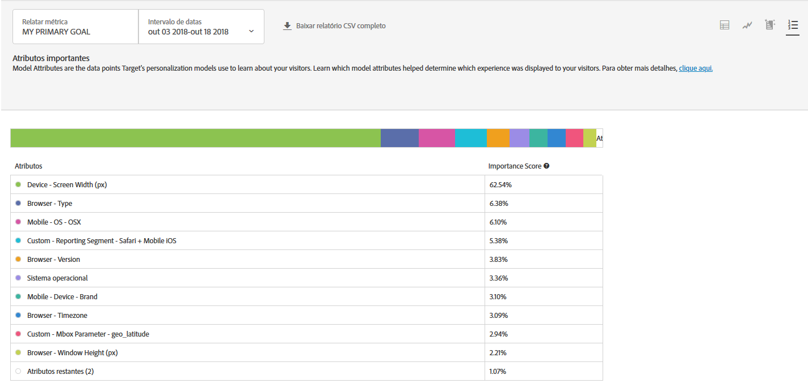

#  Relatório de atributos importantes{#important-attributes-report}

Informações sobre o relatório de Atributos importantes, um dos dois relatórios especializados disponíveis aos usuários de atividades de Automated Personalization (AP) e Direcionamento automático (AT).

>[!NOTE]
>
>Considere o seguinte ao usar relatórios de Insights de personalização:
>
>* As atividades de AP e AT estão disponíveis como parte da solução [!DNL Target Premium]. Não estão incluídos com o [!DNL Target Standard] sem uma licença do [!DNL Target Premium].
   >
   >
* [!UICONTROL Os relatórios de insights de personalização estão disponíveis apenas para atividades de AP e AT que usam uma meta de otimização de conversão. ] As atividades em que a meta de otimização foi alterada para a conversão da receita após a atividade já estar ativa também não são compatíveis.
   >
   >
* [!UICONTROL Os relatórios de ] Insightsde personalização estão disponíveis somente se o  [!UICONTROL Primary ] Goalis for selecionado na lista  [!UICONTROL do menu ] suspenso de métricas de relatório.
   >
   >
* Os relatórios de insights de personalização são suportados somente no [ambiente padrão](/help/administrating-target/hosts.md).
   >
   >
* [!UICONTROL Os relatórios de ] Insightssão gerados apenas para atividades que estão no   Livestatus e foram ativados e recebem tráfego por pelo menos 15 dias.

Em atividades diferentes, atributos distintos são mais ou menos importantes para a forma como o modelo decide personalizar. Este relatório mostra os principais atributos que influenciaram o modelo e sua importância relativa.

## Acessar o relatório de Atributos importantes {#section_8E8F997AAAF44A1B9EE06EB6FB652801}

1. Clique em **[!UICONTROL Atividade]** e clique na atividade [Automated Personalization](/help/c-activities/t-automated-personalization/automated-personalization.md#task_8AAF837796D74CF893CA2F88BA1491C9) ou [Público alvo automático](/help/c-activities/auto-target/auto-target-to-optimize.md) desejada da lista.

   Se você tem muitas atividades, você pode filtrar a lista selecionando opções nas listas suspensas [!UICONTROL Tipo], [!UICONTROL Status], [!UICONTROL Fonte de geração de relatórios], [!UICONTROL Experience Composer], [!UICONTROL Tipo de métrica] e [!UICONTROL Fonte da atividade].

1. Clique em **[!UICONTROL Relatórios]**.

   O relatório [Resumo da Automated Personalization](/help/c-reports/reports-ap.md) ou [Resumo do Público alvo automático](/help/c-reports/auto-target-summary-report.md) é exibido, fornecendo informações sobre o desempenho das atividades, representado pelo ícone da primeira tela. Os dois ícones adicionais representam os dois relatórios dos Insights de personalização: Segmentos automatizados e Atributos importantes. Observe que o Direcionamento automático tem um ícone de gráfico adicional para a exibição em gráfico do relatório de [!UICONTROL Resumo].

   

   >[!IMPORTANT]
   >
   >O relatório de [!UICONTROL Atributos importantes] somente estará disponível em, no mínimo, 15 dias após você ter ativado a sua atividade. Durante esse período inicial, você não poderá acessar esse relatório ou clicar no ícone de [!UICONTROL Atributos importantes]. Após 15 dias, supondo que haja tráfego personalizado suficiente em sua atividade, o relatório de [!UICONTROL Atributos importantes] estará disponível.

1. Após 15 dias da ativação da atividade, você pode clicar no ícone de **[!UICONTROL Atributos importantes]**.

   

1. Selecione o intervalo de datas desejado.

   Ao contrário do relatório de [!UICONTROL Resumo] (relatórios de desempenho), os [!UICONTROL Insights de personalização], incluindo os [!UICONTROL Atributos importantes], estão disponíveis apenas para intervalos de datas fixos: 15 dias, 30 dias, 45 dias, 60 dias e 90 dias. Esses intervalos de datas fixos permitem que os [!UICONTROL Insights de personalização] usem um intervalo de dados grande o suficiente para reduzir a probabilidade de obter insights de um padrão de curta duração na atividade. As duas decisões que você pode fazer para o intervalo de datas é a &quot;Data final&quot; e a &quot;Duração&quot;. Você perceberá que a opção &quot;Iniciar&quot; está em cinza. A data inicial muda automaticamente com base nas seleções de data final e duração.

   

   Você pode acessar os intervalos de datas fixos disponíveis na lista suspensa [!UICONTROL Escolher duração].

   

1. Revise os dados do relatório de [!UICONTROL Atributos importantes].

   

1. (Opcional) [Baixe o relatório no formato CSV](/help/c-reports/c-report-settings/report-settings.md#section_77E65C50BAAF4AB79242DB3A8778ADEF) para análise no Excel e em outras ferramentas.

   >[!NOTE]
   >
   >O relatório de interface do usuário dos Insights de personalização contém informações selecionadas. O download do CSV para o relatório de Atributos importantes contém detalhes adicionais. O download do relatório de Atributos importantes inclui a lista completa dos 100 principais atributos, enquanto o relatório da interface do usuário inclui apenas os 10 principais. Se estiver procurando por um atributo específico que não esteja no relatório, isso não significa que ele não tenha influenciado a atividade, mas simplesmente que não entrou na lista dos 100 principais atributos.

## Interpretar o relatório de Atributos importantes

A tabela a seguir explica como interpretar o relatório e descreve seus elementos:

| Elemento | Detalhes |
|--- |--- |
| Gráfico de barras | O gráfico de barras multicolorido na parte superior da tela permite visualizar essas pontuações de importância relativa e mapeia a cor do ponto ao lado de cada atributo respectivo na tabela. Você também pode passar o mouse sobre uma cor específica no gráfico de barras para ver o atributo que ela representa.  As pontuações de importância nos 100 principais atributos somam 100%. Para obter mais informações sobre como adicionar mais atributos que podem ser usados pelos modelos de personalização do Target, consulte  [Fazer upload de dados para os algoritmos de personalização do Target](/help/c-activities/t-automated-personalization/uploading-data-for-the-target-personalization-algorithms.md). |
| Gráfico de Classificação de atributo do modelo | A Classificação de atributo do modelo inclui os 10 principais atributos que foram mais importantes para a forma como o modelo de personalização do Target decidiu qual conteúdo mostrar para cada visitante. Em relação aos 100 principais atributos, a pontuação de importância mostra o quão importante um atributo específico foi para os modelos de personalização do Target nessa atividade. |

## Perguntas frequentes de atributos importantes {#section_740910A52FA646B4AC9452F98C2F5719}

**Relatórios de Insights de personalização não estão disponíveis ainda para minha atividade. Por que isso ocorre?**

Há diversos motivos pelos quais os relatórios dos [!UICONTROL Insights de personalização] podem ainda não estar disponíveis para a sua atividade:

* O prazo de 15 dias desde que a atividade foi ativada não decorreu. Os relatórios de Segmentos automatizados e Atributos importantes não estarão disponíveis até pelo menos 15 dias após o início da atividade. Durante esse período inicial, você não poderá acessar esses relatórios ou clicar nos ícones de Segmentos automatizados e Atributos personalizados do modelo.
* Sua atividade não teve tráfego suficiente durante o intervalo de tempo especificado. Após 15 dias, supondo que haja [tráfego personalizado suficiente](/help/c-activities/auto-target/auto-target-to-optimize.md#section_BA4D83BE40F14A96BE7CBC7C7CF2A8FB) na atividade para criar modelos de personalização, os relatórios de Segmentos automatizados e Atributos importantes ficarão disponíveis.
* Sua atividade tem uma meta de otimização de receita. No momento, os [!UICONTROL Insights de personalização] estão disponíveis apenas para atividades com meta de otimização de conversão. O suporte será adicionado para atividades com meta de otimização de receita em uma versão futura.

**O que é um atributo?**

Um atributo é a informação sobre um visitante ou sua visita específica usada pelos algoritmos de personalização para saber como personalizar o tráfego. Por exemplo, um atributo pode ser o tipo de navegador, a localização, a hora do dia da visita e assim por diante.

Para obter mais informações sobre quais atributos o [!DNL Target] usa em seus modelos de personalização, consulte [Coleta de dados para os algoritmos de personalização do Target](/help/c-activities/t-automated-personalization/ap-data.md). Para obter mais informações sobre como fazer upload de novos atributos no Target para usar nos modelos de personalização do Target, consulte [Métodos para colocar os dados no Target](/help/c-implementing-target/c-considerations-before-you-implement-target/c-methods-to-get-data-into-target/methods-to-get-data-into-target.md#concept_0069C0EFB56C4700BB33F2F35C2B9B17).

**As informações nos relatórios dos [!UICONTROL Segmentos automatizados] e [!UICONTROL Atributos importantes] são as mesmas que no download do CSV?**

Não, o relatório da interface do usuário contém informações selecionadas. O download do CSV contém detalhes adicionais. O download do relatório de Insights do segmento automatizado contém Segmentos automatizados adicionais, além dos principais segmentos incluídos na interface do usuário, juntamente com a forma como esses segmentos são executados em relação às ofertas ou experiências. O relatório de Atributos importantes inclui os 100 principais atributos de visitantes e sua importância relativa, enquanto a interface do usuário inclui apenas os 10 principais atributos de visitantes.

**Posso ver os Insights de personalização para um intervalo de datas personalizado?**

Os relatórios dos Insights de personalização (os [!UICONTROL Segmentos automatizados] e [!UICONTROL Atributos importantes]) estão disponíveis apenas para intervalos de datas fixos: 15 dias, 30 dias, 45 dias, 60 dias e 90 dias. Esses intervalos de datas fixos permitem que os [!UICONTROL Insights de personalização] usem um intervalo de dados grande o suficiente para reduzir a probabilidade de obter insights de um padrão de curta duração na atividade. Você pode selecionar essas durações para qualquer data final (onde esses dados são suficientes na atividade para atender a duração).

**Como os [!UICONTROL Insights de personalização] são criados?**

Os [!UICONTROL Insights de personalização] são criados usando uma técnica de patente pendente da Adobe chamada MAGIX (Model Agnostic Globally Interpretable Explanations). Você pode saber mais sobre o MAGIX no paper publicado pela equipe de pesquisa da Adobe disponível no [site da arXiv.org](https://arxiv.org/abs/1706.07160).

**Os [!UICONTROL Insights de personalização] estão disponíveis para metas de modelagem baseadas em receita/meta principal?**

No momento, os [!UICONTROL Insights de personalização] estão disponíveis apenas para atividades com meta de otimização de conversão. O suporte será adicionado para atividades com meta de otimização de receita em uma versão futura.

**Qual é a pontuação de importância do atributo no relatório de Atributos importantes?**

A pontuação de importância na parte do relatório &quot;Classificação de importância do atributo&quot; fornece informações sobre quais variáveis usadas pelo algoritmo para aprender eram mais importantes ao determinar como dividir todos os visitantes nos segmentos identificados. Ele atribuiu uma pontuação percentual aos 100 principais atributos usados pelo modelo.

**Por que algumas ofertas/experiências com uma taxa de conversão mais baixa recebem uma quantidade maior de tráfego em comparação a outras ofertas/experiências para um determinado segmento automatizado?**

Há vários motivos possíveis pelos quais você pode ver mais visitas para uma oferta/experiência de conversão mais baixa em um segmento automatizado, incluindo:

* Um pequeno número de visualizações para algumas ou todas as ofertas/experiências de um determinado segmento automatizado.
* Atividades de volume inferior nas quais determinadas ofertas ou experiências não têm modelos criados.
* Atividades de volume inferior nas quais foram criados modelos para algumas ofertas/experiências antes do que para outras. Por exemplo, suponha que um modelo adicional foi criado no dia 22 e você está analisando os dados dos dias 10 a 24.
* Regras de direcionamento em uma oferta específica que limitam quais visitantes podem ver quais ofertas/experiências.
* Não há intervalos de confiança no relatório de insight. No entanto, se os índices de conversão estiverem próximos o suficiente, o modelo poderá fornecer tráfego para que o número seja maior em um ponto, mas não “estatisticamente diferente” do outro.

Pode ser útil saber como o modelo fornece o tráfego. Cada indivíduo é servido com base no seu perfil total. No entanto, os relatórios de Insights generalizam esse comportamento para facilitar sua interpretação por um humano. Como resultado, os segmentos não são mutuamente exclusivos. Isso pode fazer com que segmentos individuais exibam esse tipo de comportamento, pois uma mesma pessoa pode aparecer em vários segmentos.

**Quais são as diferentes formas de usar as informações nos Insights de personalização?**

* Descubra novos públicos-alvo para direcionar: se visualizar um segmento automatizado específico com um desempenho particularmente bom, considere criar um público-alvo para que seja possível reutilizá-lo em outros relatórios.
* Teste suas hipóteses de que tipo de visitantes responderá a quais experiências.
* Obtenha informações sobre o conteúdo que funcionou para que tipo de visitantes: quais ofertas foram responsáveis pelo aumento de visitantes.
* Identifique o conteúdo com baixo desempenho.
* Entenda quais atributos foram mais importantes para a forma como o modelo aprendeu.
* Veja quais atributos são usados nos modelos de personalização e qual a importância deles.
* Identifique as oportunidades para os pontos de dados adicionais que você pode passar para o Target para informar ainda mais a sua personalização.