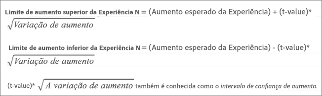
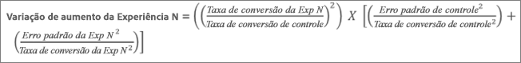
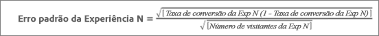
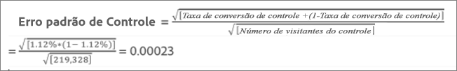
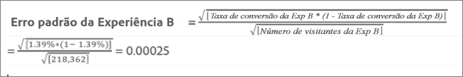
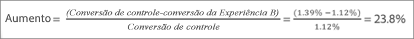
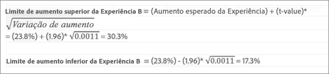

# Média de aumento, Limites de aumento e Intervalo de confiança{#average-lift-lift-bounds-and-confidence-interval}

Os relatórios incluem vários pontos de dados e representações de visualização que ajudam você a entender os limites de aumento e o nível de confiança associados à sua atividade. Isso ajuda você a determinar um vencedor com mais precisão.

## Média de aumento, Limites de aumento e Intervalo de confiança {#topic_AFFDC672A8A34D028B100EF6BE5D8129}

Os relatórios incluem vários pontos de dados e representações de visualização que ajudam você a entender os limites de aumento e o nível de confiança associados à sua atividade. Isso ajuda você a determinar um vencedor com mais precisão.

>[!NOTE]
>
>Este recurso está disponível somente na exibição de relatórios na Visualização em tabela. Este recurso não está disponível para atividades que usam o [Analytics como fonte de relatórios (A4T)](../../c-integrating-target-with-mac/a4t/a4t.md#concept_7540C8C04259434AB6EE33B09F47A1DE).

## Visão geral {#section_62C0D7E76F3D49A7B3C371C82AEF27D5}

As informações de aumento na interface do usuário do Target incluem:

| Elemento | Detalhes |
|--- |--- |
| Aumento | O número grande e a seta refletem o valor esperado do aumento. Esse número é o ponto médio do intervalo dos limites de aumento. A seta de aumento esperado é exibida em cinza até que a confiança passe 95%. Após esse limite, a seta é exibida em vermelho ou verde com base no aumento negativo ou positivo, respectivamente. |
| Limites de aumento | Este é o intervalo de confiança de 95% do aumento. Ele é exibido como um intervalo abaixo da média de aumento. Consulte o Exemplo de cálculo abaixo para obter um exemplo de como esses limites de aumento são calculados. |
| Boxplot (Gráfico de Caixa) | O boxplot na interface do Target representa o valor esperado e 95% do intervalo de confiança da métrica de sucesso em questão. Pense nisso como uma maneira gráfica de exibir as informações de aumento e os limites de aumento. Existem alguns modos especiais usados pelo Target para ajuda a interpretar as informações de confiança, um deles é a cor. O gráfico exibe qualquer sobreposição no intervalo de confiança de uma experiência específica com o intervalo de confiança do controle em cinza e qualquer faixa do intervalo de confiança de uma experiência específica acima ou abaixo do intervalo de confiança de controle como verde ou vermelho, respectivamente. O comprimento da barra do boxplot representa o tamanho do intervalo de confiança de uma maneira fácil de entender. À medida que você coleta mais dados em sua atividade, a barra é alterada. O intervalo de confiança é derivado da variação e do tamanho da amostra (número de visitantes). Quanto menor a variação e quanto maior o tamanho da amostra, mais estreito o seu intervalo de confiança. |
| Confiança | A confiança de uma experiência ou oferta representa a probabilidade de que o aumento da experiência/oferta associada sobre a experiência/oferta de controle seja &quot;real&quot; (não causado aleatoriamente). Normalmente, 95% é o nível de confiança recomendado para o aumento ser considerado significativo. |

A ilustração a seguir mostra informações sobre limites de aumento e Nível de confiança:

## Como são calculados os Limites de aumento?  {#section_1D360781D972483693680BE0F07AEAD1}

Os limites de aumento representam os intervalos de confiança de 95% do aumento que a experiência ou oferta específica tem sobre a experiência de controle ou oferta. Falando vagamente, isso significa que o aumento real tem cerca de 95% de chance de estar entre esses limites.

Os limites de aumento são calculados usando a seguinte fórmula:

Existe um cálculo adicional para chegar à entrada dos nossos limites de aumento:

* **valor t:** a estatística crítica para o nosso nível de confiança de 95% é de 1,96. Saiba mais sobre [os valores t aqui](https://en.wikipedia.org/wiki/T-statistic).
* **Variação do aumento:** A métrica de sucesso do Erro Padrão de Experiência N e a métrica de sucesso Erro Padrão da Experiência de Controle são necessárias para determinar a variação de aumento, que é calculada usando a seguinte fórmula (ilustrada caso a métrica de sucesso seja conversão).

   

* **Índice de conversão / Erro padrão da métrica de sucesso:** O erro padrão é calculado da mesma forma para a Experiência N e o Controle, usando a seguinte fórmula (ilustrada caso a métrica de sucesso seja conversão). Saiba mais sobre [erro padrão aqui](https://en.wikipedia.org/wiki/Standard_error).

   

   >[!NOTE]
   >
   >O erro padrão para atividades de métricas de sucesso de receita é baseado na variação da amostra da receita.

## Exemplo de cálculo {#section_35BD6FB7AFD346E28BA093147C248471}

Vamos considerar um exemplo de atividade com duas experiências e os seguintes resultados:

| Experiência | Visitantes | Conversões | Índice de conversão |
|--- |--- |--- |--- |
| Experiência A (Controle) | 219, 328 | 2,466 | 1.12% |
| Experiência B | 218, 362 | 3,040 | 1.39% |

Com base em nossas fórmulas, podemos calcular as entradas necessárias para os limites de aumento.

**Erro padrão para Experiência A (Controle)**

**Erro padrão para Experiência B**

**Variação de aumento para Experiência B**

**Variação de aumento para Experiência B**

Aumento esperado para Experiência B:

Portanto, os limites de aumento para a Experiência B podem ser:

>[!NOTE]
>
>Espere pequena variações entre os cálculos manuais usando as fórmulas acima e os números exibidos no relatório. A diferença pode ser atribuída ao fato de que os números de exibições de página usados nos cálculos manuais são arredondados. O aumento mostrado no relatório de destino é baseado nos números exatos obtidos do engajamento total e da contagem de engajamento. Os números de engajamento podem ser obtidos por meio da API de relatórios de desempenho.

## Quando os Limites de aumento não são exibidos? {#section_C5622E1E94684DAD937249B51A9E42CC}

Em determinados casos, o Target não exibe os limites de aumento:

* Para qualquer atividade, quando o número total de visitas ou visitantes for menor que 30.
* Para atividades de Alocação automática, nenhum limite de aumento é exibido até que uma experiência tenha atingido 60% de confiança.

