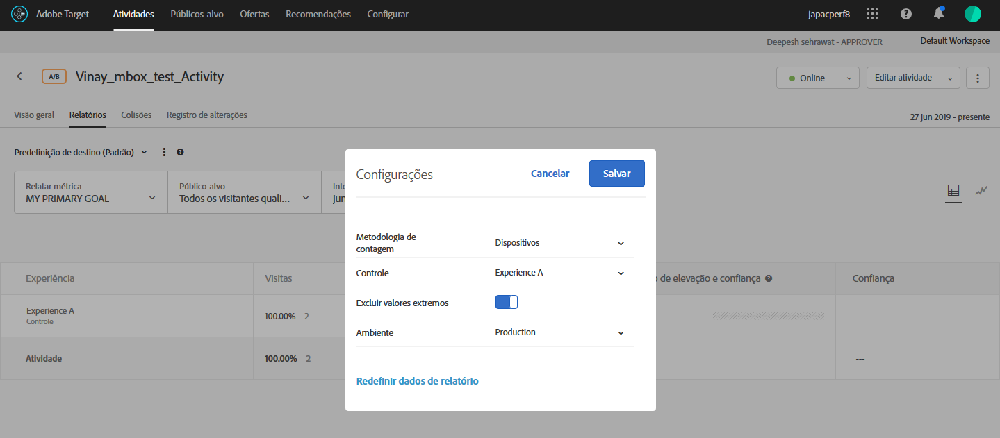

# Excluir valores extremos

You can exclude extreme values from affecting reports in [!DNL Adobe Target] so a few unusual orders don&#39;t affect your activity results. Um exemplo de um pedido incomum pode ser um técnico comprando uniformes para um time inteiro em vez de compradores individuais comprando uniformes individuais.

>[!NOTE]
>
>O sinalizador [!UICONTROL Excluir valores extremos] é aplicado apenas para atividades com métricas do tipo receita e envolvimento.

Os valores extremos são automaticamente sinalizados com um indicador com base nas regras a seguir. Você pode alternar entre ver e excluir os valores extremos dos seus relatórios. Uma atividade terá seus valores extremos excluídos após a atividade ter sido executada por uma hora ou 15 pedidos, o que ocorrer primeiro.

Um valor é considerado extremo se ele tiver +/- 3 desvios-padrão do valor médio de pedido usando dados do último mês (até o ponto no tempo em que o cálculo foi feito).

Por exemplo, o filtro de valor extremo geralmente é útil ao usar a RPV. A RPV combina a taxa de conversão e o valor médio de pedido, e costuma exibir a volatilidade dessas métricas. Caso use a RPV e veja que os pedidos não estão sendo distribuídos normalmente, é provável que os resultados apareçam normais se você aplicar o filtro de pedido extremo.

Quando um valor é marcado como extremo, seu valor de pedido é substituído com o valor médio de pedido da experiência pelo último mês, excluindo extremos. The order is also marked as extreme in the [!UICONTROL Order Details] report and in the CSV download for daily results.

**Para excluir os valores extremos dos seus relatórios:**

1. Abra uma atividade que inclua métricas do tipo receita ou envolvimento e clique na guia **[!UICONTROL Relatórios.]**
1. Clique no ícone de engrenagem para exibir a caixa de diálogo **[!UICONTROL Configurações]** .

   

1. Deslize o botão **[!UICONTROL Excluir valores]** extremos para a posição &quot;ligado&quot; ou &quot;desligado&quot;, conforme desejado.
1. Clique em **[!UICONTROL Salvar]**.
