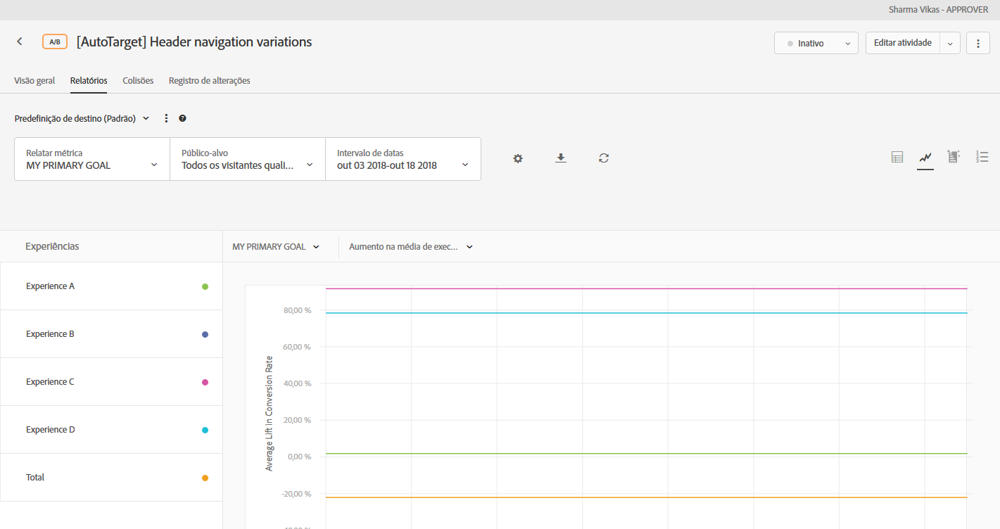
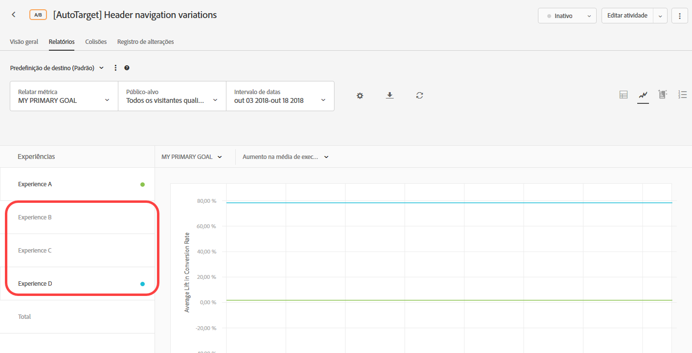

# Configurações do relatório{#report-settings}

Information to help you set the elements you want to appear in your report in [!DNL Adobe Target]. As definições de relatório podem ser salvas para uso posterior.

Para exibir um relatório:

1. Clique em **[!UICONTROL Atividades]** e depois clique na atividade desejada na lista.
1. Clique na guia **[!UICONTROL Relatórios]**.

   

## Predefinição do Target {#section_51F67341465045BEB4F1A2FB638A8EB1}

Você pode salvar até dez predefinições diferentes de um relatório de atividade individual, após configurá-lo como desejado (métricas, intervalos de datas, públicos-alvo, configurações avançadas e assim por diante). All [!DNL Target] users can display, edit, and delete the various presets, regardless of who created them.

Você também pode configurar um relatório de atividade individual, como desejado, e depois salvar essa configuração como sua predefinição padrão/favorita. A partir de agora, esta será a exibição apresentada sempre que você visualizar o relatório dessa atividade.

### Criar uma predefinição ou predefinição padrão

1. Configure o relatório de atividades conforme desejado.

   As configurações disponíveis, incluindo métricas, intervalos de datas, audiências, configurações avançadas e assim por diante, são explicadas abaixo.

1. Perto de **[!UICONTROL Predefinição do Target]**, clique no ícone de três elipses verticais > **[!UICONTROL Salvar como novo]**.

   

   A caixa de diálogo Nova predefinição é exibida:

   

1. Review the information in the **[!UICONTROL Filters]** and **[!UICONTROL Settings]** sections to ensure that the report is configured as desired, then specify the **[!UICONTROL Preset Name]** (up to 50 characters).
1. (Conditional) If you want this to be your default/favorite report view, slide the **[!UICONTROL Set as default preset]** toggle to the On position.
1. Clique em **[!UICONTROL Salvar]**.

### Selecionar uma predefinição diferente

Selecione a predefinição desejada na lista suspensa **[!UICONTROL Predefinição do Target]**.

### Editar uma predefinição

1. Selecione a predefinição que deseja editar.
1. Edite a configuração do relatório como desejado (métricas, intervalos de datas, públicos-alvo, configurações avançadas e assim por diante).

   Depois de clicar em [!UICONTROL Salvar], após a edição da configuração do relatório, um asterisco ( * ) será exibido depois do nome predefinido para indicar que a predefinição foi alterada, como mostrado abaixo:

   

1. Clique no ícone de três elipses verticais > **[!UICONTROL Salvar como novo]** para criar uma nova predefinição.

   Ou

   Clique no ícone de três elipses verticais > **[!UICONTROL Atualizar]** para atualizar a predefinição atual.

   

### Excluir uma predefinição

1. Selecione a predefinição que deseja excluir.
1. Clique no ícone de três elipses verticais > **[!UICONTROL Excluir]**.

   

1. Clique em **[!UICONTROL Excluir]** novamente para confirmar sua exclusão (as predefinições excluídas não podem ser recuperadas).

### Tratamento de erros predefinidos

Alertas e mensagens dentro de relatórios informam se uma predefinição se tornar inválida. O alerta ou a mensagem instrui a escolher outro público-alvo, métrica, grupo de hosts ou experiência para tornar uma predefinição válida.

A lista a seguir descreve algumas das situações que podem fazer com que uma predefinição se torne inválida:

* Um público-alvo do relatório foi removido da atividade, mas é referenciado na definição predefinida.
* Uma (ou mais) métrica foi excluída, mas referenciada na definição predefinida. Por exemplo, você pode excluir uma ou mais métricas da atividade e, em seguida, adicionar novas métricas.
* Um (ou mais) grupo de hosts (ambiente) não existe, mas é referenciado na definição predefinida.
* Uma (ou mais) experiência foi excluída depois que a predefinição foi criada, mas é referenciada na definição predefinida.
* Uma predefinição é semanticamente inválida, pois as entidades referenciadas ainda existem, mas foram atualizadas de forma a alterar a definição semântica da predefinição. Por exemplo, suponha que você crie inicialmente uma predefinição chamada &quot;Receita no Chrome&quot;. Posteriormente, você atualiza a atividade para medir a Métrica de conversão, em vez da Receita. Essa atualização na definição da atividade invalida a definição predefinida semântica.

## Métrica de relatório {#section_894ABD7148244806B7CE556EBBA2AD62}

Clique na lista suspensa **[!UICONTROL Métrica do relatório]** para selecionar outra [métrica de sucesso](../../c-activities/r-success-metrics/success-metrics.md#reference_D011575C85DA48E989A244593D9B9924) ou várias métricas para exibir no gráfico.

Por padrão, a métrica principal é determinada na configuração de métricas de sucesso ao criar a atividade. Se você alterar a configuração e salvar novamente a atividade, a métrica principal da geração de relatórios será atualizada.

Para obter mais informações sobre a seleção de várias métricas para visualização nos relatórios, consulte  [Exibir várias métricas em um relatório](../../c-reports/c-report-settings/view-multiple-metrics.md#concept_9E3C3F6F3EC1412FAF252975AC0720B7).

## Público-alvo {#section_70926EB4618945D9AFF2B0564FF3717B}

Clique na lista suspensa [!UICONTROL Público] para alterar o público exibido no relatório.

Para obter mais informações, consulte [Públicos](../../c-target/target.md#concept_A782F8481A5041EBA75103CB26376522).

## Intervalo de datas {#section_A410A768403C4E01891F95CB357E63ED}

A caixa Intervalo de datas exibe o intervalo de datas atual do relatório. Clique no ícone suspenso para exibir um calendário que permite alterar o intervalo de datas do relatório.

Selecione as datas **[!UICONTROL Iniciais]** e **[!UICONTROL Finais]** para o relatório. You can also use the **[!UICONTROL From start of Activity]** and **[!UICONTROL Till end of Activity]** check boxes.

Clique em **[!UICONTROL Personalizar datas]** para selecionar intervalos de datas predefinidos: Últimos 7 dias, Últimos 15 dias ou Últimos 30 dias. Esses intervalos de datas predefinidos são intervalos acumulados. Se a data de início for menor do que o número de dias escolhido, o calendário mostrará o intervalo desde a data de início, mas acumulará quando a data de início se tornar mais anterior do que o número de dias escolhido conforme a duração da atividade aumenta.

Os relatórios têm as seguintes restrições de data:

* A data de início do relatório deve ficar dentro dos últimos dois anos.
* Os relatórios de grupos de ofertas são limitados a 99 dias a partir do dia atual.
* Os relatórios por hora estão limitados a 15 dias.

## Configurações {#section_D99CE462107D45CABE0960F820E1E972}

Para configurar as configurações do relatório:

1. Clique no ícone de engrenagem e faça as alterações desejadas (conforme explicado abaixo).
1. Clique em **[!UICONTROL Salvar]** ao concluir.

A ilustração a seguir mostra a caixa de diálogo Configurações para uma atividade A/B:

Dependendo do tipo de atividade selecionada, as opções variam:

### Metodologia de contagem

Selecione a metodologia desejada:

* Visitantes
* Visitas
* Impressões de atividade

### Controle

Selecione a experiência de controle a ser usada ao calcular e comparar o incentivo.

### Ambiente

Selecione o ambiente (grupo de host) a ser usado para o relatório. Para obter mais informações, consulte [Hosts](../../administrating-target/hosts.md#concept_516BB01EBFBD4449AB03940D31AEB66E).

### Redefinir dados do relatório

Redefina os dados do relatórios para remover os dados antigos. Os visitantes atuais permanecerão na atividade.  This option is available only for those with [!UICONTROL Approver] permissions.

>[!IMPORTANT]
>
>Essa é uma ação permanente que não pode ser desfeita.

### Excluir valores extremos

The [!UICONTROL Exclude Extreme Values] toggle applies to activities with Revenue and Engagement metric types only. Para obter mais informações, consulte [Exceto pedidos extremos](../../c-reports/c-report-settings/excluding-extreme-orders.md#task_2AE7743FFCDD466DAEEB720BE5F33DAA).

## Baixar {#section_77E65C50BAAF4AB79242DB3A8778ADEF}

Click the **[!UICONTROL Download]** icon to download report data in a [!DNL .csv] format for quick import into Excel, Access, or other data analysis programs.

Para obter mais informações, consulte [Fazendo download de dados em um arquivo CSV](../../c-reports/downloading-data-in-csv-file.md#concept_3F276FF2BBB2499388F97451D6DE2E75).

## Atualizar {#section_E203729F2F314DF3856D2EE67C60B370}

Click the **[!UICONTROL Refresh]** icon to refresh a report&#39;s table and graph view without refreshing the entire page, its configuration, or its date range.

## More options {#section_AB1B5C695D7045A0A0AC0E2698D2E7DE}

Clique no ícone de Mais opções (três elipses verticais) para acessar as opções [!UICONTROL Editar atividade] e [!UICONTROL Exibir URLs de experiência].

## Opções de visualização

Você pode visualização o relatório em vários formatos, dependendo do tipo de atividade. Selecione a opção desejada.

* **Visualização** da tabela: Clique no ícone Visualização **[!UICONTROL da]** tabela para visualização do relatório como uma tabela.
* **Visualização** do gráfico: Clique no ícone Visualização **[!UICONTROL do]** gráfico para visualização do relatório como gráfico.
* **Segmentos** automatizados:(Disponível somente para atividades Automated Personalization (AP) e Público alvo automático (AT).) Clique no ícone **Segmentos automatizados para visualização do relatório [Segmentos](/help/c-reports/c-personalization-insights-reports/automated-segments-report.md)automatizados.
* **Atributos** importantes: (Disponível somente para atividades Automated Personalization (AP) e Público alvo automático (AT).) Clique no ícone **Atributos importantes para visualização no relatório [Atributos](/help/c-reports/c-personalization-insights-reports/important-attributes-report.md)importantes.

## Média de aumento, Limites de aumento e Intervalo de confiança {#section_0D87615B1D3344B3858BA494EEBC16FB}

Os relatórios incluem vários pontos de dados e representações de visualização que entendem os limites de aumento e o nível de confiança associados à sua atividade. Isso ajuda você a determinar um vencedor com mais precisão.

Para obter mais informações, consulte [Incentivo médio, Limites de incentivo e Intervalo de confiança](../../c-reports/c-report-settings/average-lift-bounds-and-confidence-interval.md#topic_AFFDC672A8A34D028B100EF6BE5D8129).

Considere o seguinte:

* Disponível somente quando os relatórios estão sendo exibidos em Exibição em tabela.
* Este recurso não está disponível para atividades que usam o [Analytics como fonte de relatórios (A4T)](/help/c-integrating-target-with-mac/a4t/a4t.md).

## Contribuição de localização  {#section_5832F126AC114AE1ABFFF4D9B904393B}

Clique no ícone de **[!UICONTROL Contribuição de localização]** para que o relatório mostre a contribuição por localização.

## Experiências {#section_3A450DE1FA7E43F0AAB73165EC3D1C34}

(Disponível somente ao exibir o relatório em gráficos)

Marque ou desmarque as experiências à esquerda do gráfico para exibir ou ocultar as experiências correspondentes no gráfico.

Na ilustração a seguir, somente as experiências Padrão, Centro-este e Total são exibidas no relatório. A experiência na Ásia está oculta no gráfico.

## Média móvel  {#section_59066693158C4433B87D07402C2BC6CD}

(Disponível somente ao exibir o relatório em gráficos)

&quot;Média em execução&quot; reflete as conversões cumulativas (do start da janela do relatórios até a data representada no gráfico) divididas pelos visitantes cumulativos.

Selecione a exibição de gráfico desejada:

* Média móvel
* Executar aumento médio
* Diariamente
* Aumento diário

O nome dessa lista suspensa varia dependendo da visualização selecionada, mas será uma das visualizações listadas acima.

## Metodologia de contagem {#section_01B0ED5665C74AE1AE97259800190C3E}

(Disponível somente ao exibir o relatório em gráficos)

É possível escolher a metodologia de contagem de gráficos nos relatórios. Note that this is not supported for [!UICONTROL Automated Personalization] (AP) activities.

To access the [!UICONTROL Counting Methodology] option, while viewing a report in graph mode, click the **[!UICONTROL My Primary Goal]** drop-down, then select the counting methodology.

A metodologia de contagem será a mesma que a selecionada na caixa de diálogo [!UICONTROL Configurações], descrita acima.

Como padrão, o gráfico é criado em modo [!UICONTROL Diário].

You can change the mode by clicking the [!UICONTROL Daily] drop-down list, then selecting a cumulative option.

>[!NOTE]
>
>O nome dessa lista suspensa varia dependendo do modo selecionado.

Há quatro modos para atividades de direcionamento automático: Controle diário, Direcionamento diário, Controle cumulativo e Direcionamento cumulativo.

A seguir, a ordem padrão na qual o gráfico é criado:

* **Testes A/B (incluindo Autoalocação e Automated Personalization)**: Ordem de criação da experiência, em ordem decrescente.
* **Direcionamento de experiência (XT)**: Ordem das experiências na atividade.
* **Teste multivariado (MVT)**: Alfabético pelo nome da experiência.
* **Recommendations**: Ordem de criação da experiência, em ordem decrescente.

À medida que usa as opções de Metodologia de contagem, considere os seguintes avisos:

* For [Auto-Target activities](/help/c-activities/auto-target/auto-target-to-optimize.md), there is no option for selecting &quot;Visitors&quot; as the counting methodology. O direcionamento automático é o único tipo de atividade que você não pode colocar em gráfico por visitantes.
* For activities that use [Analytics as the reporting source (A4T)](/help/c-integrating-target-with-mac/a4t/a4t.md), you cannot plot Visitor, Visit, or Impression cumulatively.

## Trabalhar com gráficos com mais de 16 experiências na atividade

Se uma atividade tem menos de 16 experiências, cada experiência é representada em uma cor diferente no gráfico.

Se uma atividade tiver mais de 16 experiências, as linhas coloridas das primeiras 16 são exibidas no gráfico. As experiências restantes estão cinzas no painel Experiências à esquerda e nenhuma linha de gráfico correspondente é exibida no gráfico. As linhas para somente 16 experiências podem ser mostradas em qualquer momento.

Se você passa o cursor do mouse sobre as experiências em cinza, uma nova linha de gráfico cinza, correspondente à tais experiências, é exibida temporariamente no gráfico. Para exibir em cores a linha de gráfico de uma experiência cinza, você pode desmarcar uma experiência colorida, ao clicar no nome dela, e, em seguida, selecionar a experiência em cinza desejada ao clicar no nome dela.

Como exemplo, a ilustração a seguir mostra um gráfico de atividade com 26 experiências:

O gráfico exibe as linhas para as primeiras 16 experiências (algumas se sobrepõem, então parece que há menos de 16 linhas). O ponto colorido no painel Experiências à esquerda, perto de cada nome da experiência, indica que a linha do gráfico da experiência é exibida na cor correspondente.

Se você faz a rolagem no painel Experiência, observará que os nomes de das experiências 17 até 26 estão em cinza, conforme mostrado na ilustração a seguir:

Se você passa o cursor do mouse sobre uma experiência em cinza, uma nova linha de gráfico cinza, correspondente à tal experiência, é exibida temporariamente no gráfico.

Pressuponha que você deseje exibir a linha de gráfico para a Experiência R e não quer ver a linha para a Experiência P. É possível clicar no nome da Experiência P para desmarcá-la e, em seguida, clicar no nome da Experiência R para selecioná-la, conforme mostrado a seguir:

