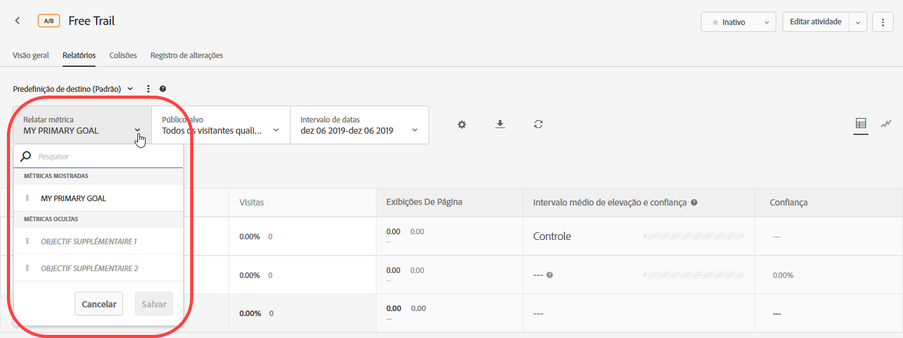
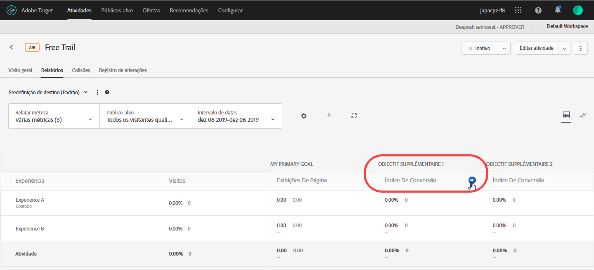
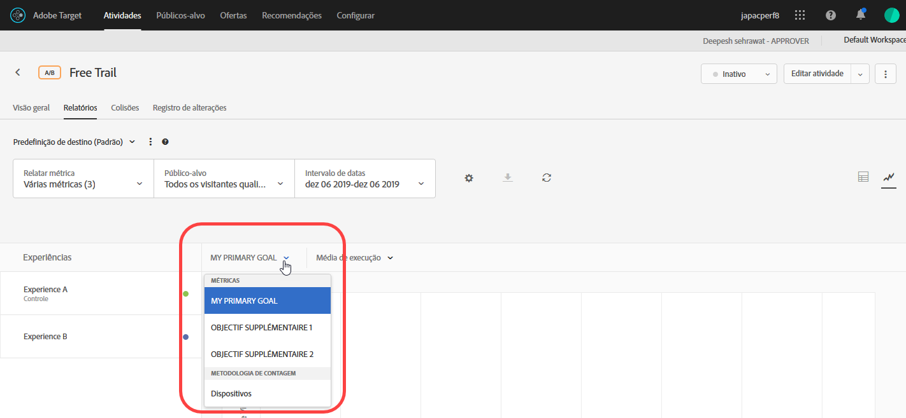

# Exibir várias métricas em um relatório{#view-multiple-metrics-in-a-report}

Você pode selecionar várias métricas para visualização em um relatório [!DNL Adobe Target].

Esteja ciente das seguintes informações ao trabalhar com várias métricas nos relatórios:

* A capacidade de visualização de várias métricas está disponível somente para atividades [A/B Test](/help/c-activities/t-test-ab/test-ab.md), [Autoalocação](/help/c-activities/automated-traffic-allocation/automated-traffic-allocation.md), [Público alvo automático](/help/c-activities/auto-target/auto-target-to-optimize.md) e [Direcionamento de experiência](/help/c-activities/t-experience-target/experience-target.md) (XT).
* Não é possível adicionar mais de 20 métricas a um relatório para uma atividade que use [Analytics para Público alvo](/help/c-integrating-target-with-mac/a4t/a4t.md) (A4T). Você pode adicionar quantas métricas você tiver na atividade aos relatórios de atividades que *não* usam A4T.
* Se você tiver selecionado várias métricas, não será possível usar a opção Baixar para baixar os relatórios em CSV. Você deve selecionar uma única métrica apenas para ativar a opção [!UICONTROL Baixar].
* Não é possível visualização de várias métricas para atividades criadas antes da versão [!DNL Target] de julho de 2015 (30 de julho de 2015).

**Para selecionar várias métricas para exibir no relatório:**

1. Para exibir um relatório, clique em **[!UICONTROL Atividades]**, clique na atividade desejada da lista e na guia **[!UICONTROL Relatórios.]**
1. Clique na lista suspensa **[!UICONTROL Métrica de relatório]** para exibir as listas [!UICONTROL Métricas exibidas] e [!UICONTROL Métricas ocultas].

   

   Você pode usar a caixa [!UICONTROL Pesquisar] para encontrar rapidamente as métricas disponíveis para adicionar à lista de [!UICONTROL Métricas exibidas].

   Observe que você pode selecionar várias métricas dos dois modos [!UICONTROL Exibição de tabela] e [!UICONTROL Exibição de gráfico] do relatório.

1. Passe o mouse sobre as métricas desejadas na lista [!UICONTROL Métricas ocultas], em seguida, clique em **[!UICONTROL Selecionar]** para movê-las para a lista [!UICONTROL Métricas exibidas].

   Ou

   Arraste e solte as métricas desejadas da lista [!UICONTROL Métricas ocultas] para a lista [!UICONTROL Métricas exibidas].

   Deve existir ao menos uma métrica na lista [!UICONTROL Métricas exibidas].

   Você pode reorganizar as métricas arrastando-as e soltando-as na ordem desejada na lista [!UICONTROL Métricas exibidas]. A ordem selecionada será refletida na [!UICONTROL Visualização de tabela] e [!UICONTROL Visualização de gráfico]. Para remover uma métrica da lista [!UICONTROL Métricas exibidas], passe o ponteiro do mouse sobre a métrica e clique no ícone **X**.

1. Clique em **[!UICONTROL Salvar]** ao concluir.
1. (Condicional) Ao visualizar o relatório na [!UICONTROL Visualização de tabela], passe o ponteiro do mouse sobre qualquer cabeçalho de coluna de métrica para exibir uma seta azul. Clique na seta para expandir a tabela e exibir o [!UICONTROL Aumento] e a [!UICONTROL Confiança] para essa métrica.

   

   Você pode expandir apenas uma métrica/coluna por vez. Clique na seta novamente para recolher as colunas.

1. (Condicional) Ao exibir o relatório na Visualização de gráfico, você pode selecionar métricas individuais para exibir na lista suspensa:

   

