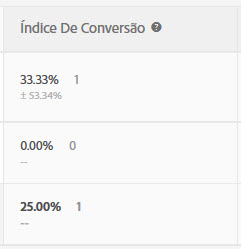

# Índice de conversão

A taxa de conversão, o incentivo, a confiança (significância estatística) e o intervalo de confiança são reportados para cada experiência.

A ilustração a seguir mostra o cabeçalho do gráfico para uma atividade de amostra com os cabeçalhos [!UICONTROL Índice de conversão], [!UICONTROL Aumento] e [!UICONTROL Confiança] destacados.

>[!NOTE]
>
>Em todos os dados, pedidos duplicados são ignorados se uma `orderID` for enviada. O relatório de auditoria relaciona os pedidos duplicados ignorados.

## Índice de conversão {#section_07A36846C4E84D0881906809B9CE5A74}

Mostra a taxa de conversão mediana, a confiança, o intervalo e o número de conversões.

Por exemplo, examine a seguinte coluna Índice de conversão do relatório:

A primeira linha é a experiência de controle. Mostra uma taxa de conversão de 15%, com três conversões. A segunda linha, Experiência B, mostra uma taxa de conversão de 15%, com um intervalo de confiança de aproximadamente 15,65% e três conversões.

>[!NOTE]
>
>No momento, o intervalo de confiança é calculado somente para métricas binárias.

## Aumento {#section_0F409572C720433D9378092ABC999982}

Compara o índice de conversão de cada experiência com a experiência de controle.

Aumento = (CR da experiência - CR de controle) / CR de controle

Se o controle for 0, não há aumento percentual.

## Confiança (significância estatística)   {#section_35DB6724813D40C7B0808DE18FE595C1}

Este número representa a probabilidade de que os resultados seriam duplicados se o teste fosse executado novamente. A confiança é arredondada para 100,00% sempre que for maior ou igual a 99,995%.

Consulte [Nível de confiança e intervalo de confiança](/help/c-reports/conversion-rate.md#concept_0D0002A1EBDF420E9C50E2A46F36629B).

## Dados de varejo {#section_30A674731BA6440E9BB93C421BE990EE}

Os dados de AOV, RPV e Vendas são exibidos para cada experiência se você inseriu uma mbox [de Pedido local](/help/c-implementing-target/c-implementing-target-for-client-side-web/t-mbox-download/orderconfirm-create.md) (`orderConfirmPage`) e a selecionou como a mbox de conversão.

## Nível de confiança e intervalo de confiança {#concept_0D0002A1EBDF420E9C50E2A46F36629B}

Para cada experiência, o nível de confiança e o intervalo de confiança são exibidos.

As conversões e as variáveis contínuas das métricas baseadas no Target, como métricas de receita e de envolvimento, são calculadas da seguinte forma:

* **Conversão:** sim ou não
* **Todos os outros:** valores em um intervalo

Você pode realizar cálculos offline para o for Target (A4T), mas isso exige uma etapa com as exportações de dados no [!DNL Analytics]Analytics. Para obter mais informações, consulte &quot;Execução de cálculos offline no Analytics for Target (A4T)&quot; abaixo.

### Nível de confiança {#section_26FE5E44BDD5478792A65FCFD83DCCDC}

O *nível de confiança* é representado pelo percentual mais escuro na coluna Índice de conversão para cada experiência.

  

O nível de confiança, ou significância estatística, indica qual a probabilidade de o sucesso de uma experiência não resultar de simples acaso. Um nível de confiança mais alto indica:

* Que o desempenho da experiência é significativamente diferente do controle.
* Que o desempenho da experiência não se deve somente a ruídos.
* Se você executar esse teste novamente, provavelmente você verá os mesmos resultados.

Se o nível de confiança for superior a 90% ou 95%, o resultado poderá ser considerado estatisticamente significativo. Antes de tomar decisões comerciais, tente esperar até o tamanho da amostra ser grande o suficiente e as quatro barras de confiança de uma ou mais experiências ficarem consistentes por um período contínuo para garantir que os resultados sejam estáveis.

>[!NOTE]
>
>A confiança é arredondada para 100,00% sempre que for maior ou igual a 99,995%.

### Intervalo de confiança {#section_F582738DFE1648C78B93D81EBC6CACF7}

>[!NOTE]
>
>No momento, o intervalo de confiança é calculado somente para métricas binárias.

O *intervalo de confiança* é uma faixa dentro da qual o valor real pode ser encontrado em um determinado nível de confiança. O intervalo de confiança aparece como um percentual aproximado cinza claro na coluna Índice de conversão. No exemplo abaixo, o intervalo de confiança para o incentivo da Experiência B é aproximadamente 15,65%.

**Exemplo:** o RPV de uma experiência é de US$ 10, seu nível de confiança é de 95% e seu **intervalo de confiança** é de US$ 5 a US$ 15. Se executarmos este teste diversas vezes, 95% das vezes o RPV seria entre US$ 5 e US$ 15.

**O que gera impacto sobre o intervalo de confiança?** A fórmula segue métodos estatísticos padrão para calcular intervalos de confiança.

* **Tamanho da amostra:** conforme a amostra aumenta, o intervalo diminui. Este é o método ideal, pois significa que os seus relatórios estão chegando mais perto do valor da métrica de sucesso.
* **Desvio padrão menor:** Resultados mais semelhantes, como AOVs semelhantes, números semelhantes ou visitantes convertidos a cada dia reduzem o desvio padrão.

## Cálculo de confiança e como executá-lo offline   {#section_86F7C231943043A5B8B6BFE67B706E3B}

O [download do relatório de CSV](/help/c-reports/downloading-data-in-csv-file.md#concept_3F276FF2BBB2499388F97451D6DE2E75) inclui apenas dados brutos e não inclui métricas calculadas, como receita por visitante, aumento ou confiança usada para testes A/B.

Para calcular essas métricas calculadas, baixe o arquivo do Excel [Calculadora de confiança completa](/help/assets/complete_confidence_calculator.xlsx) do Target para inserir o valor da atividade ou revise os [cálculos estatísticos usados pelo Target](/help/assets/statistical-calculations.pdf).

>[!NOTE]
>
>Essa calculadora é para relatórios baseados em Target e não para relatórios A4T.

## Realização de cálculos offline para Analytics for Adobe Target (A4T) {#section_B34BD016C8274C97AC9564F426B9607E}

Você pode realizar cálculos offline para o A4T, mas isso exige uma etapa com as exportações de dados no [!DNL Analytics].

Para o A4T, usamos um cálculo de teste t de Estudante para variáveis contínuas (em vez de métricas binárias). No Analytics, um visitante é sempre rastreado e todas as ações realizadas são contadas. Portanto, se o visitante comprar várias vezes ou visitar uma métrica de sucesso várias vezes, esses hits adicionais serão contados. Isso torna a métrica uma variável contínua. Para efetuar o cálculo do teste t de Estudante, é necessário a &quot;soma dos quadrados&quot; para calcular a variação, que é utilizada no denominador da estatística t. [Este documento explica os ](/help/assets/statistical-calculations.pdf) detalhes das fórmulas matemáticas usadas. A soma dos quadrados pode ser recuperada de [!DNL Analytics]. Para obter a soma dos dados dos quadrados, é necessário executar uma exportação no nível do visitante para a métrica para a qual você está otimizando, por um período de tempo de amostra.

Por exemplo, se você estiver otimizando para exibições de página por visitante, você exportaria uma amostra do número total de visualizações de página por visitante e por um período de tempo especificado, talvez alguns dias (alguns milhares de pontos de dados são tudo que você precisa). Você, então, elevaria ao quadrado de cada valor e somaria os totais (a ordem das operações é essencial aqui). Este valor de &quot;soma dos quadrados&quot; é então usado na Calculadora de confiança completa. Use a seção &quot;receita&quot; dessa planilha para esses valores.

**Para usar o recurso de exportação de dados do [!DNL Analytics] para fazer isso:**

1. Efetue logon no [!DNL Adobe Analytics].
1. Clique em **[!UICONTROL Ferramentas]** > **[!UICONTROL Data Warehouse]**.
1. Na guia **[!UICONTROL Solicitação de Data Warehouse]**, preencha os campos.

   Para obter mais informações sobre cada campo, consulte &quot;Descrições do Data Warehouse&quot; em [Data Warehouse](https://experienceleague.adobe.com/docs/analytics/export/data-warehouse/data-warehouse.html).

   | Campo | Instruções |
   |--- |--- |
   | Nome da solicitação | Especifique um nome para sua solicitação. |
   | Data de relatório | Especifique um período de tempo e granularidade. Como prática recomendada, escolha não mais que uma hora ou um dia de dados para sua primeira solicitação.  Os arquivos do Data Warehouse demoram mais para processar quanto mais longo for o tempo solicitado, por isso, é sempre uma prática recomendada solicitar primeiro um pequeno período de tempo para garantir que o arquivo retorne o resultado esperado. Em seguida, vá para o Gerenciador de solicitações, duplique sua solicitação e solicite mais dados pela segunda vez. Além disso, se você alternar a granularidade para algo diferente de &quot;Nenhum&quot;, o tamanho do arquivo aumentará drasticamente.  |
   | Segmentos disponíveis | Aplique um segmento, se necessário. |
   | Detalhamentos | Selecione as dimensões desejadas:   O padrão é pronto (OOTB), enquanto o Personalizado inclui eVars e props. Recomenda-se a utilização de &quot;ID de visitante&quot; se forem necessárias informações ao nível da ID de visitante, em vez de &quot;ID de visitante da Experience Cloud&quot;.<ul><li>ID do visitante é a ID final usada pelo Analytics. Ela será AID (se o cliente for legado) ou MID (se o cliente for novo ou tiver eliminado os cookies desde que o serviço de identificação de visitante do MC foi iniciado).</li><li>A ID de visitante da Experience Cloud só será definida para clientes novos ou com cookies eliminados desde que o serviço de ID de visitante do MC foi iniciado.</li></ul> |
   | Métricas | Selecione sua métrica desejada. O padrão é OOTB, enquanto o Personalizado inclui eventos personalizados. |
   | Visualização de Relatório | Revise suas configurações antes de agendar o relatório.  |
   | Agendar entrega | Digite um endereço de email para entregar o arquivo, nomeie o arquivo e selecione [!UICONTROL Enviar imediatamente]. Observação: o arquivo pode ser entregue via FTP em [!UICONTROL Opções avançadas de entrega] . |

1. Clique em **[!UICONTROL Solicitar esse relatório]**.

   A entrega do arquivo pode levar até 72 horas, dependendo da quantidade de dados solicitada. Você pode verificar o andamento de sua solicitação a qualquer momento clicando em [!UICONTROL Ferramentas] > [!UICONTROL Data Warehouse] > [!UICONTROL Gerenciador de solicitações].

   Se você deseja solicitar novamente os dados que solicitou no passado, você pode duplicar uma solicitação antiga do [!UICONTROL Gerenciador de solicitações,] conforme necessário.

Para obter mais informações sobre [!DNL Data Warehouse], consulte os seguintes links na documentação de ajuda do [!DNL Analytics]:

* [Criar uma solicitação do Data Warehouse](https://experienceleague.adobe.com/docs/analytics/export/data-warehouse/t-dw-create-request.html)
* [Práticas recomendadas do Data Warehouse](https://experienceleague.adobe.com/docs/analytics/export/data-warehouse/data-warehouse-bp.html)

## Metodologia de contagem {#concept_EC19BC897D66411BABAF2FA27BCE89AA}

É possível optar por exibir os relatórios por diferentes metodologias de contagem para entender como as suas atividades afetam os usuários durantes os ciclos de vida deles ou durante uma única sessão.

A metodologia de contagem é compatível com todos os outros tipos de atividade.

* Teste A/B

   Como exceção, as atividades A/B de Direcionamento automático são compatíveis apenas com a metodologia de contagem padrão &quot;Visita&quot;.

* Direcionamento de experiência (XT)
* Teste multivariado (MVT)

   Para o relatório de contribuição do Elemento MVT, o Target não suporta os tipos de Impressões de atividade para as métricas de receita.

* Recommendations

Somente a metodologia de contagem padrão (Visitas) é atualmente suportada para atividades de Personalização automatizada (AP).

Você pode visualizar relatórios pelas seguintes metodologias de contagem:

* **Visitante:** um participante único na atividade, pela duração da atividade.

   Uma pessoa será contada como um novo participante se visitar o site com um novo computador e um novo navegador, excluir o cookie ou converter e retornar para a atividade com o mesmo cookie. Um participante é identificado pela PCID no cookie mbox do visitante. Se o PCID mudar, a pessoa será considerada um novo visitante.

* **Visita:** um único participante em uma experiência durante uma sessão de navegador única de 30 minutos.

   Se uma conversão for alcançada ou um visitante retornar ao site após se ausentar por pelo menos 30 minutos, esse visitante será contado como um novo visitante. Uma visita é identificada pela `sessionID` do cookie da mbox do visitante. Quando a `sessionID` muda, a visita é considerada nova.

* **Impressão/Visualização da página:** contado cada vez que um visitante carrega qualquer página da atividade.

   Uma única visita pode incluir várias impressões de sua página inicial, por exemplo.

>[!NOTE]
>
>Normalmente, as contagens são determinadas por cookies e pela atividade da sessão. No entanto, se você alcançar o ponto de conversão final de uma atividade e, em seguida, entrar na atividade novamente, você será considerado um novo participante e uma nova visita à atividade. Isso é verdade mesmo se os valores PCID e `sessionID` não mudarem.

## Por que [!DNL Target] recomenda usar os testes t de Estudante? {#t-test}

Os testes A/B são experimentos para comparar o valor médio de alguma métrica comercial em uma variante de controle (também conhecida como experiência) com o valor médio dessa mesma métrica em uma ou mais experiências alternativas.

[!DNL Target] A recomenda o uso de dois testes [ t de ](https://en.wikipedia.org/wiki/Student%27s_t-test#:~:text=The%20t%2Dtest%20is%20any,the%20test%20statistic%20were%20known.)Estudante de amostra, pois eles exigem menos suposições do que alternativas como testes z, e são o teste estatístico adequado para fazer comparações emparelhadas de métricas de negócios (quantitativas) entre experiências de controle e experiências alternativas.

### Mais detalhes

Ao executar testes A/B online, cada usuário/visitante é atribuído aleatoriamente a uma única variante. Posteriormente, fazemos medições das métricas de negócios de interesse (por exemplo, conversões, pedidos, receita etc.) para visitantes em cada variante. O teste estatístico que usamos então testa a hipótese de que a métrica média de negócios (por exemplo, taxa de conversão, pedidos por usuário, receita por usuário etc.) é igual para o controle e uma determinada variante alternativa.

Embora a própria métrica de negócios possa ser distribuída de acordo com alguma distribuição arbitrária, a distribuição da média dessa métrica (em cada variante) deve convergir para uma distribuição normal por meio do [Teorema de limite central](https://en.wikipedia.org/wiki/Central_limit_theorem). Observe que, embora não haja garantia de quão rapidamente essa distribuição de amostragem da média se converterá ao normal, essa condição normalmente é alcançada devido à escala de visitantes em testes online.

Dada esta normalidade da média, pode-se demonstrar que a estatística de teste a ser usada segue uma distribuição t, porque é a proporção de um valor normalmente distribuído (a diferença em meios da métrica de negócios) para um termo de escala com base em uma estimativa a partir dos dados (o erro padrão da diferença em meios). O **t-test do aluno** é então o teste de hipótese apropriado, dado que a estatística de teste segue uma distribuição t.

### Por que outros testes não são usados?

Um **z-test** é inadequado porque, no cenário de teste A/B típico, o denominador da estatística de teste não é derivado de uma variação conhecida e, em vez disso, deve ser estimado a partir dos dados.

**Os** testes &quot;Qui-quadrado&quot; não são utilizados porque são adequados para determinar se existe uma relação qualitativa entre duas variantes (ou seja, uma hipótese nula de que não há diferença entre variantes). Os testes T são mais adequados para o cenário de _comparação quantitativa_ de métricas.

O **Mann-Whitney U test** é um teste não paramétrico, que é adequado quando a distribuição de amostras da métrica média de negócios (para cada variante) não é normalmente distribuída. No entanto, como discutido anteriormente, dada a magnitude do tráfego envolvido em testes online, o Teorema do Limite Central normalmente se aplica, e assim o teste t pode ser aplicado com segurança.

Métodos mais complexos, como **ANOVA** (que generalizam os testes t para mais de duas variantes) podem ser aplicados quando um teste tem mais de duas experiências (&quot;Testes A/Bn&quot;). No entanto, a ANOVA responde à pergunta &quot;se todas as variantes têm a mesma média&quot;, enquanto no teste A/Bn típico estamos mais interessados em _qual variante específica_ é melhor. Em [!DNL Target], portanto, aplicamos testes t regulares comparando cada variante a um controle, com uma correção de Bonferroni para considerar várias comparações.
