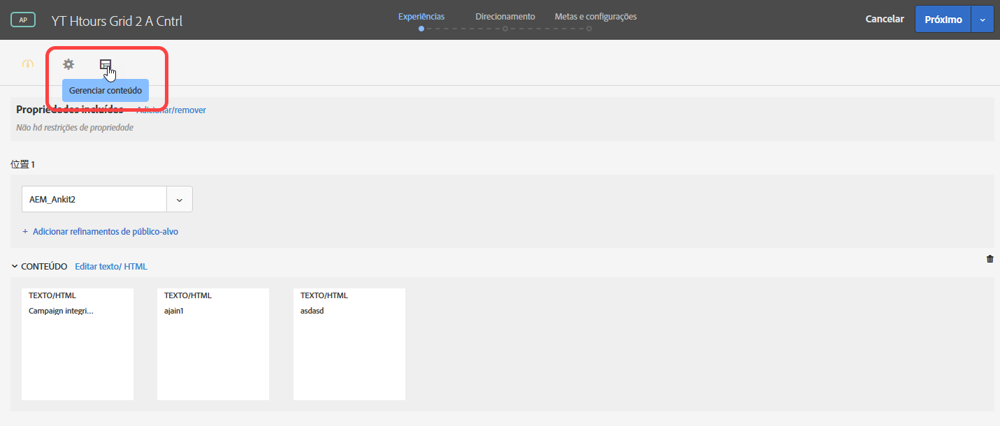
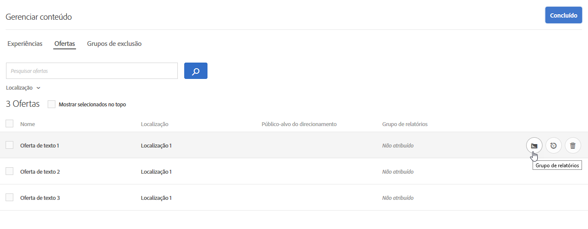
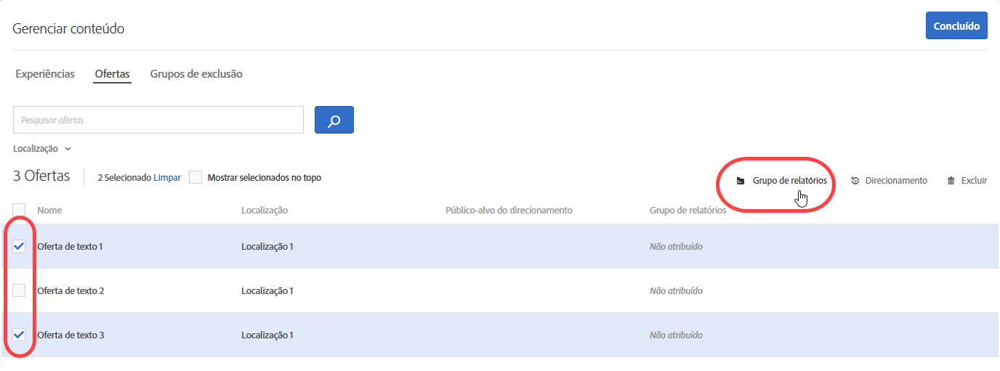
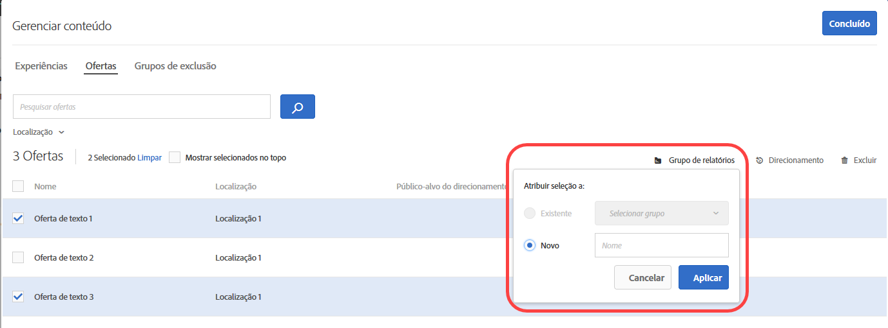

#  Oferecer grupos de relatório na personalização automatizada{#offer-reporting-groups-in-automated-personalization}

Informações sobre como usar grupos de relatórios em [Automated Personalization](/help/c-activities/t-automated-personalization/automated-personalization.md) (AP) atividades.

Os grupos de relatórios executam duas funções-chave:

* Eles permitem ver suas ofertas agrupadas em relatórios de atividade AP.
* Eles desempenham um papel fundamental com o funcionamento dos modelos de personalização [!DNL Target].

Quando você usa grupos de relatórios, [!DNL Target] cria apenas um modelo de personalização para cada grupo de relatórios, em vez de cada oferta na atividade AP, usando os dados de todas as ofertas desse grupo.

Se a configuração da atividade não tiver dados suficientes para criar um modelo de personalização por oferta, os grupos de relatórios poderão ajudar a reduzir os requisitos de dados para usar a Personalização automatizada. Os grupos de relatórios também podem ajudar a resolver o problema de &quot;inicialização imediata&quot; para novas ofertas, agrupando ofertas semelhantes para que cada modelo receba mais dados para treinar. Os grupos de modelagem também podem ser usados para atividades em que novas ofertas estão sendo introduzidas regularmente na atividade de AP.

Essa abordagem funciona bem se os visitantes responderem da mesma maneira a todas as ofertas de um grupo. A prática recomendada é agrupar as ofertas nas quais grupos semelhantes de visitantes respondem de maneira similar. Ou seja, agrupe ofertas com taxas de conversão semelhantes. Você nunca deve colocar todas as ofertas em um único grupo de relatórios. Agrupar todas as ofertas ou agrupar ofertas com taxas de conversão muito diferentes provavelmente reduz a eficácia dos modelos de personalização [!DNL Target].

>[!NOTE]
>
>Se uma oferta for removida ou substituída de um determinado grupo de modelagem, o tráfego antigo que visualizou essa oferta específica também será excluído do grupo de modelagem. Em outras palavras, ofertas excluídas não contribuem para os dados usados para os modelos de personalização [!DNL Target] aprender.

**Para configurar grupos de relatórios:**

1. Na página [!UICONTROL Experiências] de uma atividade AP, clique no ícone **[!UICONTROL Gerenciar conteúdo]**.

   

1. Clique na guia **[!UICONTROL Ofertas]** na parte superior da caixa de diálogo [!UICONTROL Gerenciar conteúdo].
1. (Condicional) Adicione experiências específicas a um grupo de relatórios, passando o mouse sobre a oferta desejada e clicando no ícone da pasta **[!UICONTROL Grupo de relatórios]**.

   

1. (Condicional) Adicione experiências em lote a um grupo de relatórios, marcando a caixa de seleção das experiências relevantes e clicando no ícone da pasta **[!UICONTROL Grupo de relatórios]** no canto superior direito da caixa de diálogo.

   

1. (Condicional) Para atribuir a oferta selecionada a um grupo de relatórios existente, selecione **[!UICONTROL Existente]**, selecione o grupo de relatórios desejado na lista suspensa e clique em **[!UICONTROL Aplicar]**.

   Ou

   Para criar um novo grupo de relatórios para atribuir a oferta selecionada, selecione **[!UICONTROL Novo]**, nomeie o novo grupo de relatórios e clique em **[!UICONTROL Aplicar]**.

   

