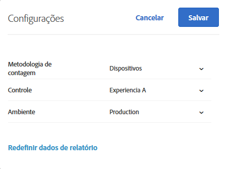

# Perguntas frequentes de geração de relatórios{#reporting-faq}

Lista de perguntas frequentes sobre relatórios no Target.

## Por que os números de visitas diminuem no Target em vez de em outras soluções da Experience Cloud? {#section_7E626FDB417E41B8B58BBF30FB207409}

Os números métricos, por exemplos, visitas, informados pelo [!DNL Target] sempre serão menores que os números informados em outras soluções da [!DNL Experience Cloud] por vários motivos:

* O [!DNL Target] conta visitas somente para visitantes que se qualificaram para a atividade. Outra soluções contam as visitas de visitantes que exibem a página, independentemente de qual atividade os levou à página.
* Pode haver uma situação em que diferentes atividades competem pelo mesmo local (mutuamente exclusivo). Como resultado, os visitantes visualizam diferentes conteúdos em uma página da Web, afetando os números de métrica informados pelo [!DNL Target].

## Por que não há dados disponíveis para o meu relatório de atividade? {#section_E4722F6445884130951DF79981C8289B}

Se um conteúdo de atividade foi entregue com sucesso aos usuários, mas o relatório não contiver dados, certifique-se de que você tenha o ambiente correto (grupo de hosts) selecionado nas configurações do relatório.

Se você tem um ambiente de desenvolvimento selecionado, pode ver a seguinte mensagem de erro: &quot;Não há dados disponíveis para as configurações de relatório selecionadas&quot;.

Para alterar o ambiente de um relatório de atividade:

1. Clique em **[!UICONTROL Atividades]**, clique na atividade desejada da lista, em seguida, clique na guia **Relatórios[!UICONTROL .]**
1. Clique no ícone de engrenagem para configurar o relatório.

   

   >[!NOTE]
   >
   >O ícone de engrenagem não está disponível para os relatórios de Personalização automatizada.

1. Na lista suspensa **[!UICONTROL Ambiente]**, selecione **[!UICONTROL Produção]**.

   Os dados de relatório podem não estar disponíveis se você tem um ambiente de desenvolvimento selecionado.

1. Clique em **[!UICONTROL Salvar configurações]**.

Para obter mais informações sobre os ambientes, consulte [Hosts](../administrating-target/hosts.md#concept_516BB01EBFBD4449AB03940D31AEB66E).
