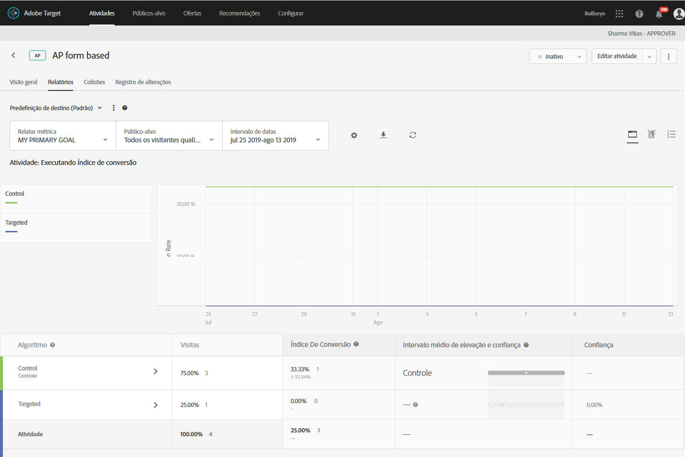

#  Relatórios de resumo da personalização automatizada{#automated-personalization-summary-reports}

Relatórios especializados estão disponíveis para usuários de Personalização automatizada.

>[!NOTE]
>
>A Personalização automatizada está disponível como parte da solução do [!DNL Target Premium]. Ela não está incluída no [!DNL Target Standard] como uma licença do [!DNL Target Premium].

1. Clique em **[!UICONTROL Atividades]**, clique na atividade desejada de [!UICONTROL Personalização automatizada] da lista, em seguida, clique na guia **Relatórios[!UICONTROL .]**

   Se você tiver muitas atividades, pode filtrar a lista ao selecionar [!UICONTROL Personalização automatizada] na lista suspensa [!UICONTROL Tipo].

1. (Opcional) Clique no ícone de [!UICONTROL Baixar] para baixar a exibição resumida (por exemplo, comparação de tráfego de Controle e Direcionado) conforme detalhado por todas as métricas de sucesso disponíveis.

>[!NOTE]
>
>O ícone [!UICONTROL Configurações] não está disponível para os relatórios de [!UICONTROL Personalização automatizada].

[!UICONTROL Personalização automatizada] fornece os relatórios a seguir:

## Relatório de nível de atividade {#section_6F72FC5C790B4492B3DCECBFFA971337}

O relatório [!UICONTROL Nível de atividade] compara o desempenho agregado de usar um algoritmo de [!UICONTROL Personalização automatizada] para um conteúdo veiculado aleatoriamente (controle).

As regras padrão da interpretação de resultados do teste A/B ainda são aplicáveis, incluindo incentivo, confiança, tendência, duração e assim por diante. Para obter mais informações sobre a interpretação de resultados, consulte [Sobre o Índice de conversão](../c-reports/conversion-rate.md#concept_2D9FEDE8F94A485DAC86D611BFBDC844).

## Relatório de nível de oferta {#section_CAA6409879E349C6906E2BE8156D87A1}

O relatório [!UICONTROL Nível da oferta] para a experiência Random Forest compara o desempenho de cada algoritmo aplicado à oferta à mesma oferta veiculada aleatoriamente (Controle). Portanto, as ofertas não devem ser comparadas entre si nessa exibição. No exemplo abaixo, pode ser declarado que a Oferta D exibe um incentivo de 12,43% quando veiculada de acordo com a lógica do algoritmo (Random Forest) em oposição ao modo aleatório (Controle).

Clique no algoritmo de experiência (Random Forest ou controle) para visualizar o relatório de Nível de oferta.

As ofertas podem ser mostradas em grupos de relatórios, e esses grupos de relatórios podem ser recolhidos e expandidos. Selecione [!UICONTROL Grupo de relatórios] na lista suspensa para exibir as informações com roll-up, em vez das ofertas.

>[!NOTE]
>
>O ícone de relógio indica que o modelo de algoritmo ainda está sendo criado. O ícone de marca de verificação indica que o algoritmo de base foi estabelecido.

