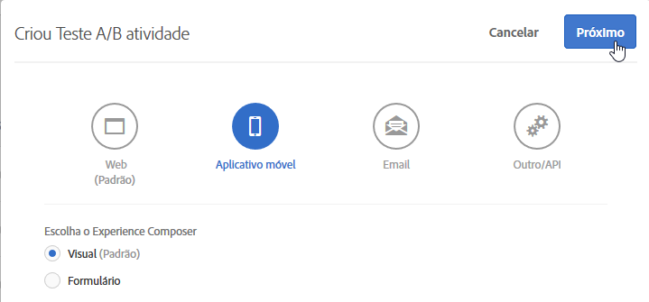

# Aplicativo para dispositivos móveis no Visual Experience Composer{#mobile-app-visual-experience-composer}

O Visual Experience Composer (VEC) para aplicativos móveis nativos permite criar atividades e personalizar o conteúdo de maneira autônoma, sem dependências de desenvolvimento contínuas e ciclos de lançamento de aplicativos.

O [Visual Experience Composer](../../c-experiences/experiences.md#section_34265986611B4AB8A0E4D6ACC25EF91D) existente fornece um recurso do tipo "faça você mesmo" para criar atividades e personalizar experiências que podem ser entregues dinamicamente às suas propriedades da Web, por meio da mbox global do Target, sem nenhuma intervenção do desenvolvedor. Agora você pode aproveitar o VEC para fazer o mesmo para os aplicativos móveis nativos. O VEC para aplicativos móveis, disponível em [AEP SDK v5](https://aep-sdks.gitbook.io/docs/using-mobile-extensions/adobe-target-vec), pode ser usado para criar atividades de [Teste A/B](/help/c-activities/t-test-ab/test-ab.md) e [Direcionamento de experiência (XT)](/help/c-activities/t-experience-target/experience-target.md) para aplicativos móveis. Compatibilidade com outros tipos de atividade estará disponível no futuro.

O VEC para aplicativos móveis é compatível com os navegadores listados em [Navegadores suportados](../../c-implementing-target/c-considerations-before-you-implement-target/supported-browsers.md#reference_01B4BF99E7D545A7998773202A2F6100).

## Uso do Visual Experience Composer nos aplicativos móveis {#using-the-mobile-vec}

A seguinte ilustração representa o processo de uso do VEC para aplicativos móveis:

| Processo | Detalhes |
|--- |--- |
| Pareamento | Autorize com segurança o aplicativo móvel e o dispositivo para funcionarem com o Target. Esta etapa é necessária apenas uma vez para um dispositivo. |
| Criação | Crie uma  [Atividade do Target](/help/c-activities/activities.md), como visualização em tempo real das ações realizadas na interface do usuário do Target. |
| Entrega | O Target entrega atividades automaticamente no aplicativo nativo para dispositivos móveis. |

**Pareamento:**

O VEC para aplicativos móveis se conecta em tempo real ao aplicativo para aplicativo móvel do profissional de marketing para a criação de atividades do Target. Para habilitar isso, o primeiro passo é parear com segurança (autorizar) o dispositivo e o aplicativo móvel ao Target.

1. Ao criar uma atividade de Teste A/B, por exemplo, selecione **[!UICONTROL Aplicativo para dispositivos móveis]**, selecione **[!UICONTROL Visual (padrão)]**, depois clique em **[!UICONTROL Próximo]**.

   

1. Insira o URL do aplicativo, depois clique em **[!UICONTROL Criar deep link]**.

   

O processo de pareamento contém as etapas a seguir:

1. Insira o esquema do URL do aplicativo que pode ser usado para gerar um deep link. Um deep link típico se parece com:

   `mymobileapp://path?params`

1. O deep link está disponível como um código QR ou um URL. Os usuários podem ler o código QR do telefone ou enviar por email/mensagem o URL para eles mesmos. O URL do deep link tem um token de autorização usado para parear com segurança o aplicativo para dispositivos móveis e o dispositivo móvel ao Target.
1. Abrir o URL do deep link no seu dispositivo móvel. Isso inicia o aplicativo móvel. O SDK identifica que o aplicativo foi inicializado para o pareamento e a criação no VEC.

   O SDK faz uma solicitação ao servidor do Target e se registra. O servidor do Target autoriza o token e estabelece uma conexão em tempo real com o dispositivo (por meio de soquetes da Web atualmente).

   Após a conexão ser estabelecida, uma exibição em tempo real do aplicativo aparece na interface do Target. O aplicativo tem um contorno vermelho em sobreposição que é um indicador de que o aplicativo está conectado com o Target, como mostrado na ilustração abaixo.

   

   Os dispositivos que já estão pareados podem ser reconectados ao inicializar o aplicativo e abrir a interface de criação.

**Criação:**

Após o aplicativo estar conectado e uma exibição em tempo real do aplicativo aparecer no VEC, é possível começar a criar a sua atividade. Nesse momento, as seguintes ações são compatíveis:

| Ação | Detalhes |
|--- |--- |
| Trocar imagem | Troque uma imagem por outra selecionando uma oferta de imagem diferente ou configurando diretamente o URL de CDN de uma imagem. As ofertas de imagem no Target são veiculadas pelo [Adobe Scene7](/help/administrating-target/scene7-settings.md). |
| Alterar texto | Altere o conteúdo, a cor ou o tamanho da fonte do texto em um elemento de texto, botão ou rótulo. |
| Alterar plano de fundo | Altere o conteúdo ou o plano de fundo do elemento para uma área de texto ou botão. |

As ações realizadas no VEC são visíveis em tempo real no aplicativo, o que permite uma capacidade de visualização em tempo real durante a criação. As ações estão associadas a Telas ou Exibições relevantes para dispositivos móveis e estão associadas de maneira adequada.

**Gerenciar várias versões do aplicativo**

Quando uma nova versão do aplicativo é detectada, você é notificado de que a versão do aplicativo foi adicionada à lista de versões direcionadas.

Várias versões de aplicativos móveis podem ser adicionadas e removidas manualmente da caixa de diálogo [!UICONTROL Gerenciar versões] .

## Exibições do Target e aplicativos móveis {#target-views}

O VEC para aplicativos móveis aproveita um novo conceito de Exibições: um grupo lógico de elementos visuais que juntos constituem uma experiência em um aplicativo móvel.

**Introdução às exibições do Target**

Considere um aplicativo de compras de flores como exemplo. O aplicativo permite que os usuários realizem as tarefas a seguir:

* Listar as flores e os buquês disponíveis
* Exibir detalhes
* Pedir flores
* Controlar configurações, como opções de pagamento e endereços

Neste aplicativo, cada uma dessas tarefas pode ser realizada em uma tela diferente do aplicativo para dispositivos móveis. Enquanto os usuários navegam pelo aplicativo, uma tela é renderizada que permite a eles realizar uma das tarefas a seguir. Se você é um desenvolvedor Android, estará mais propenso a criar quatro Classes de atividade do Android diferentes com cada classe associada a uma dessas tarefas.

Nesse caso, cada uma dessas tarefas pode ser considerada como Exibições pelas quais o seu aplicativo para dispositivos móveis transita. Nos referiremos a elas como Exibições do Target - cada uma caracterizada exclusivamente. Uma Exibição do Target, ou Exibição em síntese, é um contêiner lógico de elementos visuais que são exibidos na tela dos dispositivos móveis. Exemplos de uma Exibição são uma tela ou uma Classe de atividade do Android.

Aplicativos para dispositivos móveis raramente são tão simples. Vamos torná-lo um pouco mais realista. Na primeira tarefa, a que lista as flores e buquês disponíveis, vamos adicionar a capacidade de criar vários layouts e, portanto, telas diferentes. Por exemplo, vamos adicionar um recurso de "Classificar por" que tenha três opções:

* Por popularidade
* Preço - baixo para alto
* Preço - alto para baixo

Neste exemplo, sempre que um usuário selecionar uma opção "Ordenar por" diferente, uma nova tela é exibida, mesmo quando a Classe de atividade é a mesma. Cada uma dessas telas pode assim ser considerada uma Exibição do Target diferente.

Como profissional de marketing, você tem interesse em criar experiências diferentes e executar ofertas distintas em cada uma dessas exibições, sem pedir aos seus desenvolvedores que configurem mboxes locais ou passem por um ciclo de lançamento de aplicativos.

## Configuração do VEC para aplicativos móveis no Target{#setting-up}

Os desenvolvedores devem fazer o seguinte para ativar o VEC para aplicativos móveis:

* Configurar a extensão VEC do Adobe Target no Launch
   * A extensão VEC depende da [extensão do Adobe Target](/help/c-implementing-target/c-implementing-target-for-client-side-web/how-to-deployatjs/cmp-implementing-target-using-adobe-launch.md). Verifique se a extensão do Adobe Target já está configurada e ativada.
* Adicione a extensão VEC do Target ao seu aplicativo.
   * [Android - Configuração do aplicativo móvel](/help/c-target-mobile-app/c-mobile-visual-experience-composer/mobile-visual-experience-composer-android.md)
   * [iOS - Configuração do aplicativo móvel](/help/c-target-mobile-app/c-mobile-visual-experience-composer/mobile-visual-experience-composer-ios.md)

## Métodos de implementação para o VEC do Target

A extensão VEC do Target recupera as experiências relevantes do Target para seu aplicativo por meio de uma solicitação de rede. As ofertas são recuperadas por meio dessa chamada de rede e aplicadas automaticamente nas telas direcionadas. Nenhuma solicitação de rede subsequente é feita para recuperar as experiências do VEC enquanto o usuário navega por várias telas do aplicativo.

O comportamento padrão da extensão é fazer uma solicitação de rede síncrona (chamada de bloqueio) no momento da inicialização do aplicativo. Você pode usar o Launch para controlar o comportamento dessa solicitação de rede para responder ao comportamento do aplicativo.

### Buscar automaticamente atividades do Target

Esse é o comportamento padrão em que uma solicitação de rede é iniciada automaticamente pela extensão VEC do Target. Você pode usar uma das seguintes opções para tornar essa solicitação uma chamada de bloqueio ou uma solicitação assíncrona.

* Buscar uma chamada síncrona (o plano de fundo está DESATIVADO)

   Quando selecionada, a extensão VEC do Target faz uma solicitação de rede como chamada de bloqueio na inicialização do aplicativo. As ofertas são aplicadas imediatamente e não há cintilação no aplicativo. Esse é o comportamento padrão da extensão.

* Buscar uma chamada assíncrona (o plano de fundo está ATIVADO)

   Quando selecionada, a extensão VEC do Target faz uma solicitação de rede em segundo plano na inicialização do aplicativo, mas não bloqueia o carregamento do aplicativo. Se as experiências forem criadas na tela inicial do aplicativo, as ofertas poderão não se aplicar à tela inicial se a ela for renderizada antes da conclusão da chamada. A renderização da tela do aplicativo é geralmente identificada pelos eventos de ciclo de vida `didFinishLaunchingWithOptions` e `onActivityResumed` no iOS e Android, respectivamente. As ofertas se aplicam automaticamente em todas as telas subsequentes.

### Buscar atividades do Target programaticamente

Você pode desativar a solicitação de rede automática da extensão VEC do Target e decidir fazer uma chamada programática de API da extensão. Isso fornece aos desenvolvedores controle sobre como integrar as ofertas de VEC do Target no aplicativo. A extensão VEC do Target tem dois métodos estáticos, `prefetchOffers` e `prefetchOffersBackground`, que podem ser usados para recuperar programaticamente ofertas de VEC do Target.

* O método do `prefetchOffers` oculta a tela atual até que as ofertas de VEC do Target sejam buscadas. As ofertas são aplicadas automaticamente à tela atual, se aplicável, e a tela fica visível novamente.
* O método do `prefetchOffersBackground` não oculta a tela atual e é feita uma chamada para recuperar as ofertas do Target relevantes. As ofertas do Target *não* são aplicadas à tela atual e não há cintilação. Conforme o usuário navega para telas subsequentes, as ofertas são aplicadas automaticamente, se aplicável.

### Lidar com as restrições do espaço de trabalho do Target

É possível definir o valor do `at_property` para o espaço de trabalho usando a interface do Launch. Isso garante que apenas as atividades nesse espaço de trabalho sejam entregues ao Aplicativo móvel.

## Orientações gerais para as chamadas de API do Target {#section_C7276795F02540DCA230AEEDF882A833}

Para adicionar Exibições do Target de maneira adequada, aqui está uma tabela simples que delineia as localizações corretas de onde colocar as chamadas a `targetView`:

| Localização aceitável para TargetView | Sob as adições corretas |
|--- |--- |
| No final do `Activity::onStart`, `Activity::onResume` | Fica a cargo do desenvolvedor se ele considera `OnStart` e `OnResume` como sendo as mesmas ou diferentes `targetViews`. Se forem as mesmas, use o mesmo `viewName`. Se forem diferentes, use `viewNames` diferentes. Estes eventos são automaticamente adicionados pelo SDK. |
| Imediatamente após uma chamada a `Activity::SetContent` | Se a interface do usuário não mudar, podemos inserir uma chamada de `targetView`. |
| Dentro do `View::willAppear` | Se a exibição selecionada for mostrada exclusivamente em uma hierarquia de exibição específica. |
| Imediatamente após uma chamada a `Activity::SetContentView` | Se a atividade não altera/corrige qualquer conteúdo no código a seguir. |

Para o Android, aqui está uma tabela com as localizações incorretas onde colocar as chamadas a `targetView`:

| Localização de TargetView inaceitável | Motivo |
|--- |--- |
| Dentro de `Activity::onCreate` | A atividade foi criada, mas não há garantias de que a exibição associada à atividade foi concluída e/ou anexada à janela. Este posicionamento pode fazer com que a tela de criação não seja amostrada ou seja amostrada de maneira incompleta e/ou as ofertas sejam aplicadas de uma maneira não determinística. |
| Dentro do `View::didAppear` | A exibição já apareceu e o aplicativo da oferta criará uma experiência ruim na interface do usuário com tremulação. |
| Dentro do `View::didLoad` | A exibição não é anexada à hierarquia de exibição principal e pode estar instanciada, mas não há garantias de que será mostrada na interface do usuário do aplicativo. |

## Entrega {#delivery}

As atividades do Target criadas com o VEC para aplicativos móveis são automaticamente entregues nos aplicativos móveis. Essas atividades são buscadas previamente durante a inicialização do aplicativo (com base na configuração de inicialização) e aplicadas enquanto o usuário navega pelas diferentes Exibições do Target, muitas vezes mapeadas diretamente nas telas.

Ao chamar o método de API do `TargetVEC.prefetchOffersBackground()`, as ofertas do Target são buscadas no Target Edge e armazenadas em cache localmente. Isso permite uma experiência do usuário mais estável, já que as ofertas do Target são aplicadas imediatamente do cache com o acionamento das exibições do Target com `targetView()`, em vez de serem buscadas pela rede.

Para maior flexibilidade, você também pode chamar a API do `TargetVEC.prefetchOffers()`, que pré-oculta o layout atual até que as ofertas do Target sejam buscadas previamente e aplicadas para mostrar a Exibição do Target (possivelmente causando cintilação).

O `TargetVEC.prefetchOffersBackground()` também pode ser chamado repetidamente enquanto o usuário navega em um aplicativo do cliente, para atualizar o cache de oferta local do Target com o conteúdo mais apropriado (seguindo as atualizações mais recentes do perfil do usuário do Target atual).

Observe que, sempre que as ofertas do Target forem previamente buscadas, se possível, também serão aplicadas as ofertas de exibição do Target acionadas com `AdobeTargetMobile.targetView()`.

## Solução de problemas {#ts}

**O VEC para aplicativos móveis informa que o aplicativo se desconectou.**

Sua conexão com a Internet deve ter caído. Reinicie o aplicativo após a Internet estar disponível novamente e uma nova conexão será estabelecida. Recomendamos a criação de uma atividade de VEC para aplicativos móveis em uma conexão Wi-Fi.

**O VEC para aplicativos móveis não está sincronizado com o meu aplicativo móvel.**

Clique no botão [!UICONTROL Atualizar] no VEC para sincronizar a exibição.

## Limitações conhecidas {#limitations}

* O VEC para aplicativos móveis pode ser usado atualmente para criar atividades de [Teste A/B](/help/c-activities/t-test-ab/test-ab.md) e [Direcionamento de experiência (XT)](/help/c-activities/t-experience-target/experience-target.md) para aplicativos móveis. Compatibilidade com outros tipos de atividade estará disponível no futuro.
* Ao tentar reconectar o aplicativo ao VEC para aplicativos móveis, você deve sair completamente do aplicativo e reiniciá-lo.

   Se o aplicativo móvel já estiver aberto durante qualquer um dos cenários listados abaixo, feche-o e reabra-o. No entanto, você *deve* fechar o aplicativo na seção de aplicativos recentes e *não* pressionando o botão Voltar. Se o aplicativo for fechado pressionando o botão Voltar, pode haver problemas de conexão intermitente.

   Há várias situações em que você deve reiniciar o aplicativo para se conectar ao VEC para aplicativos móveis, se o aplicativo já estiver aberto:

   * Ao criar uma nova atividade, após selecionar o aplicativo móvel, a caixa de diálogo da lista de dispositivos é exibida. Se o aplicativo já estiver aberto, feche-o e reinicie-o para que o dispositivo seja mostrado como disponível para seleção.
   * A caixa de diálogo do dispositivo é exibida ao iniciar a edição de uma atividade. Se o aplicativo já estiver aberto, feche-o e reinicie-o para que o dispositivo seja mostrado como disponível para seleção.
   * A caixa de diálogo do dispositivo é exibida ao navegar da etapa "Metas e configurações" de volta para a etapa "Criação" (Etapa 1). Se o aplicativo já estiver aberto, feche-o e reinicie-o para se conectar novamente ao VEC para aplicativos móveis.
   Certifique-se de fechar o aplicativo na seção de aplicativos recentes e não pressionando o botão [!UICONTROL Voltar.]

## Vídeo de treinamento: Adobe Target Mobile App Visual Experience Composer (3:33) {#video}

>[!VIDEO](https://video.tv.adobe.com/v/27528?captions=por_br)