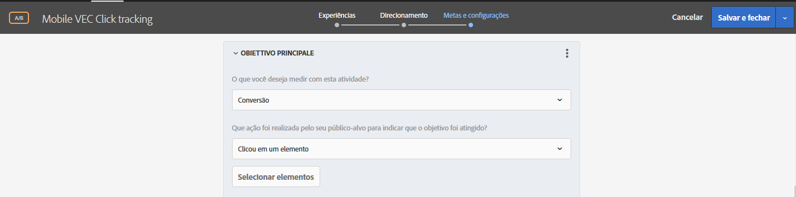
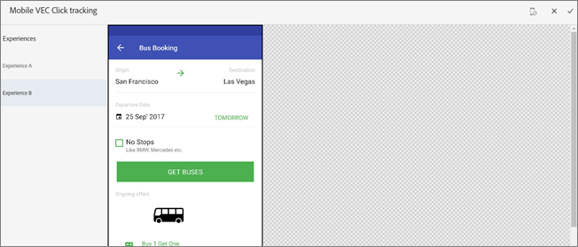

# Configurar o rastreamento de cliques no VEC para aplicativos móveis{#set-up-click-tracking-in-the-mobile-vec}

O VEC para aplicativos móveis oferece suporte à configuração de metas de rastreamento de cliques para atividades do [!DNL Target].

1. Ao definir suas metas na página Metas e configurações para a atividade, selecione a métrica de sucesso de [!UICONTROL Conversão].

   

1. Para ação, selecione **[!UICONTROL Clicou em um elemento]** e clique em **[!UICONTROL Selecionar elementos]**.

   Seu aplicativo móvel é aberto no Visual Experience Composer (VEC).

   

1. Selecione os elementos que deseja rastrear.

   Consulte a seção [!UICONTROL Considerações] abaixo para obter dicas sobre como selecionar elementos.

   

1. Clique na marca de seleção na parte superior da tela para salvar suas seleções.

Você também pode editar e alterar as seleções de cliques ou excluí-las se precisar começar do zero.

Quando um participante da atividade clica em um elemento selecionado, esse clique é contado como uma conversão.

## Considerações {#considerations}

Há várias coisas a considerar ao selecionar elementos:

* Quando mais de um elemento é selecionado e um visitante clica em um desses elementos, o clique é contabilizado. Para contabilizar cada item separadamente, configure métricas de sucesso individuais para cada elemento.
* Os eventos de clique são enviados para o Target assim que o usuário clica no elemento.
* No VEC para aplicativos móveis, somente os elementos com um manipulador de cliques anexado podem ser selecionados.
* Você pode navegar para qualquer seção do aplicativo, mas certifique-se de que as [exibições](/help/c-target-mobile-app/c-mobile-visual-experience-composer/mobile-visual-experience-composer.md#target-views) estejam definidas para a seção em que você está selecionando elementos para o rastreamento de cliques.
* Ao editar uma atividade, se o dispositivo já estiver selecionado na Etapa 1, não será necessário selecionar o dispositivo novamente. No entanto, se você chegar diretamente na página de rastreamento de cliques, será exibida a tela de seleção de dispositivos para selecionar um dispositivo autorizado.
* Um painel Modificações é exibido no VEC do aplicativo móvel que exibe os elementos configurados para rastreamento de cliques.

   