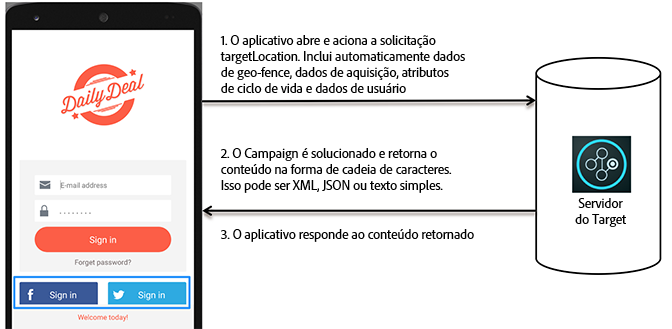

# Como o Target funciona em aplicativos móveis{#how-target-works-in-mobile-apps}

O Adobe Mobile SDK entra em contato com o servidor do Target para obter o conteúdo juntamente com outros pontos de dados, para mostrar a experiência correta ao usuário.

## Locais direcionados e métricas de sucesso   {#section_A08AAB0ABA9C4568A5AFD4D27EF1CE74}

Uma *localização direcionada* também é conhecida como uma  mbox. Uma localização identificada no aplicativo é ativada para teste ou personalização (por exemplo, mensagem de boas vindas na tela inicial). Essas localizações são identificadas durante o processo de criação de teste.

Um *[métrica de sucesso](/help/c-activities/r-success-metrics/success-metrics.md#reference_D011575C85DA48E989A244593D9B9924)* é uma ação realizada pelo usuário que identifica se uma atividade específica foi bem-sucedida (como se conectar, fazer uma compra, reservar uma passagem e assim por diante).

* **Localização direcionada:** o conteúdo mostrado abaixo do botão de registro.

   Esse usuário específico tem frete grátis até às 18h. Essa localização pode ser reutilizada nas várias atividades do Target para executar a personalização e os testes A/B.

* **Métrica do sucesso:** a ação executada pelo usuário, em que o usuário toca no botão de registro.

**Compreender como o Target funciona no SDK**

