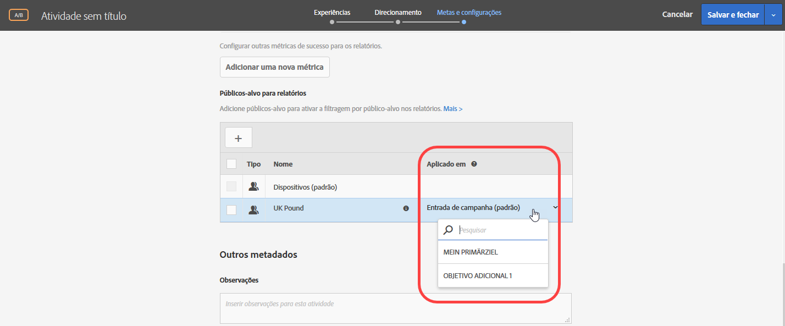
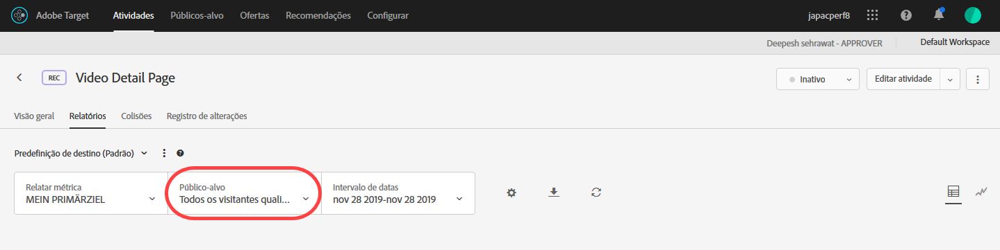

# Aplicar um relatório de público-alvo a uma métrica de sucesso{#apply-a-reporting-audience-to-a-success-metric}

Escolha uma métrica de sucesso que qualifique o usuário para o público-alvo do relatório.

Para todas as atividades, a lista suspensa [!UICONTROL Aplicado em] permite que você aplique um público-alvo a uma métrica de sucesso para exibir números de relatórios depois que a métrica tiver sido alcançada e para ações subsequentes.

Por exemplo, suponha que você tenha criado uma atividade para todos os visitantes que entram na sua página inicial e acessem a página de conversão, mas também queira obter mais detalhes dos visitantes que adicionaram mais de US$ 50 ao carrinho antes de converter.

A lista suspensa Aplicado em oferece três categorias: qualquer visitante da atividade, apenas visitantes que atingem uma determinada etapa da atividade ou apenas visitantes que alcançam a conversão. Ou, para expressar isso de outra maneira, você pode especificar que um visitante deve ter alcançado uma mbox na página de entrada da atividade, uma mbox que define algum ponto no meio da atividade ou a mbox de conversão no final da atividade.

[Métricas de sucesso](../c-activities/r-success-metrics/success-metrics.md#reference_D011575C85DA48E989A244593D9B9924) estão disponíveis apenas se você as configurar para sua atividade. Se você não definiu as métricas de sucesso, verá apenas duas opções na lista suspensa: Entrada da campanha e Conversão.

Considere as seguintes informações ao aplicar um público-alvo de relatórios a uma métrica de sucesso:

* Para ações antes da ação com a métrica de sucesso aplicada, o Target não aplica um público-alvo segmentado.
* Para ações depois da métrica de sucesso aplicada, o Target aplica um público-alvo segmentado.

Para exibir a segmentação nos relatórios, selecione o público-alvo desejado na lista suspensa Audiência no relatório da atividade.

