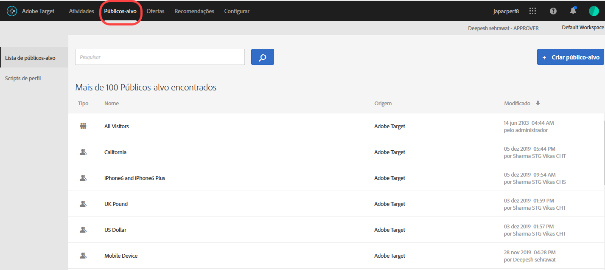
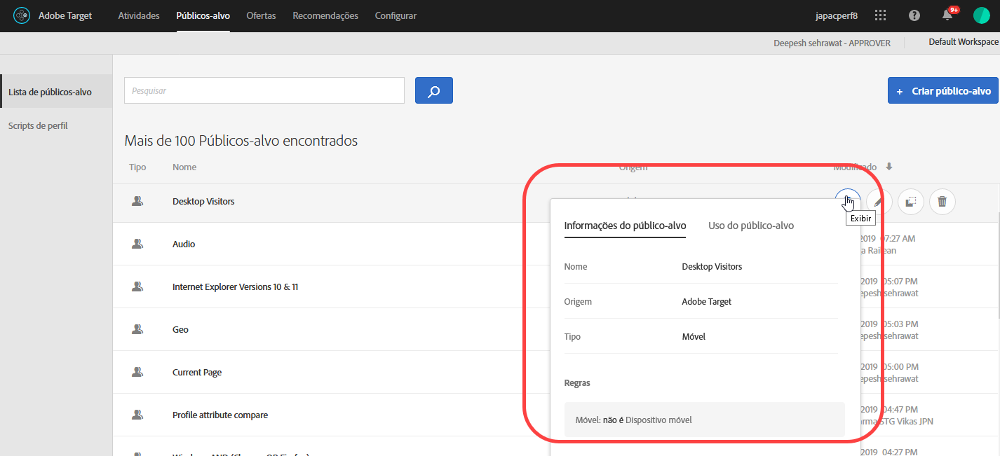
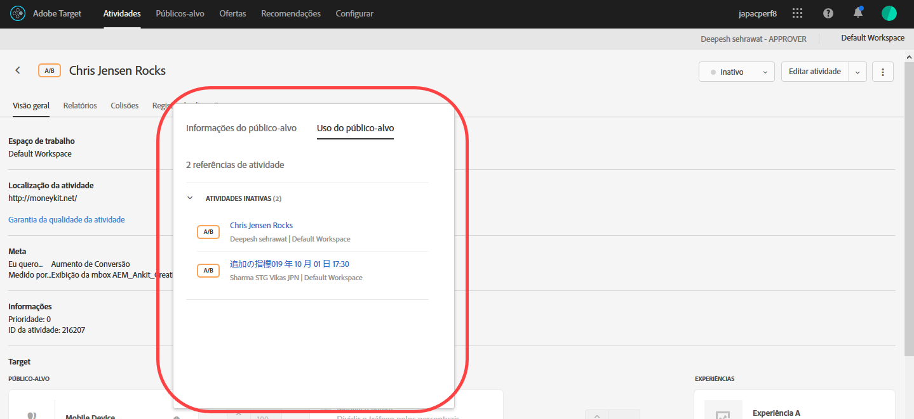
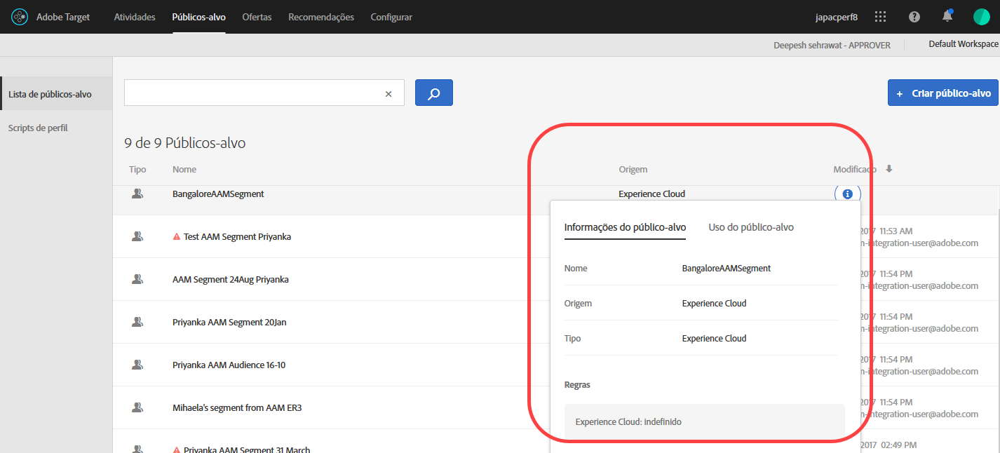

# Criar públicos-alvo{#create-audiences}

Os públicos no Adobe Target determinam quem verá o conteúdo e as experiências em uma atividade direcionada.

Os público-alvo são usados sempre que o direcionamento estiver disponível. Ao direcionar uma atividade, você pode selecionar um público-alvo reutilizável na lista de [!UICONTROL Públicos-alvo], [criar um público-alvo específico para a atividade](/help/c-target/creating-activity-only-audience.md) e direcioná-lo, ou [combinar vários públicos-alvo](/help/c-target/combining-multiple-audiences.md#concept_A7386F1EA4394BD2AB72399C225981E5) para criar um público-alvo ad hoc.

Você também pode usar os dados do público-alvo coletados pelo [!DNL Analytics] para o direcionamento e personalização em tempo real no [!DNL Adobe Target] e outras soluções da [!DNL Experience Cloud]. Consulte [Audiência](https://docs.adobe.com/content/help/en/core-services/interface/audiences/audience-library.html) no Guia *do usuário dos serviços* principais.

O [!DNL Target] define dois tipos de público-alvo:

* **Direcionamento de públicos-alvo:** usado para oferecer conteúdo diferente para diferentes tipos de visitantes.
* **Relatório de públicos-alvo:** usado para determinar como diferentes tipos de visitantes respondem ao mesmo conteúdo para que você possa analisar os resultados de seus testes.

   No [!DNL Target], é possível configurar relatórios de públicos-alvo apenas se você usar o [!DNL Target] como fonte de geração de relatórios. Se você usa o [ Adobe Analytics como fonte de relatórios](/help/c-integrating-target-with-mac/a4t/a4t.md) (A4T), precisa configurar os públicos dos relatórios no [!DNL Analytics].

## Usar a lista de Públicos

Para acessar a lista [!UICONTROL Públicos-alvo], clique em **[!UICONTROL Públicos-alvo]** na barra do menu superior:

A lista de [!UICONTROL Públicos-alvo] contém todos os públicos-alvo que você pode usar em suas atividades. Use a lista de [!UICONTROL Públicos-alvo] para criar, editar, excluir ou copiar os públicos. A lista também mostra a fonte onde o público-alvo foi criado ([!DNL Target], [!DNL Target Classic], [!DNL Adobe Audience Manager (AAM),] [!DNL Experience Cloud] e assim por diante). Públicos predefinidos, como &quot;Novos visitantes&quot; e &quot;Visitantes recorrentes&quot;, não podem ser renomeados.

Ao trabalhar com públicos-alvo que foram originalmente criados no AAM, o Target o alerta se você fizer referência a um público-alvo em atividades do Target que foram posteriormente excluídas no AAM.

* Se um público-alvo foi excluído no AAM, é exibido um ícone de aviso na lista [!UICONTROL Público-alvo] e no seletor de público. Uma dica de ferramenta na interface do usuário também indica que o público-alvo foi excluído do AAM.
* Se você tentar combinar vários públicos com um público-alvo excluído, ou se tentar salvar uma atividade que faça referência a um público-alvo excluído, será exibida uma mensagem de aviso.

Você também pode direcionar parâmetros de perfis personalizados e parâmetros de `user.`. When adding an audience, click **[!UICONTROL Add Rule]** > **[!UICONTROL Visitor Profile]**, then choose the parameter you want to use to target your activity. Se o parâmetro desejado não aparecer, ele ainda não foi acionado por uma mbox. Outros parâmetros de mbox personalizados estão disponíveis na lista suspensa [!UICONTROL Parâmetros personalizados].

Use a caixa de pesquisa para pesquisar sua lista de [!UICONTROL Públicos-alvo]. Você pode procurar qualquer parte de um nome de público-alvo ou pode colocar uma determinada sequência de caracteres entre aspas.

Você pode classificar a lista de [!UICONTROL Públicos-alvo] por nome de público-alvo ou pela data da última modificação. Para classificar por nome ou data, clique no cabeçalho da coluna e selecione para exibir os públicos-alvo em ordem crescente ou decrescente.

## Exibir definições de público-alvo {#section_11B9C4A777E14D36BA1E925021945780}

É possível ver os detalhes da definição de público-alvo em um cartão pop-up na interface do usuário do Target, sem precisar abrir o público-alvo. Essa funcionalidade se aplica a públicos-alvo criados no Target Standard/Premium e a públicos-alvo importados do Target Classic ou criados por meio de API.

Por exemplo, o seguinte cartão de definição de público-alvo é acessado quando você passa o mouse sobre um público-alvo na lista de públicos-alvo e clica no ícone Exibir:

O seguinte cartão de definição de público-alvo é acessado clicando-se no ícone Exibir na página Visão geral de uma atividade:

Clique na guia [!UICONTROL Uso do público-alvo] para ver outras atividades que se referem àquele público-alvo, se aplicável. Dessa forma, é possível evitar um impacto acidental em outras atividades ao editar públicos-alvo. As informações incluem atividades ao vivo, atividades inativas, atividades arquivadas e atividades de sincronização. Esse recurso está disponível para todos os públicos-alvo (público-alvo de biblioteca e  [públicos-alvo somente de atividades](/help/c-target/creating-activity-only-audience.md#concept_A6BADCF530ED4AE1852E677FEBE68483)).

Se um público-alvo for combinado com outro público-alvo e o público-alvo combinado for usado para criar uma atividade, as informações de uso dos dois públicos-alvo exibirão a atividade recém-criada.

O seguinte cartão de definição de público-alvo é para um público-alvo importado da Adobe Experience Cloud. Neste caso, o público-alvo foi importado do Adobe Audience Manager (AAM).

Os detalhes a seguir estão disponíveis para esses tipos de público-alvo importados:

| Tipo de público-alvo | Detalhes |
|--- |--- |
| Público-alvo de dispositivos móveis | Nome de comercialização, fornecedor e modelo. O operador `matches | does not match` é exibido em vez do `equals | does not equal` . |
| Público-alvo com comportamento de visitante | **user.categoryAffinity:** `categoryAffinity` com o parâmetro `FAVORITE`.  **Monitoramento:** serviço de monitoramento é igual a verdadeiro. **Sem serviço de monitoramento:** serviço de monitoramento igual a falso.  |
| Públicos-alvo que usam o operador NOT | **Regra única**: o Target exibe o público-alvo no formato `[All Visitor AND [NOT [rule]`. A regra única NÃO é exibida com E com o público-alvo de `AllVisitor`.  |

Tenha os seguintes pontos em mente ao trabalhar com públicos-alvo importados:

* Os públicos-alvo de direcionamento de expressão não são mais suportados no Target Standard/Premium.
* O Target Standard/Premium não suporta alguns públicos-alvo obsoletos ou melhorou os operadores para facilidade de uso. Por causa disso, a definição de um público-alvo importado, apesar de funcionar de acordo com a definição, não significa que o mesmo esteja agora disponível para criação na interface Standard/Premium. Por exemplo, os públicos-alvo sociais são visíveis com suas regras, mas o Target Standard/Premium não permite que públicos-alvo sociais sejam criados.

## Vídeo de treinamento: Uso de públicos-alvo 

Este vídeo inclui informações sobre o uso de públicos-alvo.

* Explique o termo &quot;público-alvo&quot;
* Explicar as duas maneiras como o público-alvo é usado para otimização
* Encontre públicos-alvo na lista de públicos-alvo
* Segmente uma atividade para um público-alvo
* Use públicos-alvo para relatórios passivos em uma atividade

>[!VIDEO](https://video.tv.adobe.com/v/17398)
