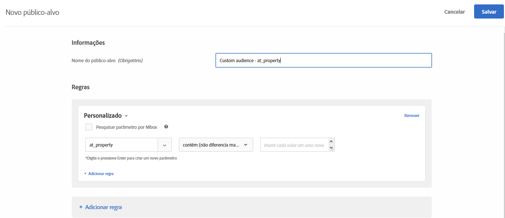

# Parâmetros personalizados

Parâmetros personalizados são parâmetros mbox em [!DNL Adobe Target]. Se você enviar qualquer parâmetro de mbox para mboxes, ou usar a função `targetPageParams` , esses parâmetros serão exibidos aqui para uso em públicos-alvo.

Para obter mais informações, consulte [Envio de parâmetros para uma mbox global](/help/c-implementing-target/c-implementing-target-for-client-side-web/t-mbox-download/c-understanding-global-mbox/pass-parameters-to-global-mbox.md).

Ao criar um público-alvo personalizado com base em um parâmetro de mbox, `mboxParameter` não solicita mais `mboxName`. O nome da mbox agora é opcional. Essa alteração permite usar parâmetros de várias mboxes ou referenciar um parâmetro que ainda não foi gravado na borda.

1. Na interface do [!DNL Target], clique em **[!UICONTROL Públicos-alvo]** > **[!UICONTROL Criar público-alvo]**.
1. Nomeie o público-alvo e adicione uma descrição opcional.
1. Arraste e solte **[!UICONTROL Personalizado]** no painel do construtor de público-alvo.

   Para selecionar o parâmetro desejado:

   * Ao criar um público-alvo, selecione um nome de parâmetro na lista, comece a digitar os primeiros caracteres do nome do parâmetro desejado ou digite o nome completo do nome do parâmetro desejado.
   * Se você lembrar o nome da mbox, mas não o nome do parâmetro, use a lista suspensa [!UICONTROL Filtrar por] para filtrar em uma mbox conhecida que passa o parâmetro desejado.

   Com ambos os métodos, não há link entre a mbox e o parâmetro. O público-alvo funciona com base no parâmetro em todas as mboxes que passam esse parâmetro.

   Se você editar um público-alvo existente, os critérios de filtragem serão exibidos com o nome da mbox fornecido durante a criação.

1. Escolha um avaliador:

   * Contém (não diferencia maiúsculas de minúsculas)
   * Não contém (não diferencia maiúsculas de minúsculas)
   * Igual
   * Não é igual
   * É maior que
   * É maior que ou igual a
   * É menor que
   * É menor que ou igual a
   * Parâmetro presente
   * Parâmetro não presente
   * O valor do parâmetro está presente
   * O valor do parâmetro não está presente
   * Parâmetro ou valor não está presente
   * Comece com
   * Termina com

   

1. Inserir cada valor em uma nova linha.
1. (Opcional) Configure regras adicionais para o público-alvo.
1. Clique em **[!UICONTROL Concluído]**.

O [cartão pop-up dos detalhes de definição](/help/c-target/c-audiences/audiences.md#section_11B9C4A777E14D36BA1E925021945780) do público-alvo mostra o nome do parâmetro na seção Regras. Não há referência à mbox usada para filtragem.

>[!NOTE]
>
>Para públicos-alvo personalizados criados antes do [!DNL Target] versão 18.5.1 (22 de maio de 2018), os nomes de mbox não são exibidos no cartão pop-up de definição do público-alvo. Salve o público-alvo personalizado novamente para obter o nome da mbox a ser exibido no cartão.

## Considerações {#considerations}

* Os públicos-alvo e as atividades são avaliados para uma mbox específica. Por exemplo, se a mbox global passar um determinado parâmetro, mas a mbox regional não, o direcionamento de atividade/público-alvo desse parâmetro não será qualificado para a mbox regional.
* O direcionamento não é avaliado em parâmetros internos da mbox, como mboxPC, mboxSession, mbox3rdPartyId, mboxMCSDID, mboxMCAVID, mboxMCGVID, mboxCount, mboxId e mboxVersion.

## Vídeo de treinamento: Criação de públicos-alvo 

Este vídeo inclui as informações sobre o uso das categorias de público-alvo.

* Criar públicos-alvo
* Definir categorias de públicos-alvo

>[!VIDEO](https://video.tv.adobe.com/v/17392)
