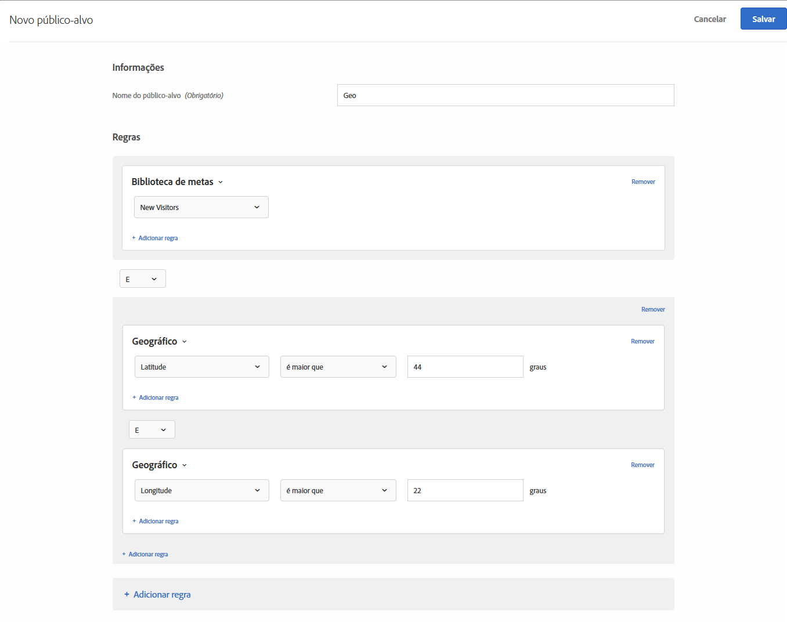

# Geografia  

Use públicos em [!DNL Adobe Target] para direcionar usuários com base em sua localização geográfica, incluindo país, estado/província, cidade, código postal/CEP, DMA ou operadora de celular.

Os parâmetros de localização geográfica permitem definir atividades e experiências com base nas informações geográficas dos visitantes. Você pode incluir ou excluir visitantes com base no país, estado/província, cidade, código postal/CEP, latitude, longitude, DMA ou operadora de celular. Esses dados são enviados com cada solicitação [!DNL Target] e se baseiam no endereço IP do visitante. Selecione esses parâmetros exatamente como quaisquer outros valores de definições de metas.

## Criar um público-alvo com geolocalização {#section_49CBFFAAC8694C4AAD3DE4B2DB7B05DE}

1. Na interface do [!DNL Target], clique em **[!UICONTROL Públicos-alvo]** > **[!UICONTROL Criar público-alvo]**.
1. Dê um nome ao público-alvo.
1. Clique em **[!UICONTROL Adicionar regra]** > **[!UICONTROL Geografia]**.

1. Clique em **[!UICONTROL Selecionar]** e selecione uma destas opções:

   * País
   * Estado
   * Cidade
   * Código Postal
   * Latitude
   * Longitude
   * DMA
   * Operadora de celular

   O endereço IP de um visitante é transmitido com uma solicitação de mbox, uma vez por visita (sessão), para resolver parâmetros de geolocalização para esse visitante.

   Para operadoras de celular, o [!DNL Target] os dados de registro do endereço IP (proprietários do bloco de endereços IP) para determinar a operadora de celular apropriada usando [Códigos de país móveis (MCC) e Códigos de rede móveis (MNC)](https://www.mcc-mnc.com).

1. Especifique um operador e o valor apropriado.
1. (Opcional) Clique em **[!UICONTROL Adicionar regra]** e configure regras adicionais para o público-alvo.
1. Clique em **[!UICONTROL Salvar]**.

A ilustração a seguir mostra um público-alvo que direciona os usuários que acessam a atividade de uma latitude maior que 44° e de uma longitude menor que 22°.

## Precisão {#section_D63D5FFCB49C42F9933AFD0BD7C79DF1}

A precisão da geolocalização depende de vários fatores. As conexões de Wi-Fi estão mais precisas que as redes de celular. Quando um visitante estiver usando uma conexão de dados de celular, a precisão da geolocalização pode ser afetada pelo local, relacionamento de dados da operadora com [DeviceAtlas](https://deviceatlas.com/device-data/user-agent-tester) e outros fatores. As conexões de rede baseada em torres de celular podem ser menos precisas que as conexões com fio ou Wi-Fi. Além disso, o endereço IP de um visitante pode ser mapeado para o local ISP do visitante, que pode não ser o mesmo que o local real do visitante. Alguns problemas de localização geográfica móvel podem ser solucionados pelo uso da [API de localização geográfica](https://developer.mozilla.org/en-US/docs/Web/API/Geolocation_API).

A tabela a seguir mostra a precisão das informações geográficas baseadas em IP de [DigitalEnvoy](https://www.digitalelement.com/solutions/) para conexões de Internet com fuio ou Wi-Fi. A DigitalEnvoy oferece os dados mais precisos do setor. A precisão global é de mais de 99,9% em nível nacional e de até 97% em nível municipal. As informações de precisão não se aplicam a redes baseadas em torre de celular.

| País | Estado | Cidade | Região |
|--- |--- |--- |--- |
| BR | 99.99% | 96% | 94% |
| Canadá | 99,99% | 96% | 94% |
| Europa | 99,99% |  |  |
| Reino Unido | 99,99% |  | 87% |
| Alemanha | 99,99% | 95% | 93% |
| Escandinávia | 99% | Próximo de 90 | Próximo de 85 |
| Espanha | 99,99% | Em torno de 90% | Entre 85 e 90 |
| Ásia | 99% | Próximo de 95 | Próximo de 90 |
| Japão | 99,99% | Próximo de 95 | Próximo de 90 |
| Austrália | 99,99% | 94% | 91% |

## Utilização da geolocalização em scripts de perfil   {#section_92C93138542C4A94997E3F4BE3F5DA28}

Você pode usar as informações de geografia para os scripts de perfil.

Por exemplo, use:

* `profile.geolocation.country`
* `profile.geolocation.state`
* `profile.geolocation.city`
* `profile.geolocation.zip`
* `profile.geolocation.dma`
* `profile.geolocation.domainName`
* `profile.geolocation.ispName`
* `profile.geolocation.connectionSpeed`
* `profile.geolocation.mobileCarrier`

Dessa forma você pode criar uma expressão de definição com o nome de &quot;Da América do Norte&quot; com o código a seguir:

`return profile.geolocation.country == 'united states' || profile.geolocation.country == 'canada' || profile.geolocation.country == 'mexico';`

## Utilização dos valores de geolocalização como tokens {#section_E7F7FDF62C3B4934A6565D04B24655F6}

Agora é possível usar os valores de `profile.geolocation` diretamente como tokens em ofertas, plug-ins e assim por diante.

Por exemplo, use:

* `${profile.geolocation.country}`
* `${profile.geolocation.state}`
* `${profile.geolocation.city}`
* `${profile.geolocation.zip}`
* `${profile.geolocation.dma}`
* `${profile.geolocation.domainName}`
* `${profile.geolocation.ispName}`
* `${profile.geolocation.connectionSpeed}`
* `${profile.geolocation.mobileCarrier}`
* `${profile.geolocation.latitude}`
* `${profile.geolocation.longitude}`

## Perguntas frequentes sobre geolocalização {#section_DD308A53AF0F48FA8C81423580561FE7}

**Como especifico a latitude e a longitude?**

* O valor para latitude/longitude deve ser um valor numérico em graus.
* O valor para latitude/longitude pode ter um máximo de precisão de cinco casas decimais.
* O valor de latitude deve estar entre -90 e 90.
* O valor de longitude deve estar entre -180 e 180.

**Como a geolocalização funciona em dispositivos móveis?**

A maioria dos usuários de dispositivos móveis acessa conteúdo via WiFi, o que significa que o geolocalização baseado em IP do [!DNL Target] é tão preciso quanto em um desktop. As conexões baseadas em torres de celular podem ser menos precisas porque o endereço IP do visitante se baseia na torre em que o sinal está sendo obtido. Alguns problemas de localização geográfica móvel podem ser solucionados pelo uso da [API de localização geográfica](https://developer.mozilla.org/en-US/docs/Web/API/Geolocation_API).

**Como o recurso geográfico trata visitantes da AOL?**

Devido à maneira como a AOL faz proxy em seu tráfego, [!DNL Target] só pode direcioná-los em um nível de país. Por exemplo, uma campanha direcionada para a França é bem-sucedida para usuários da AOL na França. Mas uma campanha direcionada a Paris não tem sucesso para usuários da AOL em Paris. Se seu objetivo é alcançar usuários da AOL, você pode definir um campo de região como &quot;aol.&quot; Na realidade, você pode alcançar usuários da AOL dos EUA especificando duas novas condições de definição: o país corresponde exatamente aos &quot;estados unidos&quot; e a região corresponde à &quot;aol.&quot;

**Que nível de granularidade de localidade é fornecido pelo geolocalização?**

* País - global
* Estado/município/região - global
* Cidade - global
* CEP/código postal - EUA, Alemanha, Canadá
* DMA/ITV (Reino Unido) - EUA, Reino Unido
* Operadora de celular - global

**Como posso testar minhas atividades se sou um usuário proveniente de uma localidade diferente?**

* **at.js 1.*x***: Você pode substituir seu endereço IP por um endereço IP de um local diferente e usar o  `mboxOverride.browserIp url` parâmetro . Portanto, se sua empresa está no Reino Unido, mas sua campanha global é direcionada a visitantes em Auckland, Nova Zelândia, utilize o estilo de URL a seguir, assumindo que `60.234.0.39` é um endereço IP em Auckland:

   `https://www.mycompany.com?mboxOverride.browserIp=60.234.0.39`

   Limpe os cookies antes de fazer o teste da atividade.

   >[!NOTE]
   >
   >`mboxOverride.browserIp` é compatível com o at.js 1.somente *x*. Essa funcionalidade não é compatível com o at.js 2.*x*.

* **at.js 2.*x***: Para substituir seu endereço IP por at.js 2.*x*, instale uma extensão/plug-in do navegador (como X-Forwarded-For Header for Chrome ou Firefox). Essa extensão permite passar o cabeçalho x-encaminhado-for nas solicitações de página.

**Como os territórios, por exemplo, Porto Rico e Hong Kong, são mapeados na estrutura de geolocalização?**

Porto Rico, Hong Konge outros territórios são tratados como valores de &quot;País&quot; separados.

**A  [!DNL Target] captura (e armazena) informações como CEP quando a atividade é direcionada com recursos de direcionamento por localização geográfica?**

Não, [!DNL Target] usa dados geográficos somente durante a sessão e, em seguida, os dados são descartados.

## Vídeo de treinamento: Criação de públicos-alvo 

Este vídeo inclui as informações sobre o uso das categorias de público-alvo.

* Criar públicos-alvo
* Definir categorias de públicos-alvo

>[!VIDEO](https://video.tv.adobe.com/v/17392)
