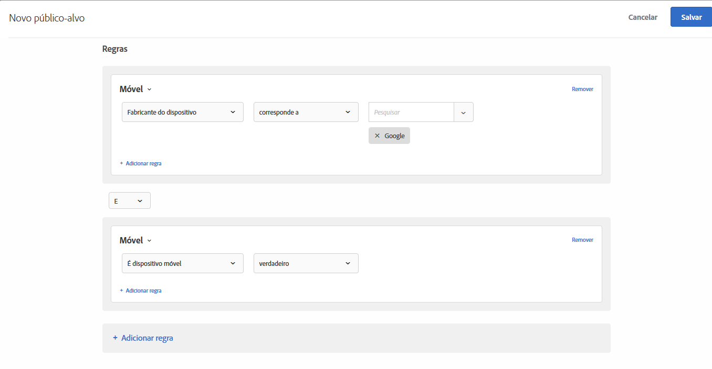

# Mobile{#mobile}

Crie públicos-alvo para direcionar dispositivos móveis com base em parâmetros como dispositivo móvel, tipo de dispositivo, fornecedor de dispositivo, dimensões de tela (por pixels), e muito mais.

Por exemplo, talvez você queira mostrar conteúdos diferentes para usuários que entram na sua página de um telefone e que visitam de um computador. Nesse caso, você pode selecionar o público-alvo móvel e depois selecionar a opção **[!UICONTROL Is Mobile Phone]**, adicionar os detalhes específicos que são importantes para você, como tipo de telefone, tamanho da tela (em pixels) etc.

A definição de metas móvel é fornecida pelo [DeviceAtlas,](https://deviceatlas.com/device-data/user-agent-tester) um serviço de dotmobi. O DeviceAtlas é um amplo banco de dados de dispositivos móveis construídos em dados compilados a partir de diversas fontes, incluindo fabricantes e operadores de rede. Estes dados são então verificados, referenciados e validados para construir um banco de dados de dispositivos móveis grande e preciso.

A detecção do dispositivo é realizada pela análise das cadeias de caracteres Usuário-agente. Alguns fabricantes de dispositivo, como a Apple, desativam essa funcionalidade ao não fornecer informações suficientes no UA.

Por exemplo, os dispositivos da Apple não compartilham tokens específicos do modelo de dispositivo no UA. O resultado é que não é possível detectar os modelos de iPhone (como iPhone 5S, iPhone SE, iPhone 6 e assim por diante) usando um método simples baseado em palavra-chave.

Para resolver isso, o Target coleta dados adicionais para detectar com precisão iPhones e outros dispositivos da Apple usando os seguintes parâmetros:

| Parâmetro | Tipo | Descrição |
|--- |--- |--- |
| devicePixelRatio | String | Proporção entre pixels físicos e pixels independentes de dispositivo (dips) no navegador.  por exemplo, &quot;1,5&quot; ou &quot;2&quot; |
| screenOrientation | String | O dispositivo e o mecanismo JavaScript do navegador são compatíveis com a Orientação do dispositivo. Ela pode ser Paisagem ou Retrato. |
| webGLRenderer | String | Renderizador do navegador do driver gráfico. |

>[!NOTE]
>
>Clientes que usam o SDK móvel não precisam fazer nada para aproveitar desta funcionalidade. Clientes usando at.js devem [atualizar para a nova versão at.js 1.5.0](../../../c-implementing-target/c-implementing-target-for-client-side-web/target-atjs-versions.md#reference_DBB5EDB79EC44E558F9E08D4774A0F7A) (ou posterior).

Você pode escolher mais de uma propriedade de dispositivo móvel. Várias seleções são unidas com um OU.

Os clientes que usam uma integração personalizada (que não usa at.js ou o Mobile SDK) podem coletar esses parâmetros e passá-los como parâmetros da mbox.

1. Na interface do [!DNL Target], clique em **[!UICONTROL Públicos-alvo]** > **[!UICONTROL Criar público-alvo]**.
1. Dê um nome ao público-alvo.
1. Clique em **[!UICONTROL Adicionar regra]** > **[!UICONTROL Móvel]**.
1. Clique em **[!UICONTROL Selecionar]** e selecione uma destas opções:

   * Nome de marketing do dispositivo
   * Modelo do dispositivo
   * Fornecedor do dispositivo
   * É dispositivo móvel
   * É celular
   * É tablet
   * SO
   * Altura de tela (px)
   * Largura de tela (px)

   >[!NOTE]
   >
   >Devido às novas alterações introduzidas no iOS 12.2, a criação de um público-alvo com regras definidas pelo Nome de comercialização do dispositivo e pelo Modelo do dispositivo que especifica os Modelos do iPhone foi afetada. Não é mais possível direcionar os usuários de iPhones com iOS 12.2. No entanto, se esses usuários não tiverem o iOS 12.2, o direcionamento por Modelo do iPhone continuará a funcionar corretamente.
   >
   >A atualização do iOS 12.2 não afeta a identificação dos seguintes modelos, pois eles não oferecem suporte à atualização para o iOS 12.2: iPhone, iPhone 3G, iPhone 3GS, iPhone 4, iPhone 4s, iPhone 5, iPhone 5c, iPad, iPad 2, iPad/Retina display, iPad Retina (4ª Geração), iPod Touch 4 e iPod Touch 5.

   >[!NOTE]
   >
   >Você pode direcionar por operadora de dispositivo móvel usando as [configurações geográficas](../../../c-target/c-audiences/c-target-rules/geo.md#concept_5B4D99DE685348FB877929EE0F942670).

1. (Opcional) Clique em **[!UICONTROL Adicionar regra]** e configure regras adicionais para o público-alvo.
1. Clique em **[!UICONTROL Salvar]**.

A ilustração a seguir mostra um público-alvo direcionando visitantes que usam dispositivos móveis fabricados pelo Google.

## Vídeo de treinamento: Criação de públicos-alvo

Este vídeo inclui as informações sobre o uso das categorias de público-alvo.

* Criar públicos-alvo
* Definir categorias de públicos-alvo

>[!VIDEO](https://video.tv.adobe.com/v/17392)
