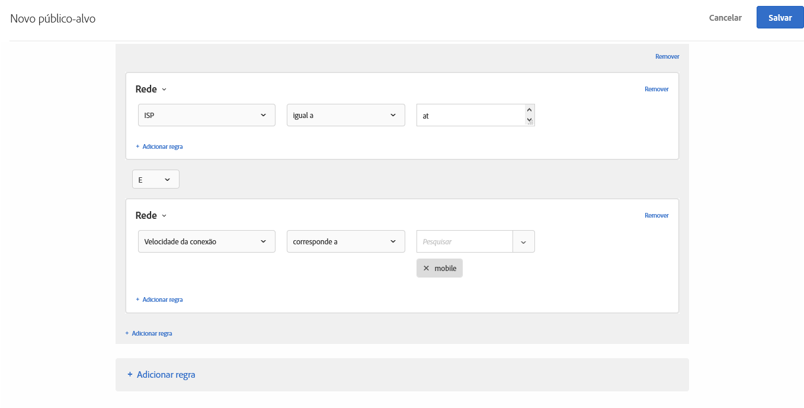

# Rede{#network}

Você pode criar públicos-alvo com base nos detalhes da rede.

1. Na interface do [!DNL Target], clique em **[!UICONTROL Públicos-alvo]** > **[!UICONTROL Criar público-alvo]**.
1. Dê um nome ao público-alvo.
1. Clique em **[!UICONTROL Adicionar regra]** > **[!UICONTROL Rede]**.
1. Clique em **[!UICONTROL Selecionar]** e selecione uma destas opções:

   * **ISP:** ISP é uma empresa que fornece acesso a Internet para seus assinantes, normalmente com uma taxa mensal ou anual. Muitas ISPs fornecem serviços adicionais, como hospedagem na Web ou email. O campo ISP é de ISP comercial (como Comcast ou TimeWarner) ou outra entidade, como instituição comercial ou educacional.

      A seguir, estão alguns exemplos de ISPs populares nos Estados Unidos:

      | Nome popular | Nome de ISP | Nome do Domínio | Endereço IP de exemplo |
      |---|---|---|---|
      | Cablevision | Cablevision Systems Corp. | *.optonline.net | 68.196.130.239 |
      | CenturyLink | Qwest Communications Company, LLC | *.centurylink.net | 64.40.65.0 |
      | Comunicações de concessão | Comunicações de concessão | *.charter.com | 71.85.225.124 |
      | Comcast | Comcast Cable Communications, Inc. | *.comcast.net | 76.27.24.28 |
      | Cox | Cox Communications Inc. | *cox.net | 68.224.174.22 |
      | Speakeasy | MegaPath Corporation | *.speakeasy.net | 66.93.240.0 |
      | Time Warner | Time Warner Cable Internet LLC | *.res.rr.com | 72.229.28.185 |
      | Verizon FiOS | MCI Communications Services, Inc. d/b/a Verizon Business | *.fios.verizon.net | 173.68.112.34 |
      | Vivint | Smartrove Inc. | *.vivintwireless.net | 170.72.26.105 |
      | AT&amp;T Wireless | AT | *.mycingular.net |  |
      | Sprint mobile | Sprint Personal Communications Systems | endereço ip |  |
      | T-Mobile | T-Mobile USA, Inc. | endereço ip | 208.54.86.0 |
      | Verizon Wireless | Cellco Parternship DBA Verizon Wireless | *.myvzw.com | 70.195.74.199 |

      >[!NOTE]
      >
      >Quando o direcionamento é baseado em ISP, use o nome do ISP, não o nome popular. Certifique-se de criar a regra para diferenciar maiúsculas de minúsculas ou sempre usar o formato de minúsculas.

      Você pode testar os valores de domínio e ISP. https://www.whoismyisp.org é um bom recurso para fins de direcionamento. Você pode usar os endereços IP de exemplo fornecidos na tabela acima ou inserir seus próprios endereços. Em seguida, use o parâmetro `themboxOverride.browserIp= URL` para mimetizar esse endereço IP.

   * **Nome do domínio:** esse é o nome do domínio para o endereço IP do visitante. Esse não é o nome de domínio do site que você está usando com o [!DNL Target]. Esse nome de domínio está relacionado ao endereço IP do visitante e, às vezes, é chamado de nome de host. É normalmente muito similar ao nome da ISP. Às vezes, o nome de host faz referência a nomes mais antigos das empresas que criaram novo nome de marca do nome da ISP, mas não o nome do domínio.
   * **Velocidade de conexão:**&#x200B;é a velocidade da conexão à internet do visitante. As opções incluem: banda larga, cabo, discagem, móvel, oc3, oc12, satélite, t1, t2, sem fio e xdsl.

      Esse cambo baseia-se no tipo de conexão e não na velocidade real propriamente dita. O [!DNL Target] não pode determinar as velocidades de conexão exatas das conexões. O tipo de conexão de Banda larga é usado quando não há indicações de outros tipos de conexão, então um tipo específico não pode ser escolhido.

1. (Opcional) Clique em **[!UICONTROL Adicionar regra]** e configure regras adicionais para o público-alvo.
1. Clique em **[!UICONTROL Salvar]**.

A ilustração a seguir mostra um público-alvo que direciona os visitantes que usam a AT&amp;T com velocidade de conexão [!UICONTROL Celular].

## Vídeo de treinamento: Criação de públicos-alvo

Este vídeo inclui as informações sobre o uso das categorias de público-alvo.

* Criar públicos-alvo
* Definir categorias de públicos-alvo

>[!VIDEO](https://video.tv.adobe.com/v/17392)