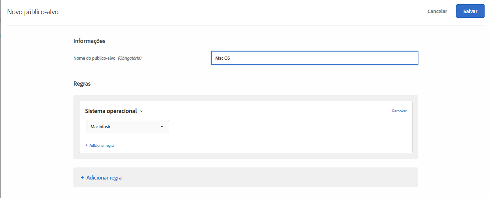

# Sistema operacional{#operating-system}

Você pode direcionar os visitantes que usam um certo sistema operacional.

1. Na interface do [!DNL Target], clique em **[!UICONTROL Públicos-alvo]** > **[!UICONTROL Criar público-alvo]**.
1. Dê um nome ao público-alvo.
1. Clique em **[!UICONTROL Adicionar regra]** > **[!UICONTROL Sistema operacional]**.
1. Clique em **[!UICONTROL Selecionar]** e selecione uma destas opções:

   * Linux
   * Macintosh
   * Windows

1. (Opcional) Clique em **[!UICONTROL Adicionar regra]** e configure regras adicionais para o público-alvo.
1. Clique em **[!UICONTROL Salvar]**.

As ilustrações a seguir mostram um público-alvo direcionado para visitantes que usam Macintosh OS.

## Vídeo de treinamento: Criação de públicos-alvo

Este vídeo inclui as informações sobre o uso das categorias de público-alvo.

* Criar públicos-alvo
* Definir categorias de públicos-alvo

>[!VIDEO](https://video.tv.adobe.com/v/17392)
