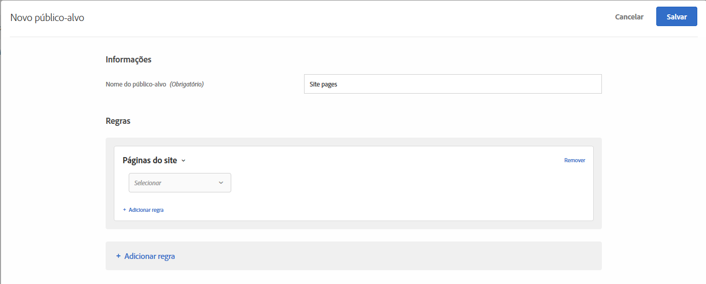
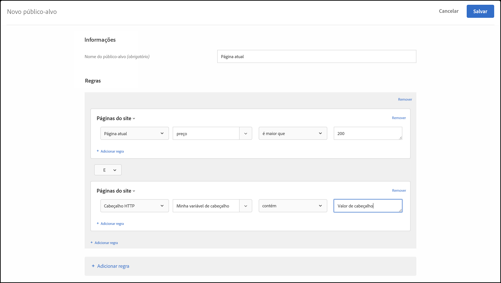

# Páginas do site{#site-pages}

Você pode público alvo visitantes que estão em uma página específica do site.

1. Na interface do [!DNL Target], clique em **[!UICONTROL Públicos-alvo]** > **[!UICONTROL Criar público-alvo]**.
1. Dê um nome ao público-alvo.
1. Clique em **[!UICONTROL Adicionar regra]** > **[!UICONTROL Páginas do site]**.

   

1. Clique na lista suspensa **[!UICONTROL Selecionar]** , selecione uma das opções a seguir e configure a regra conforme desejado.

   As opções disponíveis e os avaliadores nas listas suspensas subsequentes na regra variam dependendo de qual opção você escolher. A ilustração a seguir mostra as opções disponíveis se você escolher Página atual:

   

   As opções a seguir estão disponíveis na lista suspensa inicial quando você escolhe [!UICONTROL Selecionar].

   * **Página atual:** A página na qual o usuário está no momento.

      As seguintes opções estão disponíveis na segunda lista suspensa se você escolher essa opção:

      * URL (para obter mais informações sobre como o Público alvo avalia URLs, consulte Perguntas frequentes sobre [Públicos alvos e audiências](/help/c-target/c-troubleshooting-targets-and-audiences/troubleshooting-targets-and-audiences.md).)
      * Domínio
      * Consulta
      * Subdomínio
      * Domínio de nível superior
      * Caminho
      * Fragmento em hash (#)
   * **Página anterior:** é a página onde o usuário estava antes de clicar na página atual. (Para que a página seja acompanhada, o usuário deve clicar da página anterior para a página atual. A página anterior não é acompanhada se o usuário digitar um novo URL no navegador.) O conteúdo atual dessa página depende do design do seu site. Por exemplo, se a página atual exibir informações sobre um produto específico, a página anterior pode ser uma página de categoria onde o visitante seleciona o item específico (por exemplo, uma página que exibe diversas câmeras de um tipo específico) ou pode ser a página de aterrissagem que leva à página final.

      As seguintes opções estão disponíveis na segunda lista suspensa se você escolher essa opção:

      * URL (para obter mais informações sobre como o Público alvo avalia URLs, consulte Perguntas frequentes sobre [Públicos alvos e audiências](/help/c-target/c-troubleshooting-targets-and-audiences/troubleshooting-targets-and-audiences.md).)
      * Domínio
      * Consulta
      * Subdomínio
      * Domínio de nível superior
      * Caminho
   * **Página inicial:** a página inicial é a primeira página que o visitante vê ao acessar seu site. Por exemplo, se o visitante clica em um link no Google, que leva a uma página da categoria, a página da categoria é a página de aterrissagem. Se o link leva para sua home page, a home page é a página de aterrissagem. A página de aterrissagem é lembrada para a sessão do visitante. É possível direcionar mais profundo no site baseado em que a página de aterrissagem do visitante estava nessa sessão.

      As seguintes opções estão disponíveis na segunda lista suspensa se você escolher essa opção:

      * URL (para obter mais informações sobre como o Público alvo avalia URLs, consulte Perguntas frequentes sobre [Públicos alvos e audiências](/help/c-target/c-troubleshooting-targets-and-audiences/troubleshooting-targets-and-audiences.md).)
      * Domínio
      * Consulta
      * Subdomínio
      * Domínio de nível superior
      * Caminho
      * Fragmento em hash (#)

      >[!NOTE]
      >
      >O objeto `landing.url` é redefinido em uma alteração de subdomínio ou em uma substituição do URL direto.

   * **Cabeçalho HTTP:** Essa opção avalia as informações no cabeçalho HTTP da solicitação de Público alvo. Por exemplo, se o cabeçalho HTTP contiver informações de idioma, você poderá criar uma regra que contenha a `Accept-Language: es` condição para visitantes públicos alvos que acessam a página em espanhol.

      As seguintes opções estão disponíveis na segunda lista suspensa se você escolher essa opção:

      * Accept
      * Accept-Charset
      * Accept-Encoding
      * Accept-Language
      * Autorização
      * Controle de cache
      * Conexão
      * Tamanho do conteúdo
      * Content-MDS
      * Tipo de conteúdo
      * Data
      * Esperança
      * De
      * Host
      * Se-Correspondência
      * If-Modificated-Since
      * Se-Nenhum-Correspondência
      * If-Range
      * If-Unmodified-Since
      * Máx. para frente
      * Pragma
      * Autorização de proxy
      * Intervalo
      * Referer
      * TE
      * Atualização
      * User-Agent
      * Via
      * Aviso

   Se você escolher Página atual, Página anterior ou [!UICONTROL Landing page], as opções [!UICONTROL Domínio] e [!UICONTROL Query] estarão disponíveis. Considere o seguinte ao escolher estas opções:

   * **Domínio:** o domínio completo da página. Ao especificar um domínio, a prática recomendada é usar &quot;contém&quot;. Por exemplo, &quot;Domínio igual a facebook.com&quot; não aceitará `m.facebook.com` ou `www.facebook.com`. &quot;Domínio conterá facebook.com&quot; aceitará qualquer variante de facebook.com.
   * **Consulta:** o conteúdo do URL após o primeiro ponto de interrogação (?).

      `foo.html?e0a72cb2a2c7`

1. (Opcional) Clique em **[!UICONTROL Adicionar regra]** e configure regras adicionais para o público-alvo.
1. Clique em **[!UICONTROL Salvar]**.

É possível criar públicos-alvo de páginas do site usando seu próprio &quot;parâmetro de consulta definido pelo usuário&quot; ou &quot;cabeçalho definido pelo usuário&quot;.

Use um:

* parâmetro de consulta se a regra selecionada pelo usuário é Página atual, Página de aterrissagem ou Página anterior.
* Cabeçalho se a regra selecionada pelo usuário for um cabeçalho HTTP.

conforme ilustrado abaixo:

## Solução de problemas {#ts}

* Para que as audiências de landing page funcionem corretamente, as solicitações devem ter o `mboxReferrer` parâmetro definido (para a API do Delivery, o `context.address.referringUrl` parâmetro) que a biblioteca JavaScript do at.js obtém da página usando o `document.referrer` atributo. Este `HTMLDocument` atributo retorna o URI da página a partir da qual o usuário navegou. O valor desse atributo é uma string vazia quando o usuário navega para a página diretamente (não por meio de um link, mas, por exemplo, por meio de um marcador).

   Se esse comportamento não corresponder aos seus requisitos, considere executar uma das seguintes ações:

   * Enviar parâmetros [de](/help/c-implementing-target/c-implementing-target-for-client-side-web/t-mbox-download/c-understanding-global-mbox/pass-parameters-to-global-mbox.md) mbox para [!DNL Target] serem usados para fins de direcionamento.
   * Use uma atividade [de teste](/help/c-activities/t-test-ab/test-ab.md) A/B em vez de uma atividade de landing page. As atividades de teste A/B não alternam as experiências para o mesmo visitante.
   * Em vez disso, use um perfil [de](/help/c-target/c-audiences/c-target-rules/visitor-profile.md) visitante.

* Ao usar avaliadores &quot;start/finais com&quot; em strings contendo vírgulas, esteja ciente de que eles são avaliados como uma matriz de valores, na qual cada valor separado por vírgula é avaliado. Por exemplo, se tivermos o valor de um cabeçalho: `Accept-Language: en,zh;q=0.9,en-IN;q=0.8,zh-CN;q=0.7` ele se qualificará para condições como:
   * start com zh,
   * start com en,
   * termina com 0,7,
   * termina com 0,8.

## Vídeo de treinamento: Criação de públicos-alvo

Este vídeo inclui as informações sobre o uso das categorias de público-alvo.

* Criar públicos-alvo
* Definir categorias de públicos-alvo

>[!VIDEO](https://video.tv.adobe.com/v/17392)
