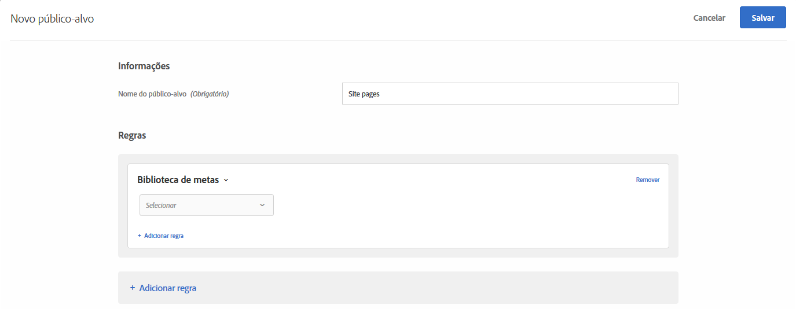

# Biblioteca do Target{#target-library}

Direcione usuários com base nas regras de direcionamento pré-criadas.

Os públicos pré-construídos na categoria Biblioteca do Target são herdados e existem em outras categorias. Para obter mais informações e práticas recomendadas, consulte  [Perguntas frequentes sobre direcionamentos e público-alvo](/help/c-target/c-troubleshooting-targets-and-audiences/troubleshooting-targets-and-audiences.md#concept_C4EE4B8F4840430CBD798D579A8F208D).

1. Na interface do [!DNL Target], clique em **[!UICONTROL Públicos-alvo]** > **[!UICONTROL Criar público-alvo]**.
1. Dê um nome ao público-alvo.
1. Clique em **[!UICONTROL Adicionar regra]** > **[!UICONTROL Biblioteca de metas]**.

   

1. Clique em **[!UICONTROL Selecionar]**, em seguida selecione uma regra de direcionamento pré-criada.

   As regras de direcionamento pré-criadas incluem, Sistema operacional Windows, Dispositivo de tablet, Navegador Safari, Visitantes que retornam, Referido no Google e muito mais.

   O público-alvo predefinido &quot;Dispositivo de tablet&quot; já qualifica quando o agente do usuário contém uma ou mais sequências de caracteres (algumas das quais são números de modelo de dispositivos). Você não precisa criar regras de direcionamento personalizado para esses dispositivos.

   Kindle, Silk, iPad, Sony Tablet, TF101, GT-P1000, GT-P1000R, GT-P1000M, SGH-T849, SHW-M180S, GT-I9000T, BNTV250 e Tablet PC.

1. (Opcional) Clique em **[!UICONTROL Adicionar regra]** e configure regras adicionais para o público-alvo.
1. Clique em **[!UICONTROL Salvar]**.

## Vídeo de treinamento: Criação de públicos-alvo

Este vídeo inclui as informações sobre o uso das categorias de público-alvo.

* Criar públicos-alvo
* Definir categorias de públicos-alvo

>[!VIDEO](https://video.tv.adobe.com/v/17392)
