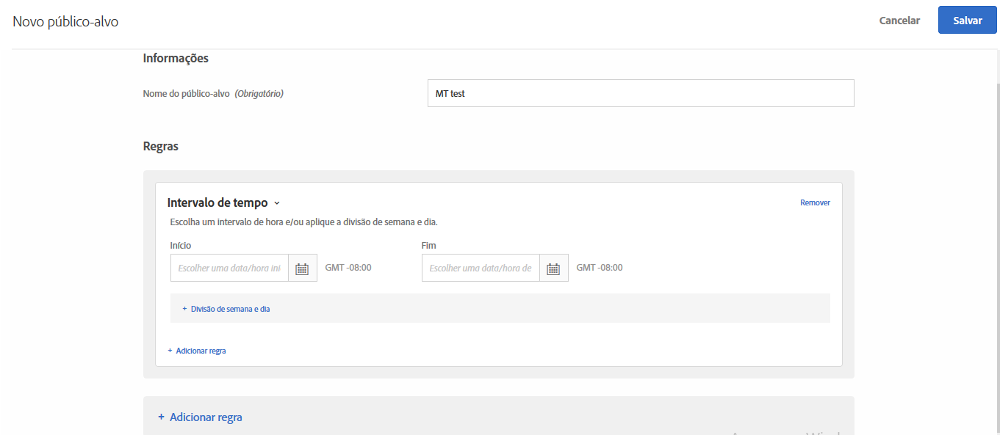

# Intervalo de tempo{#time-frame}

É possível adicionar datas e horas de início/término para direcionar os usuários que visitam seu site durante um intervalo de tempo específico. Também é possível definir opções de Divisão de semana e dia para criar padrões recorrentes de direcionamento de público-alvo.

Por exemplo, usando o [recurso de públicos-alvo ad-hoc combinados](/help/c-target/combining-multiple-audiences.md#concept_A7386F1EA4394BD2AB72399C225981E5), você pode direcionar os usuários com conteúdo específico durante os três dias que antecedem a Black Friday e com outro conteúdo após a Black Friday.

1. Na interface do [!DNL Target], clique em **[!UICONTROL Públicos-alvo]** > **[!UICONTROL Criar público-alvo]**.
1. Dê um nome ao público-alvo.
1. Clique em **[!UICONTROL Adicionar regra]** > **[!UICONTROL Intervalo de tempo]**.

   

1. Especifique as datas e horas de Início e Fim para o público-alvo.

   Deixe a data de início em branco para iniciar a segmentação de acordo com a agenda da atividade. Deixe a data de término em branco para continuar a segmentação até a data e hora de término da atividade.

   Você também pode deixar as datas de início ou término em branco. Isso permite usar o mesmo público-alvo em várias atividades (sem fazer uma cópia do público-alvo), enquanto controla as datas de início e término no nível da atividade.

   >[!NOTE]
   >
   >O fuso horário é exibido para datas de início/término como GMT +/- NN:NN, onde NN:NN é o deslocamento de GMT e reflete o fuso horário no nível da conta, em vez do fuso horário do visitante. Por exemplo, o fuso horário da Califórnia seria exibido como GMT -08:00.

1. (Condicional) Clique em **[!UICONTROL Divisão de semana e dia]** para definir padrões recorrentes, incluindo dias das semanas e horas.

   

   Você pode usar as opções de Divisão de semana e dia, por exemplo, para exibir uma opção de &quot;Bate-papo agora&quot; para os visitantes, somente durante os dias e horas em que a sua central de atendimento estiver funcionando.

   Selecione um ou mais dias da semana e defina as horas de início e término. Clique em **[!UICONTROL Adicionar mais]** para especificar os padrões adicionais, conforme desejado.

   >[!NOTE]
   >
   >O fuso horário é exibido para [!UICONTROL Divisão de semana e dia] como GMT +/- NN:NN, onde NN:NN é o deslocamento de GMT e reflete o fuso horário no nível da conta, em vez do fuso horário do visitante. Por exemplo, o fuso horário da Califórnia seria exibido como GMT -08:00.

1. (Opcional) Clique em **[!UICONTROL Adicionar regra]** e configure regras adicionais para o público-alvo.

   Observe que você pode repetir a Etapa 5 para cada regra, se desejar.

1. Clique em **[!UICONTROL Salvar]**.

## Vídeo de treinamento: Criando o emblema 

Este vídeo inclui as informações sobre o uso das categorias de público-alvo.

* Criar públicos-alvo
* Definir categorias de públicos-alvo

>[!VIDEO](https://video.tv.adobe.com/v/17392)
