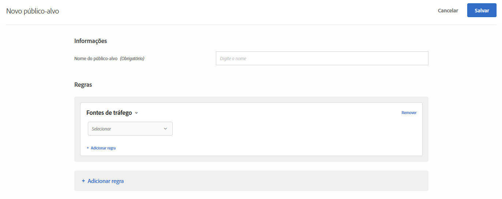

# Fontes de Tráfego {#traffic-sources}

Crie públicos-alvo para direcionar visitantes com base no mecanismo de busca ou página de aterrissagem de referência para o site.

Por exemplo, você pode definir metas com base no navegador do visitante, mecanismo de pesquisa ou na página inicial de referência. A página de aterrissagem de referência é a página que o visitante clicou para chegar ao site atual nessa sessão. (Por exemplo, se o visitante clicou em uma publicidade no Google e ela o levar para a página inicial da `adobe.com`, a página de aterrissagem de referência será `google.com`.)

É possível combinar múltiplas fontes de tráfego para criar uma regra complexa de direcionamento.

1. Na interface do [!DNL Target], clique em **[!UICONTROL Públicos-alvo]** > **[!UICONTROL Criar público-alvo]**.
1. Dê um nome ao público-alvo.
1. Clique em **[!UICONTROL Adicionar regra]** > **[!UICONTROL Fontes de tráfego]**.

   

1. Clique em **[!UICONTROL Selecionar]** e selecione uma destas opções:

   * Do Baidu
   * Do Bing
   * Do Google
   * Do Yahoo
   * Página de aterrissagem de referência: URL
   * Página de aterrissagem de referência: domínio
   * Página de aterrissagem de referência: consulta

   Dependendo da sua seleção, talvez seja necessário fornecer informações adicionais (avaliador e/ou valores).

1. (Opcional) Clique em **[!UICONTROL Adicionar regra]** e configure regras adicionais para o público-alvo.
1. Clique em **[!UICONTROL Salvar]**.

Você pode direcionar usuários que são referenciados para o seu site por meio de um mecanismo de pesquisa ou uma página de aterrissagem específica.

## Vídeo de treinamento: Criação de públicos-alvo  

Este vídeo inclui as informações sobre o uso das categorias de público-alvo.

* Criar públicos-alvo
* Definir categorias de públicos-alvo

>[!VIDEO](https://video.tv.adobe.com/v/17392)
