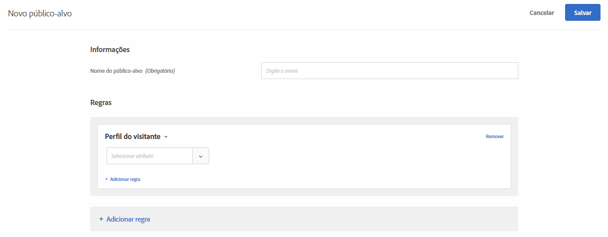

# Perfil do visitante{#visitor-profile}

Crie públicos para direcionar os visitantes que atendem a parâmetros de perfil específicos.

1. Na interface do [!DNL Target], clique em **[!UICONTROL Públicos-alvo]** > **[!UICONTROL Criar público-alvo]**.
1. Dê um nome ao público-alvo.
1. Clique em **[!UICONTROL Adicionar regra]** > **[!UICONTROL Perfil do visitante]**.

   

1. Clique em **[!UICONTROL Selecionar]** e selecione uma destas opções:

   Os parâmetros de perfil do visitante são passados por meio da mbox (perfil). Você pode direcionar visitantes novos ou que retornam, ou incluir todos os usuários.

   * Novo visitante
   * Visitante Recorrente
   * Em outros testes
   * Não em outros testes
   * Primeira página da sessão
   * Não é a primeira página da sessão
   * Afinidade de categorias

   Um perfil de visitante é criado na memória de borda local para cada chamada de mbox com um novo `mboxPC`. Após 30 minutos de inatividade, o perfil é salvo no banco de dados de destino e pode ser acessado de outras bordas.

   Quando um visitante do site faz logon no meio de uma sessão e obtém um `3rdpartyId`, todos os atributos de perfil previamente carregados e vinculados ao `3rdPartyId` ficam imediatamente disponíveis.

   Você pode direcionar parâmetros de perfis personalizados e parâmetros de `user.`. Escolha o parâmetro que deseja usar para direcionar sua atividade. Se o parâmetro desejado não aparecer, ele ainda não foi acionado por uma mbox.

1. (Opcional) Clique em **[!UICONTROL Adicionar regra]** e configure regras adicionais para o público-alvo.
1. Clique em **[!UICONTROL Salvar]**.

## Vídeo de treinamento: Criando o selo 

Este vídeo inclui as informações sobre o uso das categorias de público-alvo.

* Criar públicos-alvo
* Definir categorias de públicos-alvo

>[!VIDEO](https://video.tv.adobe.com/v/17392)
