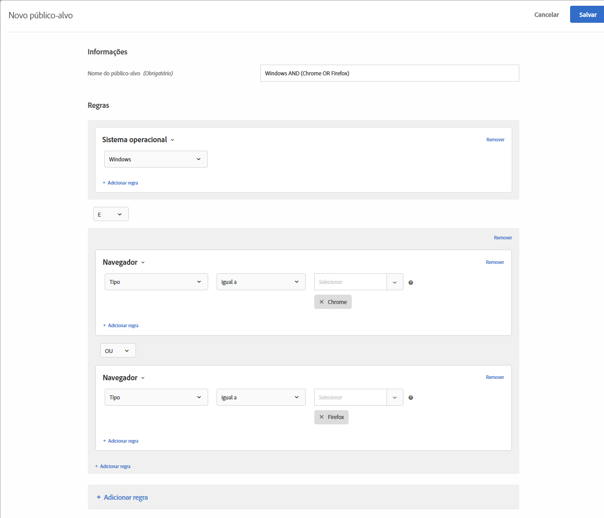

# Criar públicos em [!DNL Target]

Você pode criar públicos-alvo personalizados e salvá-los na biblioteca [!DNL Adobe Target] [!UICONTROL Públicos-alvo] para usar em suas atividades. Você também pode copiar um público-alvo existente que pode ser editado para criar um público-alvo semelhante e combinar vários públicos-alvo.

## Visão geral do público

Os públicos-alvo são definidos por regras que determinam quem está incluso ou foi excluído de uma atividade no [!DNL Target]. A definição de um público-alvo pode incluir várias regras e cada regra pode incluir vários parâmetros. Definições complexas de público-alvo usam os operadores booleanos E e OU para combinar regras e parâmetros para que você tenha controle detalhado sobre quais visitantes do site sejam contados como participantes da atividade.

Quando você combina regras ou parâmetros com AND, qualquer membro em potencial do público-alvo deve atender *todas* as condições definidas para ser incluído como participante. Por exemplo, se você definir uma regra de sistema operacional e uma regra de navegador com E, somente visitantes usando o sistema operacional *e* o navegador definidos serão incluídos na atividade.

Quando você combina regras e parâmetros com OU, qualquer membro em potencial do público-alvo só precisa atender uma única condição definida para ser incluído como participante. Por exemplo, se você definir várias regras móveis conectadas por OU, visitantes que atendam *qualquer* dos critérios definidos são incluídos na atividade.

Você pode misturar operadores booleanos para criar regras complexas; no entanto, operadores no mesmo nível da regra devem ser compatíveis. A interface de usuário aplica o operador correto automaticamente.

Por exemplo, a seguinte regra busca visitantes que estão usando Chrome *ou* Firefox em um computador com Windows:

>[!NOTE]
>
>Tenha cuidado para evitar criar regras que excluem todos membros em potencial do público-alvo. Por exemplo, não é possível alguém visitar sua página usando o Chrome *e* o Firefox simultaneamente.

## Criar um público-alvo

1. Clique em **[!UICONTROL Públicos-alvo]** na barra de menu no topo.

   

1. Na lista [!UICONTROL Públicos-alvo], clique em **[!UICONTROL Criar público-alvo]**.

   Ou

   Para copiar um público-alvo existente, na lista [!UICONTROL Audiences], clique no ícone **[!UICONTROL Mais ações]** (o ícone de elipse) e, em seguida, clique em **[!UICONTROL Duplicar]**. Você pode editar o público-alvo para criar um público-alvo semelhante.

1. Digite um nome de público-alvo descritivo e exclusivo e uma descrição opcional.
1. Arraste e solte os atributos desejados da lista **[!UICONTROL Atributos]** à direita do painel do construtor de público-alvo.

   

   Cada tipo de regra tem seus próprios parâmetros. Consulte [Categorias para públicos-alvo](/help/c-target/c-audiences/c-target-rules/target-rules.md#concept_E3A77E42F1644503A829B5107B20880D) para obter mais informações sobre a configuração de cada tipo de regra de público-alvo.

1. Defina os parâmetros da regra.

   Por exemplo, o seguinte público-alvo é direcionado a visitantes de Utah usando o sistema operacional Macintosh.

   

1. (Condicional) Continue adicionando e definindo os atributos desejados.

   Para criar outro contêiner, clique em **[!UICONTROL Adicionar contêiner]** ou simplesmente arraste outro atributo para o quadro intermediário. Em seguida, é possível ajustar o operador (E ou OU) usando a lista suspensa.

1. Clique em **[!UICONTROL Concluído]**.

   Públicos-alvo criados recentemente aparecem na lista após alguns segundos de processamento. Se o público-alvo não aparecer imediatamente na lista, tente procurar pelo público-alvo ou atualizar a lista.

## Vídeo de treinamento: Criação de públicos-alvo 

Este vídeo inclui informações sobre a criação de públicos-alvo.

* Criar públicos-alvo
* Definir categorias de públicos-alvo

>[!VIDEO](https://video.tv.adobe.com/v/17392)
