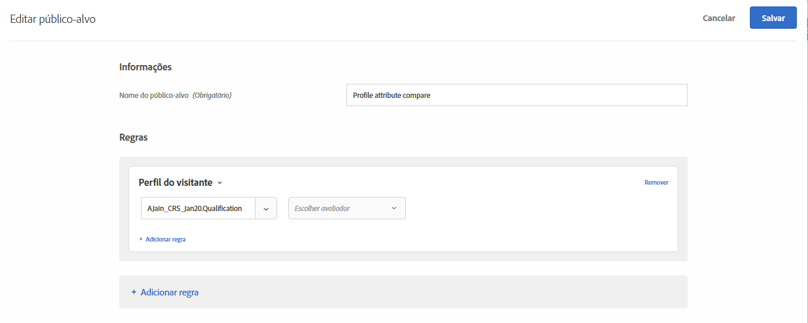
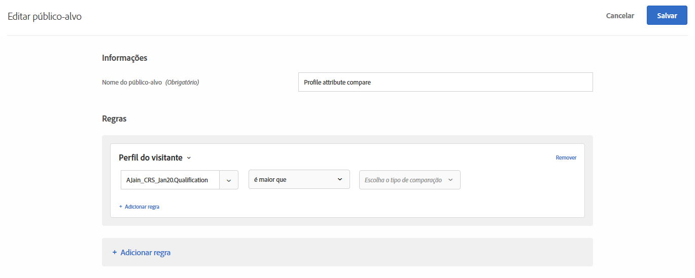
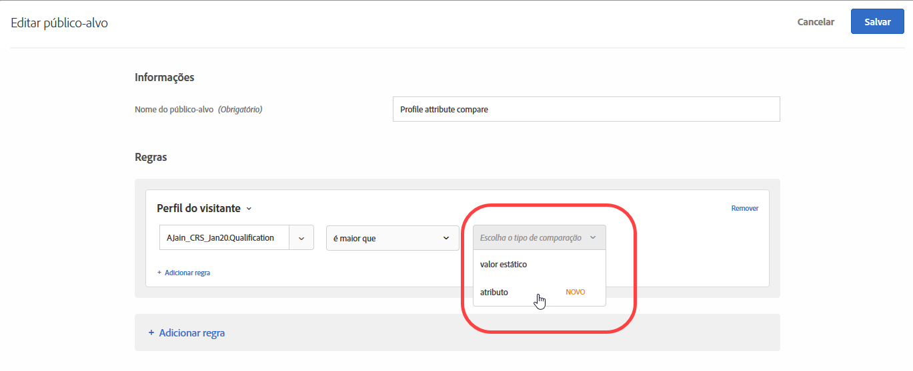
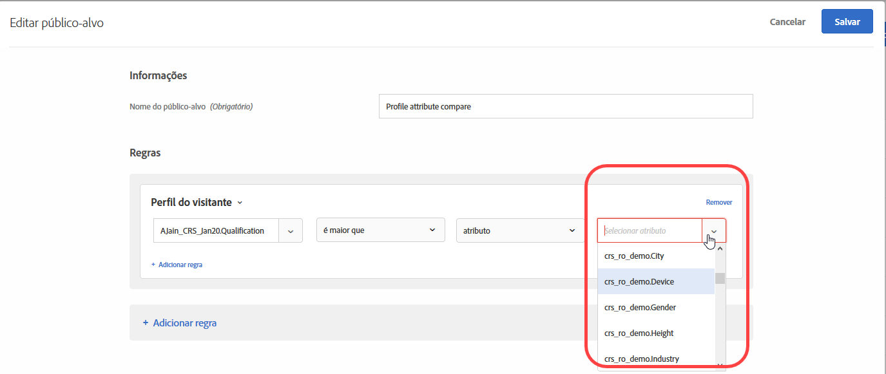

# Criar um público-alvo de comparação do atributo de perfil{#create-a-profile-attribute-comparison-audience}

Defina um público-alvo para comparar dois atributos de perfil da sua [biblioteca de público-alvo](/help/c-target/c-audiences/audiences.md) ou em um [público somente de atividade](/help/c-target/creating-activity-only-audience.md). O uso de operadores, como maior que, menor que ou igual a, define um público-alvo para comparar dinamicamente os valores de dois atributos de perfil diferentes.

>[!NOTE]
>
>Essa funcionalidade está disponível somente para a categoria de [Perfil do visitante](/help/c-target/c-audiences/c-target-rules/visitor-profile.md#concept_E972690B9A4C4372A34229FA37EDA38E).

## Visão geral {#section_303CBC78194D49A2A004945D425441E1}

Os públicos-alvo são definidos por regras que determinam quem está incluso ou foi excluído de uma atividade no Target. Uma definição de público-alvo pode incluir diversas regras, e cada uma delas pode incluir vários parâmetros. Se uma das regras incluídas usar a categoria Perfil do visitante, você poderá definir uma regra com base em um valor específico do atributo de perfil do visitante ou comparar o valor desse atributo com outro.

Por exemplo, suponhamos que você trabalhe para uma empresa de móveis e tenha feito o upload de duas pontuações de propensão de cliente no Target:

* Probabilidade de comprar móveis para a sala de jantar nos próximos 90 dias
* Probabilidade de comprar móveis para a sala de estar nos próximos 90 dias

Você poderia criar um público-alvo definido como a propensão para comprar móveis para a sala de jantar maior do que para comprar móveis para a sala de estar. O Target compararia dinamicamente as pontuações de propensão para sala de jantar e sala de estar de um visitante específico, para determinar se ele é qualificável para esse público-alvo.

Para obter mais informações, consulte [Métodos para obter dados no Target](/help/c-implementing-target/c-considerations-before-you-implement-target/c-methods-to-get-data-into-target/methods-to-get-data-into-target.md#concept_0069C0EFB56C4700BB33F2F35C2B9B17).

## Criar um público-alvo de comparação do atributo de perfil {#section_7A62FD47D5C74C3EBC3417ACDBB85013}

1. Clique em **[!UICONTROL Públicos-Públicos-alvo]** > **[!UICONTROL Criar público-alvo]** > **[!UICONTROL Adicionar regra]** > **[!UICONTROL Perfil do visitante]**.
1. Na lista suspensa **[!UICONTROL Perfil do visitante]**, escolha um atributo:

   

1. Escolha o avaliador:

   

1. Na lista suspensa **[!UICONTROL Escolher o tipo de comparação]**, escolha **[!UICONTROL Atributo]**.

   O tipo de comparação de &quot;valor estático&quot; permite comparar o atributo de perfil do visitante com os valores específicos.

   

   >[!NOTE]
   >
   >Se você estiver usando uma das categorias de perfil do visitante padrão na Etapa 1 (por exemplo, Novo visitante ou Visitante recorrente), poderá escolher somente a opção de valor estático. As opções de comparação dinâmica não estão disponíveis para as categorias padrão. Outros exemplos em que as opções de comparação dinâmica não estão disponíveis incluem &quot;Primeira página da sessão&quot;, &quot;Não em outros testes&quot;, &quot;Não é primeira página da sessão&quot; e &quot;Afinidade de categorias&quot;.

1. Escolha o atributo adicional que deseja comparar com o atributo inicial.

   

## Vídeo de treinamento  {#section_3BB8DBF3418F4520B3E274B6F40AF8F3}

Assista ao vídeo a seguir para obter mais informações e um cenário no qual seja possível usar esse recurso:

>[!VIDEO](https://video.tv.adobe.com/v/23218/)