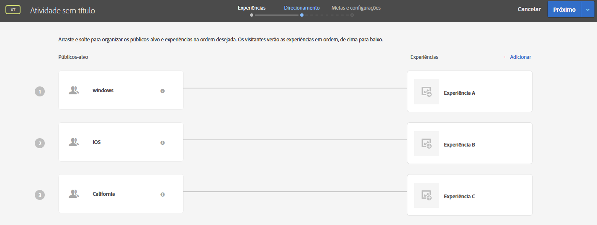

# Perguntas frequentes sobre direcionamentos e públicos{#targets-and-audiences-faq}

Lista de perguntas frequentes sobre o direcionamento de experiência e públicos-alvo.

## Ao criar públicos-alvo, por que os públicos-alvo pré-construídos na Biblioteca do Target podem ser vistos em outras categorias? {#section_9EBF5B0F9DF94168A15B92B905CCF7E0}

Os públicos pré-construídos na categoria Biblioteca do Target são herdados e existem em outras categorias. Por exemplo, o público-alvo herdado da Biblioteca do Target &gt; Novos visitantes tem uma contraparte atualizada: Perfil do visitante &gt; Novo visitante.

A prática recomendada é usar os públicos-alvo mais recentes, pois houve melhora no desempenho. Alguns clientes podem estar usando públicos-alvo herdados e pré-contruídos, por isso, eles não foram removidos da interface do Target.

## Como sei a forma que o tráfego será dividido entre os públicos-alvo? {#section_067EEFB956E7465CBF77EC86834470AB}

Por padrão, o tráfego é dividido igualmente entre as experiências. No entanto, é possível especificar direcionamentos da porcentagem para cada experiência. Nesse caso, um número aleatório será gerado e usado para escolher a experiência que será exibida. As porcentagens resultantes talvez não correspondam exatamente às metas especificadas, mas um maior tráfego significa que as experiências deverão ser divididas em maior harmonia com as metas-alvo.

## Qual experiência é exibida se um usuário se qualificar para uma atividade que contém várias experiências com vários públicos-alvo qualificados? {#section_94A60B11212D48FD8AB0803C6C7E7253}

O usuário se qualifica para a primeira experiência/público-alvo exibida na página de atividades do [!UICONTROL Target].

Por exemplo, na seguinte ilustração, um usuário da Califórnia que usa um dispositivo Windows se qualifica para a Experiência A (público-alvo do Windows) e a Experiência C (público-alvo da Califórnia). Para esse usuário seria mostrada a Experiência A, pois ela é exibida na lista Experiência C acima, na página de Direcionamentos.

## Por que os nomes para o mesmo público-alvo do Target, da Adobe Audience Manager (AAM) e da Biblioteca de público-alvo nos serviços principais são diferentes? {#section_F67E61A607B6444C8DAA4F99C3E95AED}

Os nomes de público-alvo em [!DNL Target] são exclusivos; no entanto, no [!DNL AAM] e no [!DNL Audience Library], você pode ter o mesmo nome para vários públicos-alvo (se estiverem em pastas diferentes). Quando [!DNL Target] encontrar um nome de público-alvo que corresponda a um [!DNL AAM] ou [!DNL Audience Library] público, [!DNL Target] anexa &quot; # &lt; número &gt;&quot; ao nome.

Por exemplo, você pode ver os seguintes públicos-alvo: &quot;usuários de PC&quot; (na [!DNL AAM]) e &quot;usuários de PC #1&quot; (no [!DNL Target]).

## Por que não posso renomear um público-alvo? {#section_54E420556F534D20836E261E253D8B97}

Alguns públicos-alvo do Target são predefinidos, como &quot;Novos visitantes&quot; e &quot;Visitantes recorrentes&quot;. Esses públicos-alvo predefinidos não podem ser renomeados pelos usuários.

## Por que todos os parâmetros de perfil não são exibidos na interface do usuário do Target? {#section_3CD947D15C984EE9AD19550220E0E8BD}

O [!DNL Target] tem um limite de 50 atributos de perfil exclusivos por chamada de mbox. Se você precisar passar mais de 50 atributos de perfil para o [!DNL Target], é possível fazer isso usando o método de [!UICONTROL Atualização do perfil] da API. Para obter mais informações, consulte [Atualização do perfil](https://developers.adobetarget.com/api/#authentication-tokens) na documentação da API do Adobe Target.

## Por que os visitantes veem experiências para uma atividade de AP que não deveriam ver? {#section_41CECEAE0881446A8D9F3B016857914B}

As atividades de Personalização automatizada são avaliadas uma vez por sessão. Se houver sessões ativas que se qualificaram para uma experiência específica e agora novas ofertas foram adicionadas a elas, os usuários verão o novo conteúdo junto com as ofertas exibidas anteriormente. Como elas se qualificaram previamente para essas experiências, eles ainda as veriam durante a sessão. Se houver um desejo de avaliar isso em todas as visitas a uma página única, você deverá mudar para o tipo de atividade de Direcionamento de experiência (XT).

## Por que as alterações para públicos-alvo criadas por meio da API não são refletidas na interface do usuário do Target? {#section_6BEB237CAC004A06A290F9644E5BF0FB}

Diferente de ofertas e scripts de perfil, as alterações feitas pela API para públicos criadas pelo Target Standard atualmente não são sincronizadas para a interface do usuário do Target.

## Cadeias de caracteres que representam números (números de ponto flutuante também são compatíveis) são comparadas como números.{#strings-that-represent-numbers}

Se a parte esquerda e direita das expressões “é igual a” puder ser interpretada como um número, as duas partes serão comparadas como números e não como cadeias de caracteres.

Por exemplo:

| Valor | Critérios de direcionamento | Resultado |
| --- | --- | --- |
| 1.0 | é igual a 1 | true |
| 1 | equalsIgnoreCase 1.0 | true |
| 1,230 | é igual a 1 | true |
| 1,500 | é igual a 1,5 | true |
| 1,200 | é menor que 2 | true |
| 2 | é maior que 3,0 | false |
| 045 | é igual a 45 | true |

Os números escritos em notação científica sempre serão comparados como strings.

Por exemplo,

&quot;4e-2&quot; somente será igual a &quot;4e-2&quot;. Ele *não* será igual a “0,04&quot;.