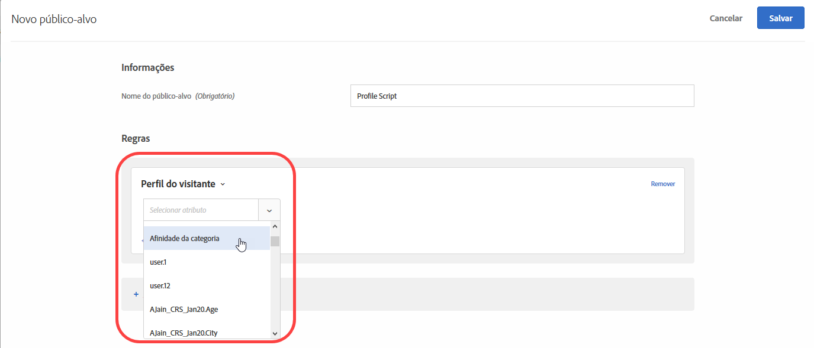

# Afinidade de categorias

O recurso de afinidade de categorias captura automaticamente as categorias visitadas por um usuário e calcula a afinidade de categoria do usuário para que possa ser direcionado e segmentado. Isso ajuda a garantir que o conteúdo seja direcionado para visitantes que tenham mais probabilidade de adotar ações em relação àquelas informações.

## Transmitindo informações de afinidade de categoria ao [!DNL Target] {#section_B0C8E46EEBAC4549AD90352A47787D04}

Sempre que um usuário visitar o site, parâmetros do perfil específicos do visitante serão gravados no banco de dados do [!DNL Target]. Os dados são vinculados ao cookie do usuário. Um parâmetro especialmente útil é `user.categoryId`, um parâmetro de mbox atribuído em uma página de produto. Conforme o visitante continua a navegação, ou retorna para outra sessão, as categorias de produtos que um usuário específico visualiza podem ser registradas. Você também pode registrar informações de categoria passando-as como parâmetro de mbox `user.categoryId` em qualquer mbox (incluindo uma mbox aninhada), como um parâmetro de URL `user.categoryId`, ou nos parâmetros da página do Target com uma mbox global. Consulte seu representante de conta para obter mais detalhes.

Separe as categorias com uma vírgula para incluir um item em várias categorias. Por exemplo:

* `user.categoryId=clothing,shoes,nike,running,nike clothing,nike shoes,nike running shoes`

Com base na frequência e recenticidade das visitas às categorias de seu produto, a afinidade de categoria (se houver) de um usuário será registrada. A Afinidade de categorias pode ser utilizada para definir populações para as suas atividades.

Use `user.categoryAffinities[]` em um script de perfil para retornar uma matriz das afinidades que um visitante preencheu.

>[!IMPORTANT]
>
>O atributo `user.categoryId` usado para o algoritmo de afinidade de categorias do Adobe Target é diferente do atributo `entity.categoryId` usado nas recomendações de produto e conteúdo do Adobe Target Recommendations. O `user.categoryId` é necessário rastrear a categoria favorita de um usuário. O `entity.categoryId` é necessário para basear as recomendações na categoria da página ou do item atual. Passe ambos os valores para o Adobe Target caso deseje usar os dois recursos.

## Caso de negócios para afinidade de categoria {#section_D6FF913E88E6486B8FBCE117CA8B253B}

A atividade de um visitante em uma sessão, como por exemplo que categoria ele ou ela visita com mais frequência, pode ser usada para definir as metas de visitas futuras. Cada página de categoria visualizada por um visitante durante uma sessão é capturada e a categoria &quot;favorita&quot; dele ou dela será calculada com base no recenticidade e modelo de frequência. Desta forma, cada vez que o visitante volta para a página inicial, a área da imagem principal pode ser direcionada para exibir conteúdo relacionado à categoria favorita daquele usuário.

## Exemplo de uso de afinidade de categorias {#section_A4AC0CA550924CB4875F4F4047554C18}

Suponha que você venda instrumentos musicais online e queira direcionar as promoções de vendas de baixos para visitantes que já tenham expressado interesse em instrumentos no passado. Utilizando a afinidade de categorias, você pode criar ofertas que sejam exibidas somente para os visitantes que tenham essa afinidade de categorias.

## Algoritmo de afinidade de categoria {#section_8B86C7FF50294208866ABF16F07D5EB9}

O algoritmo de afinidade de categoria funciona da seguinte maneira:

* 10 pontos para primeira visualização de categoria
* 5 pontos para categoria clicada após a primeira
* Quando uma nova categoria é clicada, 1 é subtraído de todas as categorias clicadas anteriormente
* Se uma categoria já tiver sido clicada (vista), clicar novamente nela não subtrairá 1 de todas as outras categorias
* Se uma sexta nova categoria for clicada, a categoria com menor pontuação entre as primeiras cinco será removida do cálculo
* No fim da sessão, divida todos os valores por 2

### Exemplo: algoritmo de afinidade de categoria

Por exemplo, visualizar a categoria `mens-clothing`, em seguida, `accessories`, `jewelry`, e `accessories` novamente em uma sessão resulta em afinidades de:

* `accessories`: 9 (+5 – 1 + 5)

* `mens-clothing`: 8 (+10 – 1 – 1)

* `jewelry`: 5 (+5)

Quando a sessão for encerrada e o usuário voltar posteriormente para o site, as pontuações serão reduzidas:

* `accessories`: 4,5 (9/2)

* `mens-clothing`: 4 (8/2)

* `jewelry`: 2,5 (5/2)

Considerando que o usuário então visualize, em ordem `jewelry`, `accessories`, `beauty`, `shoes` e `womens-clothing`:

* `accessories`: 6,5 (4.5 + 5 – 1 – 1 - 1)

* `womens-clothing`: 5 (+5)

* `jewelry`: 4,5 (2,5 + 5 – 1 – 1 - 1)

* `shoes`: 4 (+5 – 1)

* `beauty`: 3 (+5 – 1 - 1)

* `mens-clothing` é descartada depois do clique final de `womens-clothing`, como a categoria de pontuação mais baixa com uma pontuação de 1 (4 – 1 – 1 - 1)

Quando a sessão for encerrada e o usuário voltar posteriormente para o site, as pontuações serão reduzidas:

* `accessories`: 3,3 (6,5/2)

* `womens-clothing`: 2,5 (5/2)

* `jewelry`: 2,3 (4,5/2)

* `shoes`: 2 (4/2)

* `beauty`: 1,5 (3/2)

## Use afinidade de categorias para direcionamento {#concept_5750C9E6C97A40F8B062A5C16F2B5FFC}

Informações para ajudar você a usar um público-alvo de [!UICONTROL Afinidade de categoria] para direcionamento em uma atividade.

Esta seção contém as seguintes informações:

* [Criar um público-alvo para usar a afinidade de categorias](/help/c-target/c-visitor-profile/category-affinity.md#section_A27C600BBA664FE7A74F8FE076B78F40)
* [Usar o público-alvo da afinidade de categorias em uma atividade](/help/c-target/c-visitor-profile/category-affinity.md#section_91526B942D1B4AEBB8FCDF4EBFF931CF)

## Criar um público-alvo para usar a afinidade de categorias {#section_A27C600BBA664FE7A74F8FE076B78F40}

1. Na lista **[!UICONTROL Públicos-alvo]**, clique em **[!UICONTROL + Criar públicos-alvo]**.

   Ou

   Para copiar um público-alvo existente, na lista de Públicos-alvo, passe com o mouse sobre o público-alvo desejado e clique no ícone Copiar. Você pode editar o público-alvo para criar um público-alvo semelhante.

1. Digite um nome de público-alvo descritivo.
1. Clique em **[!UICONTROL + Adicionar regra]** > **[!UICONTROL Perfil do visitante]**.
1. Na lista suspensa **[!UICONTROL Perfil do visitante]**, selecione **[!UICONTROL Afinidade de categorias]**.

   

1. Selecione a categoria desejada:

   

   As categorias incluem:

   * Categoria favorita
   * Primeira categoria
   * Segunda categoria
   * Terceira categoria
   * Quarta categoria
   * Quinta categoria

   As opções &quot;Categoria favorita&quot; e &quot;Primeira categoria&quot; são equivalentes.

1. Escolha o avaliador:

   * Contém (não diferencia maiúsculas de minúsculas)
   * Não contém (não diferencia maiúsculas de minúsculas)
   * Igual

1. Especifique cada novo valor em uma linha separada (por exemplo, &quot;sapatos&quot;).
1. Clique em **[!UICONTROL Salvar]**.

## Usar o público-alvo da afinidade de categorias em uma atividade {#section_91526B942D1B4AEBB8FCDF4EBFF931CF}

Você pode usar os públicos-alvo da afinidade de categorias em qualquer atividade. Durante o fluxo de trabalho guiado de três etapas, na etapa do Target, escolha o público-alvo desejado.
