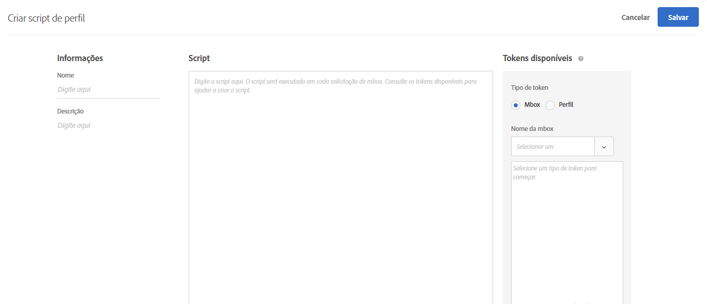
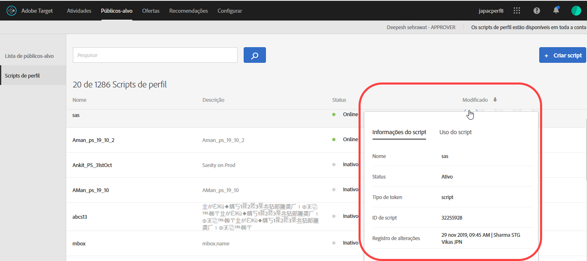
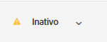

# Atributos do perfil

Os atributos do perfil são parâmetros específicos de um visitante. Estes atributos são armazenados no perfil do visitante para fornecer informações sobre ele que podem ser usadas em suas atividades.

Um perfil de usuário contém informações demográficas e comportamentais de um visitante da página da Web, como idade, gênero, produtos comprados, última visita e assim por diante, que o Target usa para personalizar o conteúdo que serve ao visitante.

Conforme um visitante navega em seu site, ou quando ele retorna para outra sessão, os atributos do perfil salvos no perfil podem ser usados para direcionar o conteúdo ou registrar informações para a filtragem de segmentos.

Para configurar os atributos do perfil:

1. Clique em **[!UICONTROL Públicos-alvo]** > **[!UICONTROL Scripts de perfil.]**

   

1. Clique em **[!UICONTROL Criar script]**.

   

   Os tipos a seguir de atributos de perfil estão disponíveis:

   | Tipo do parâmetro | Descrição |
   |--- |--- |
   | mbox | Passado diretamente pelo código de página ao criar a mbox. Consulte [Envio de parâmetros para uma mbox global](/help/c-implementing-target/c-implementing-target-for-client-side-web/t-mbox-download/c-understanding-global-mbox/pass-parameters-to-global-mbox.md).<br>**Observação**: o Target tem um limite de 50 atributos de perfil exclusivos por chamada de mbox. Se você precisar passar mais de 50 atributos de perfil para o Target, é possível fazer isso usando o método de Atualização do perfil da API. Para obter mais informações, consulte [Atualização do perfil na documentação da API do Adobe Target](http://developers.adobetarget.com/api/#updating-profiles). |
   | Perfil | Definido diretamente com um trecho de código JavaScript. Eles podem armazenar totais, como o valor total gasto por consumidor e executado em cada solicitação de mbox. Consulte Atributos de script de perfil abaixo. |

## Atributos de script de perfil {#concept_8C07AEAB0A144FECA8B4FEB091AED4D2}

Defina um atributo de perfil de script com o snippet do código JavaScript associado.

Você pode usar scripts de perfil para capturar os atributos do visitante em várias visitas. Os scripts de perfil são snippets de código definidos no Target usando um formulário de JavaScript do lado do servidor. Por exemplo, você pode usar um script de perfil para capturar a frequência na qual um visitante acessa seu site e quando ele foi visitado pela última vez.

Os scripts de perfil não são os mesmos que os parâmetros de perfil. Os parâmetros de perfil capturam as informações sobre visitantes que usam a implementação do código de mbox do Target.

## Criar scripts de perfil {#section_CB02F8B97CAF407DA84F7591A7504810}

Os scripts de perfil estão disponíveis na guia [!UICONTROL Públicos-alvo] na interface [!DNL Target].

Para adicionar um novo script de perfil, clique na guia **[!UICONTROL Scripts de perfil]**, **[!UICONTROL Criar script]**, em seguida, escreva o script.

Ou

Para copiar um script de perfil existente, na lista [!UICONTROL Scripts de perfil], passe o mouse sobre o script desejado e clique no ícone **[!UICONTROL Copiar]**: 

Você pode editar o público-alvo para criar um público-alvo semelhante.



Scripts de perfil executam os &quot;coletores&quot; de atributo de perfil em cada solicitação de localização. Quando uma solicitação de localização é recebida, o Target determina qual atividade deve ser executada e exibe o conteúdo apropriado a essa atividade e experiência, monitora o sucesso da atividade e executa todos os scripts de perfil relevantes. Isso permite que você rastreie informações sobre a visita, como o local do visitante, a hora do dia, o número de vezes que o visitante esteve no site, se ele já fez uma compra anteriormente e assim por diante. Estas informações são então adicionadas ao perfil do visitante para que você possa melhor rastrear a atividade do visitante no seu site.

Os atributos de script de perfil têm a tag de `user.` inserida antes dos nomes dos atributos. Por exemplo:

```
if (mbox.name == 'Track_Interest') { 
    if (profile.get('model') == "A5" &&; profile.get('subcat') == "KS6") { 
        return (user.get('A5KS6') || 0) + 1; 
    } 
}
```

Lembre-se das seguintes informações:

* Consulte os atributos de script do perfil (incluindo ele mesmo) no código com `user.get('parameterName')`
* Salve variáveis que podem ser acessadas na próxima vez que o script for executado (na própria solicitação da mbox) com `user.setLocal('variable_name', 'value')`. Faça referência à variável com `user.getLocal('variable_name')`. Isto é útil para situações em que você deseja fazer referência à data e hora da última solicitação.
* Os parâmetros e valores diferencia maiúsculas de minúsculas. Verifique as letras maiúsculas e minúsculas e os valores que você receberá durante a atividade ou o teste.
* Consulte a seção &quot;Referência de JavaScript para os parâmetros do perfil de script&quot; abaixo para obter mais sintaxe de JavaScript.
* O parâmetro permanece no perfil após desativar o script. Os usuários cujos perfis já contêm um parâmetro que é usado no público-alvo de uma atividade serão qualificados nessa atividade.
* Os scripts de perfil não podem ser excluídos enquanto estiverem sendo usados em uma atividade.
* Não é recomendável criar scripts de perfil dependentes que usam o resultado de um script de perfil em outro script de perfil. A ordem de execução do script de perfil não é garantida.

## Exibição dos cartões de informações do script de perfil {#section_18EA3B919A8E49BBB09AA9215E1E3F17}

Você pode exibir os cartões pop-up com as informações do script de perfil de forma semelhante aos cartões com as informações da oferta. Esses cartões com as informações do script de perfil permitem exibir a lista de atividades que fazem referência ao script de perfil selecionado, juntamente com outros metadados úteis.

Por exemplo, o cartão com as informações do script de perfil é acessado ao passar o mouse sobre um script de perfil na Lista de scripts de perfil (público-alvo > Scripts de perfil) e, em seguida, clicando no ícone Informações.

A guia [!UICONTROL Informações do script] contém as seguintes informações: Nome, Status, Tipo de token, ID do script, Log de alterações e Descrição.



A guia [!UICONTROL Uso do script] lista as atividades (e seus espaços de trabalho) que fazem referência ao script de perfil selecionado.


>[!NOTE]
>
>A guia Uso do script não exibe atividades que referenciam o script de perfil selecionado nas seguintes situações:
>
> * A atividade está no estado Rascunho.
> * O conteúdo ou a oferta usada na atividade utiliza variáveis de script (seja uma oferta na linha dentro da atividade ou dentro da biblioteca Oferta).


## O Target desativa os scripts de perfil em determinadas situações {#section_C0FCB702E60D4576AD1174D39FBBE1A7}

[!DNL Target] desativa automaticamente os scripts de perfil em determinadas situações, como em caso de demora para execução ou de excesso de instruções.

Quando um script de perfil é desativado, um ícone de alerta amarelo é exibido perto do script de perfil na interface de usuário do Target, conforme ilustrado abaixo:



Ao passar o cursor do mouse, os detalhes do erro são exibidos, conforme ilustrado abaixo:


Os motivos típicos para o sistema desativar os scripts de perfil incluem o seguinte:

* Uma variável indefinida a ser referenciada.
* Um valor inválido é referenciado. Isso normalmente é causar pela referências a valores de URL e outros dados inseridos pelo cliente, sem a validação apropriada.
* Muitas instruções de JavaScript usadas. O Target tem um limite de 2.000 instruções de JavaScript por script, mas isso não pode ser calculado somente pela leitura manual do JavaScript. Por exemplo, o Rhino trata todas as chamadas de função e as &quot;novas&quot; chamadas como 100 instruções. Isso significa que qualquer chamada para qualquer função consome 100 instruções. Além disso, o tamanho dos dados de entrada, como os valores de URL, pode afetar a contagem das instruções.
* Não seguir os itens destacados na seção [Práticas recomendadas](/help/c-target/c-visitor-profile/profile-parameters.md#section_64AFE5D2B0C8408A912FC2A832B3AAE0) abaixo.

## Práticas recomendadas {#best}

As orientações a seguir destinam-se a ajudar a escrever scripts de perfil simplificados que são os mais livres de erros possíveis, ao escrever código com falhas leves, para que os scripts sejam processados sem forçar uma interrupção do script do sistema. Essas orientações resultam das práticas recomendadas com execução eficaz comprovada. Essas diretrizes devem ser aplicadas juntamente com os princípios e as recomendações formulados pela comunidade de desenvolvimento Rhino.

* Defina o valor do script atual para uma variável local no script do usuário, defina um failover para uma string em branco.
* Valide a variável local, certificando-se de que ela não seja uma sequência de caracteres em branco.
* Use funções de manipulação com base em sequência de caracteres x Expressões Regulares.
* Use limitado para loops e abertos para ou enquanto nos loops.
* Não exceda 1.300 caracteres ou 50 iterações de loop.
* Não exceda 2.000 instruções do JavaScript. O Target tem um limite de 2.000 instruções de JavaScript por script, mas isso não pode ser calculado somente pela leitura manual do JavaScript. Por exemplo, o Rhino trata todas as chamadas de função e as &quot;novas&quot; chamadas como 100 instruções. Além disso, o tamanho dos dados de entrada, como os valores de URL, pode afetar a contagem das instruções.
* Lembre-se não apenas do desempenho do script, mas do desempenho combinado de todos os scripts. Recomenda-se menos de 5.000 instruções no total. Contar o número de instruções não é óbvio, mas o importante a ser observado é que scripts que excedem 2.000 instruções são automaticamente desativados. O número de scripts de perfil ativos não deve exceder 300. Cada script é executado com cada chamada de mbox. Execute somente a quantidade de scripts necessária.
* Em um regex, ter ponto-estrela no início (por exemplo: `/.*match/`, `/a|.*b/`) quase nunca é necessário. A pesquisa de regex começa em todas as posições em uma string (a menos que vinculada a `^`), portanto, o ponto-estrela já foi considerado. A execução do script pode ser interrompida se esse regex corresponder a dados de entrada longos o suficiente (que podem ter centenas de caracteres).
* Se tudo falhar, envolva o script em um try/catch.
* As recomendações a seguir podem ajudar a limitar a complexidade do script de perfil. Os scripts de perfil podem executar um número limitado de instruções.

   Como prática recomendada:

   * Mantenha os scripts de perfil pequenos e tão simples quanto possível.
   * Evite expressões regulares ou use somente expressões regulares muito simples. Até mesmo expressões simples podem levar muitas instruções para serem avaliadas.
   * Evite a recursão.
   * Os scripts de perfil devem ser testados em relação ao desempenho antes de serem adicionados ao Target. Todos os scripts de perfil são executados em cada solicitação de mbox. Se os scripts de perfil não forem executados corretamente, as solicitações de mbox levarão mais tempo para serem executadas. Isso pode afetar o tráfego e a conversão.
   * Se os scripts de perfil se tornarem muito complexos, considere usar [tokens de resposta](/help/administrating-target/response-tokens.md).

* Consulte a documentação do mecanismo JS Rhino para obter mais informações: [https://www.mozilla.org/rhino/doc.html](https://www.mozilla.org/rhino/doc.html).

## Depurar scripts de perfil {#section_E9F933DE47EC4B4E9AF2463B181CE2DA}

Os métodos a seguir podem ser usados para depurar scripts de perfil:

>[!NOTE]
>
>Usar [!DNL console.log] com um script de perfil não resultará no valor do perfil, pois os scripts de perfil são executados no lado do servidor.

* **Adicionar scripts de perfil como tokens de resposta para depurá-los:**

   No Target, clique em **[!UICONTROL Administration]**, clique em **[!UICONTROL Response Tokens]** e ative o script de perfil que deseja depurar.

   Sempre que carregar uma página para o site com o Target nela, parte da resposta do Target conterá o valor para o script de perfil específico, como mostrado abaixo:

   

* **Use a ferramenta de depuração mboxTrace para depurar scripts de perfil.**

   Este método requer um token de autorização que pode ser gerado clicando em **[!UICONTROL Target]** > **[!UICONTROL Administration]** > **[!UICONTROL Implementation]** > **[!UICONTROL Generate Authorization Token]** na seção [!UICONTROL Debugger tools].

   Em seguida, você adiciona esses dois parâmetros ao URL da página após o “?”: `mboxTrace=window&authorization=YOURTOKEN`.

   Isso é um pouco mais informativo do que o token de resposta, pois você obtém um instantâneo do seu perfil executado antes e um depois. Ele também mostrará todos os perfis disponíveis.

   

## Perguntas frequentes do script de perfil {#section_1389497BB6D84FC38958AE43AAA6E712}

**É possível usar os scripts de perfil para capturar informações de uma página localizada em uma camada de dados?**

Os scripts de perfil não podem ler a página diretamente porque são executados no lado do servidor. Os dados devem ser enviados por uma solicitação mbox ou através de outros  [métodos para colocar os dados no Target](/help/c-implementing-target/c-considerations-before-you-implement-target/c-methods-to-get-data-into-target/methods-to-get-data-into-target.md#concept_0069C0EFB56C4700BB33F2F35C2B9B17). Depois que os dados estiverem no destino, os scripts de perfil poderão ler os dados como um parâmetro mbox ou parâmetro de perfil.

## Referência de JavaScript para os parâmetros do perfil de script

É necessário o conhecimento simples de Javascript para usar o perfil de script de maneira eficaz
parâmetros. Esta seção serve como uma referência rápida para torná-lo produtivo com essa funcionalidade em apenas alguns minutos.

Os parâmetros do perfil de script são encontrados na guia mboxes/perfis. É possível gravar programas de JavaScript que retornam qualquer tipo de JavaScript (sequência de caracteres, inteiro, matriz, etc.).

### Exemplos de parâmetro do perfil de script  {#examples}

**Nome:** *user.recency*

```
var dayInMillis = 3600 * 24 * 1000;
if (mbox.name == 'orderThankyouPage') {
    user.setLocal('lastPurchaseTime', new Date().getTime());
}
var lastPurchaseTime = user.getLocal('lastPurchaseTime');
if (lastPurchaseTime) {
    return ((new Date()).getTime() - lastPurchaseTime) / dayInMillis;
}
```

Cria uma variável para o dia, conforme medido em milissegundos. Se o nome da mbox for `orderThankyouPage`, defina um atributo do perfil de usuário local (invisível) chamado `lastPurchaseTime` para receber o valor da data e hora atuais. O valor do último horário de compra é lido e, se estiver definido, retornamos o tempo desde a última compra, divido pelo número de milissegundos em um dia (o que resulta no número de dias desde a última compra).

**Nome:** *user.frequency*

```
var frequency = user.get('frequency') || 0;
if (mbox.name == 'orderThankyouPage') {
    return frequency + 1;
}
```

Cria uma variável chamada `frequency`, inicializando-a para o valor anterior ou 0, se não houver um valor anterior. Se o nome da mbox for `orderThankyouPage`, o valor incrementado será retornado.

**Nome:** *user.monetaryValue*

```
var monetaryValue = user.get('monetaryValue') || 0;
if (mbox.name == 'orderThankyouPage') {
    return monetaryValue + parseInt(mbox.param('orderTotal'));
}
```

Cria uma variável chamada `monetaryValue`, que pesquisa o valor atual de um determinado visitante (ou define como 0 se não houver um valor anterior). Se o nome da mbox for `orderThankyouPage`, o novo valor monetário será retornado adicionando o anterior e o valor do parâmetro `orderTotal` passado para a mbox.

**Nome:** adobeQA

```
if (page.param("adobeQA"))
     return page.param("adobeQA");
else if (page.param("adobeqa"))
     return page.param("adobeqa");
else if (mbox.param("adobeQA"))
     return mbox.param("adobeQA");
```

Cria uma variável chamada `adobeQA` para rastrear um usuário para [Controle de qualidade da atividade](/help/c-activities/c-activity-qa/activity-qa.md).

### Objetos e métodos

As seguintes propriedades e métodos podem ser referenciados pelos parâmetros do perfil de script:

| Objeto ou método | Detalhes |
| --- | --- |
| `page.url` | O URL atual. |
| `page.protocol` | O protocolo usado pela página (http ou https). |
| `page.domain` | O domínio do URL atual (tudo antes da primeira barra). Por exemplo, `www.acme.com` em `http://www.acme.com/categories/men_jeans?color=blu e&size=small`. |
| `page.query` | A sequência de consulta da página atual. Tudo depois de &quot;?&quot;. Por exemplo, `blue&size=small` em `http://www.acme.com/categories/mens_jeans?color=blue&size=small`. |
| `page.param(‘<par_name>’)` | O valor do parâmetro indicado por `<par_name>`. Se o URL atual for a página de pesquisa do Google e você digitou `page.param('hl')`, &quot;en&quot; seria obtido para o URL `http://www.google.com/search?hl=en& q=what+is+asdf&btnG=Google+Search`. |
| `page.referrer` | O mesmo conjunto de operações acima se aplica ao referenciador e à landing page (ou seja, referrer.url será o endereço url do referenciador). |
| `landing.url`, `landing.protocol`, `landing.query`, e `landing.param` | Semelhante ao da página, mas para a landing page. |
| `mbox.name` | O nome da mbox ativa. |
| `mbox.param(‘<par_name>’)` | Um parâmetro de mbox pelo nome fornecido na mbox ativa. |
| `profile.get(‘<par_name>’)` | O parâmetro do perfil de usuário criado pelo cliente pelo nome `<par_name>`. Por exemplo, se o usuário definir um parâmetro de perfil chamado de &quot;gênero&quot;, o valor poderá ser extraído usando &quot;profile.gender&quot;. Retorna o valor do &quot;`profile.<par_name>`&quot; definido para o visitante atual; retorna nulo se nenhum valor foi definido. Observe que `profile.get(<par_name>)` é qualificado como uma chamada de função. |
| `user.get(‘<par_name>’)` | Retorna o valor do &quot;`user.<par_name>`&quot; definido para o visitante atual; retorna nulo se nenhum valor foi definido. |
| `user.categoryAffinity` | Retorna o nome da melhor categoria. |
| `user.categoryAffinities` | Retorna uma matriz com as melhores categorias. |
| `user.isFirstSession` | Retorna verdadeiro se for a primeira sessão do visitante. |
| `user.browser` | Retorna o agente do usuário no cabeçalho HTTP. Como exemplo, você pode criar um direcionamento de expressão somente para usuários do Safari: `if (user.browser != null && user.browser.indexOf('Safari') != -1) { return true; }` |

### Operadores comuns


Todos os operadores JavaScript padrão estão presentes e utilizáveis. Os operadores JavaScript podem ser usados em sequências e números (bem como em outros tipos de dados). Uma breve informação:

| Operador | Descrição |
| --- | --- |
| `==` | Indica a igualdade. Permanece verdadeiro quando os operandos em ambos os lados são iguais. |
| `!=` | Indica a desigualdade. Permanece verdadeiro quando os operandos em ambos os lados não são iguais. |
| `<` | Indica que a variável à esquerda é inferior à da direita. Será avaliado como false se as variáveis forem iguais. |
| `>` | Indica que a variável à esquerda é superior à da direita. Será avaliado como false se as variáveis forem iguais. |
| `<=` | Igual a `<`, exceto se as variáveis forem iguais, então, será avaliado como verdadeiro. |
| `>=` | Igual a `>`, exceto se as variáveis forem iguais, então, será avaliado como verdadeiro. |
| `&&` | Na lógica, o &quot;AND&quot; entre as expressões, à esquerda e à direita - é verdadeiro somente quando ambos os lados são verdadeiros (caso contrário, é falso). |
| `||` | Na lógica, &quot;OR&quot; entre as expressões, à esquerda e à direita - é verdadeiro somente se um dos lados for verdadeiro (caso contrário, é falso). |
| `//` | Verifica se a origem contém todos os elementos que os booleanos de destino contém (origem da matriz, destino da matriz).<br>`//` extrai a subsequência do destino (correspondente ao regexp) e decodifica-a`Array/*String*/ decode(String encoding, String regexp, String target)`.<br>O recurso também suporta o uso de valores de sequência constantes, agrupando-os (`condition1 || condition2) && condition3` e expressões regulares (`/[^a-z]$/.test(landing.referring.url)`. |

## Vídeo de treinamento: Scripts de perfil 

Esse vídeo inclui informações sobre o uso e a criação de scripts de perfil.

* Explique o que é um script de perfil
* Explique como um script de perfil é diferente de um parâmetro de perfil
* Crie um script de perfil simples
* Use o menu Token disponível para acessar as opções disponíveis
* Ative e desative os scripts de perfil

>[!VIDEO](https://video.tv.adobe.com/v/17394)
