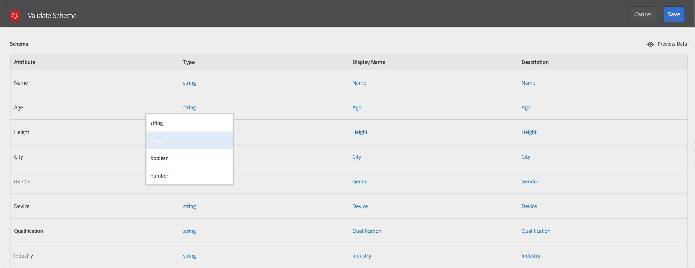

# Atributos do cliente{#customer-attributes}

Informações sobre como usar os dados de clientes corporativos provenientes de um banco de dados de gerenciamento de relacionamento com o cliente (CRM) para o direcionamento de conteúdo no Adobe Target, usando os Atributos do cliente no serviço principal de Perfis e públicos-alvo da Adobe.

Os dados de clientes corporativos coletados por meio de várias fontes e armazenados em um banco de dados de CRM podem ser usados no [!DNL Target] para entregar estrategicamente o conteúdo mais relevante para os clientes, concentrando-se principalmente em seu retorno. O serviço principal de [!DNL People] (anteriormente chamado de Perfis e Públicos-alvo) unem a coleta e a análise de dados à otimização e realização de testes, o que possibilita a execução de dados e insights.

## Visão geral dos atributos do cliente {#section_B4099971FA4B48598294C56EAE86B45A}

O serviço principal de Pessoas é parte da [!DNL Adobe Experience Cloud] e fornece às empresas uma ferramenta para enviar os dados de clientes para a plataforma da [!DNL Experience Cloud]. Os dados incorporados à [!DNL Experience Cloud] estão disponíveis para todos os fluxos de trabalho da [!DNL Experience Cloud]. O [!DNL Adobe Target] utiliza esses dados para direcionar o cliente de retorno com base nos atributos. O [!DNL Adobe Analytics] consome esses atributos e eles podem ser usados para análise e segmentação.


Considere as seguintes informações ao trabalhar com os atributos do cliente e o Target:

* Você precisa atender alguns pré-requisitos para usar o recurso de [!UICONTROL Atributos do cliente] no serviço principal do [!DNL People]. Para obter mais informações, consulte &quot;Pré-requisitos para o upload de atributos do cliente&quot; em [Atributos do cliente](https://marketing.adobe.com/resources/help/en_US/mcloud/attributes.html) na documentação dos produtos *Experience Cloud e Serviços essenciais*. Observe que a [!DNL at.js] (qualquer versão) ou a [!DNL mbox.js] versão 58 ou posterior são exigidas.
* A Adobe não garante que 100% dos dados do atributo do cliente (perfil do visitante) dos bancos de dados do CRM sejam incorporados à Experience Cloud e, portanto, estejam disponíveis para uso de direcionamento no Target. Em nosso design atual, existe a possibilidade de que uma pequena porcentagem de dados não seja incorporada.
* A duração dos dados de atributos do cliente importados da Experience Cloud para o Target depende da duração do perfil do visitante, que, por padrão, é de 14 dias. Para obter mais informações, consulte [Duração do perfil do visitante](../../c-target/c-visitor-profile/visitor-profile-lifetime.md#concept_D9F21B416F1F49159F03036BA2DD54FD)
* Se os parâmetros de `vst.*` foram a única coisa que identifica o usuário, o perfil “autenticado” existente não será recuperado, desde que `authState` seja UNAUTHENTICATED (0). O perfil será exibido apenas se `authState` for alterado para NÃO AUTENTICADO (1).

   Por exemplo, se o parâmetro `vst.myDataSource.id` for usado para identificar o usuário (onde `myDataSource` é o alias da fonte de dados) e não há MCID ou ID de terceiros, o uso do parâmetro `vst.myDataSource.authState=0` não buscará o perfil, que pode ter sido criado por meio de uma importação dos Atributos do Cliente. Se o comportamento desejado for buscar o perfil autenticado, o `vst.myDataSource.authState` precisa ter o valor de 1 (AUTENTICADO).

* Não é possível enviar os seguintes caracteres em `mbox3rdPartyID`: sinal de adição (+) e barra invertida (/).

## Fluxo de trabalho dos atributos do cliente para Target {#section_00DAE94DA9BA41398B6FD170BC7D38A3}

Conclua as etapas a seguir para usar os dados do CRM no [!DNL Target], conforme ilustrado abaixo:


As instruções detalhadas para concluir cada uma das seguintes tarefas podem ser encontradas em [Criar uma fonte de atributo do cliente e fazer upload do arquivo de dados](https://marketing.adobe.com/resources/help/en_US/mcloud/t_crs_usecase.html) na documentação dos produtos *Experience Cloud e Serviços principais*.

1. Criar um arquivo de dados.

   Exporte os dados do cliente do formato CRM para o para criar um arquivo [!DNL .csv]. Como alternativa, um arquivo zip ou gzip pode ser criado para o upload. Certifique-se de que a primeira linha do CSV seja o cabeçalho e que todas as linhas (dados do cliente) tenham o mesmo número de entradas.

   

   

1. Criar a fonte de atributo e fazer upload do arquivo de dados.

   Especifique um Nome e uma Descrição da fonte de dados e a ID do alias. A ID do alias é uma ID exclusiva para ser usada no código do atributo do cliente em VisitorAPI.js.

   >[!IMPORTANT]
   >
   >O nome da fonte de dados e o nome do atributo não podem conter ponto.

   Os arquivos de dados de até 100 MB podem ser enviados usando o método de HTTP. Os arquivos maiores que 100 MB, até 4 GB, podem ser enviados por meio de FTP.

   * **HTTPS:** você pode arrastar e soltar o arquivo de dados [!DNL .csv] ou clicar em [!UICONTROL Procurar] para fazer upload do seu sistema de arquivos.
   * **FTP:** Clique no link de FTP para [fazer upload do arquivo por meio de FTP](https://marketing.adobe.com/resources/help/en_US/mcloud/t_upload_attributes_ftp.html). O primeiro passo é fornecer uma senha para o servidor de FTP fornecido pela Adobe. Insira a senha, em seguida, clique em [!UICONTROL Concluído].

      Agora transfira o arquivo CSV/ZIP/GZIP para o servidor FTP. Após a transferência ser bem-sucedida, crie um novo arquivo com o mesmo nome e a extensão [!DNL .fin]. Transfira este arquivo vazio para o servidor. Isso indica o término da transferência e a Experience Cloud começará a processar o arquivo de dados.

1. Validar o esquema.

   O processo de validação permite mapear os nomes de exibição e as descrições aos atributos carregados (sequências, números inteiros, números e assim por diante). Mapeie cada atributo para seu tipo de dados, nome de exibição e descrição corretos.

   Clique em [!UICONTROL Salvar] após a conclusão da validação do esquema. O tempo de upload do arquivo varia dependendo do tamanho.

   

   

1. Configurar assinaturas e ativar a fonte de atributo.

   Clique em **[!UICONTROL Adicionar assinatura]**, em seguida, selecione a solução para inscrever esses atributos. [Configurar uma assinatura](https://marketing.adobe.com/resources/help/en_US/mcloud/subscription.html) define o fluxo de dados entre a Experience Cloud e as soluções. Ativar a fonte de atributo permite que os dados fluam para as soluções assinadas. Os registros do cliente carregados são combinados com sinais de ID vindos do seu site ou aplicativo.

   

   

   Ao executar esta etapa, esteja ciente das seguintes limitações:

   * O tamanho máximo de arquivo para cada upload usando o método de HTTP é de 100 MB.
   * O tamanho máximo de arquivo para cada upload usando o método de FTP é de 4 GB.
   * O número de atributos permitidos para a inscrição: 5 para o [!DNL Target Standard] e 200 para o [!DNL Target Premium].

## Usar os atributos do cliente no Target {#section_107E3A0F0EC7478E82E6DBD17B30B756}

Você pode usar os atributos do cliente no [!DNL Target] das seguintes maneiras:

### Criação de públicos-alvo de direcionamento

No [!DNL Target], você pode selecionar um atributo do cliente na seção Perfil do visitante ao criar um público-alvo. Todos os atributos do cliente têm o prefixo &lt; data_source_name &gt; na lista. Combine esses atributos como necessário a outros atributos de dados para construir públicos-alvo.


### Criação de scripts de perfil usando tokens

Os atributos de cliente podem ser referenciados nos scripts de perfil, usando o formato `crs.get('<Datasource Name>.<Attribute name>')`.

Esse script de perfil pode ser usado diretamente nas ofertas para entrega de atributos que pertencem ao visitante atual.

### Uso de mbox3rdPartyID no seu site para uma implementação e uso bem-sucedidos

Envie o mbox3rdPartyId como um parâmetro para a mbox global dentro do método `targetPageParams()`. O valor de mbox3rdPartyId deve ser definido para a ID do cliente que estava presente no arquivo de dados CSV.

```
<script type="text/javascript">
            function targetPageParams() {
               return 'mbox3rdPartyId=2000578';
            }
</script>
```

### Uso do serviço de Experience Cloud ID.

Se você estiver usando o serviço de Experience Cloud ID, será necessário definir uma ID do cliente e um Estado de autenticação para usar os atributos do cliente no direcionamento. Para obter mais informações, consulte [IDs e estados de autenticação do cliente](https://marketing.adobe.com/resources/help/en_US/mcvid/mcvid-authenticated-state.html) na documentação do *Serviço de Experience Cloud ID*.

Para obter mais informações sobre o uso de atributos do cliente no [!DNL Target], consulte os recursos a seguir:

* [Criar uma fonte de atributo do cliente e fazer upload do arquivo de dados](https://marketing.adobe.com/resources/help/en_US/mcloud/t_crs_usecase.html) na documentação dos produtos *Experience Cloud e Serviços principais*
* [Atributos do cliente: quanto mais você souber, melhor se conectará](https://blogs.adobe.com/digitalmarketing/analytics/customer-attributes-know-better-connect/) no *Blog de Marketing digital*

## Problemas encontrados com frequência pelos clientes {#section_BE0F70E563F64294B17087DE2BC1E74C}

Você pode encontrar os seguintes problemas ao trabalhar com atributos do cliente e o [!DNL Target]:

| Problema | Detalhes |
|--- |--- |
| Os atributos do cliente são removidos, pois o perfil é muito grande | Não há limite de caracteres em um campo específico do perfil do usuário, mas se o perfil for maior que 64 K, ele será truncado, removendo os atributos mais antigos até que o perfil fique abaixo de 64 KB novamente. |
| Atributos não listados na Biblioteca de público-alvo no [!DNL Target], mesmo depois de vários dias | Isso geralmente é um problema de conexão do pipeline. Como solução, solicite que a equipe dos Atributos do Cliente republique o feed. |
| A entrega não funciona com base no atributo | O perfil ainda não foi atualizado na borda. Como solução, solicite que a equipe dos Atributos do Cliente republique o feed. |
| Problemas de implementação | Esteja ciente dos seguintes problemas de implementação:<ul><li>A ID do visitante não foi passada corretamente. A ID foi passada no mboxMCGVID, em vez de `setCustomerId`.</li><li>A ID do visitante foi passada corretamente, mas o estado de AUTENTICAÇÃO não foi definido como autenticado.</li><li>`mbox3rdPartyId` não foi transmitido corretamente.</li> |
| `mboxUpdate` não foi executado adequadamente | O mboxUpdate não foi executado adequadamente com `mbox3rdPartyId`. |
| Os atributos do cliente não estão sendo importados para o Target | Se você não puder encontrar os dados dos Atributos do cliente no Target, verifique se a importação ocorreu nos últimos x dias, onde x é o valor [Duração do perfil do visitante](/help/c-target/c-visitor-profile/visitor-profile-lifetime.md) do Target (14 dias por padrão). |

Os problemas nas linhas 1 e 2 acima causam aproximadamente 60% dos problemas nessa área. Os problemas na linha 3 causam aproximadamente 30% dos problemas. O problema na linha 4 causa aproximadamente 5% dos problemas. Os 5% restantes são devido a diversos problemas.

## Vídeo de treinamento: Fazer upload de dados offline usando atributos do cliente {#section_9A4E0FA0D0934D06BD8D5BFA673E9BD8}

Este vídeo mostra como importar CRM offline, suporte técnico, ponto de venda e outros dados de marketing para o serviço de Pessoas da Experience Cloud, além de como associá-los a visitantes que usam suas IDs conhecidas.

>[!VIDEO](https://video.tv.adobe.com/v/17802t1/?captions=por_br)
