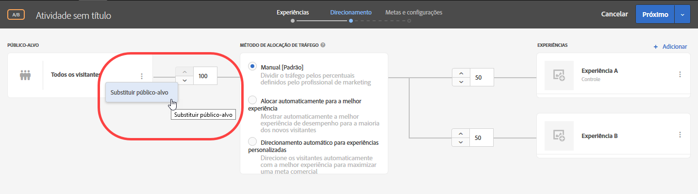
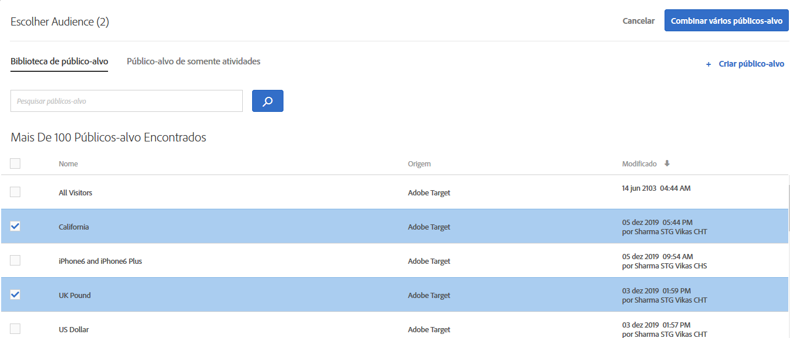
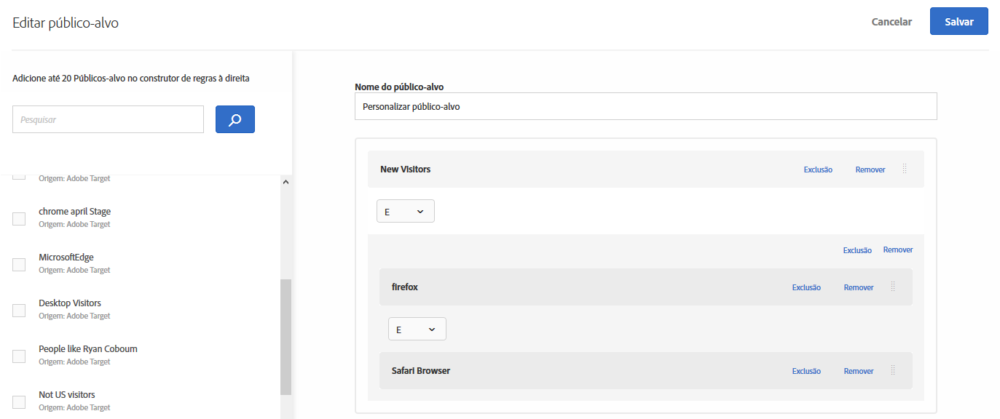
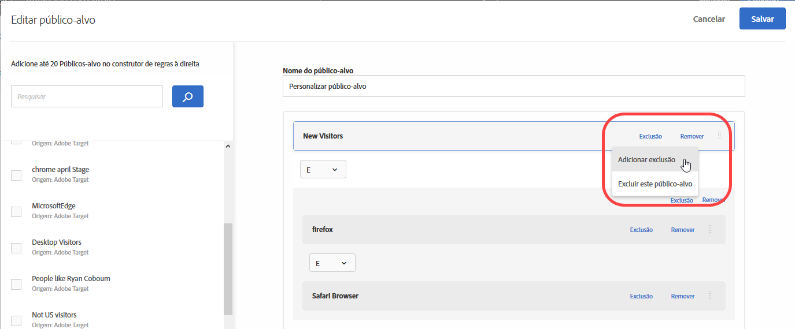
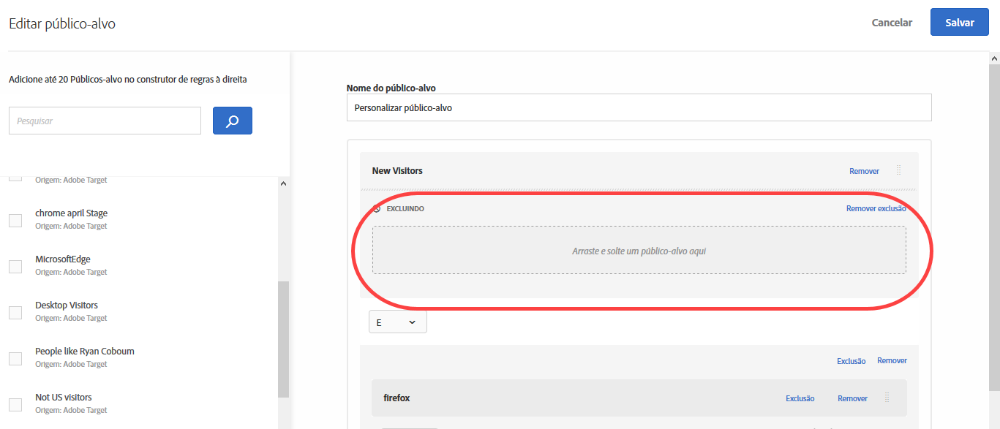
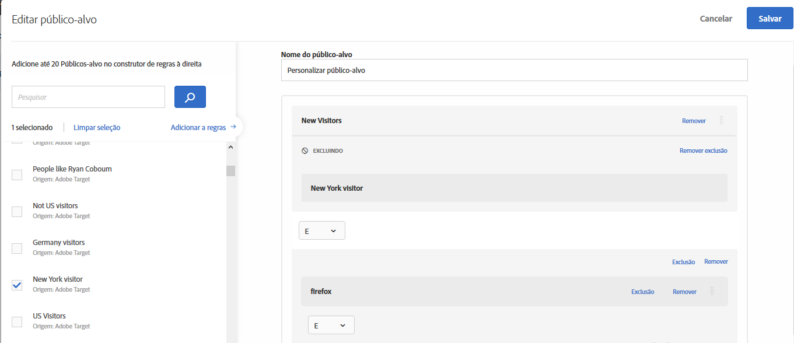
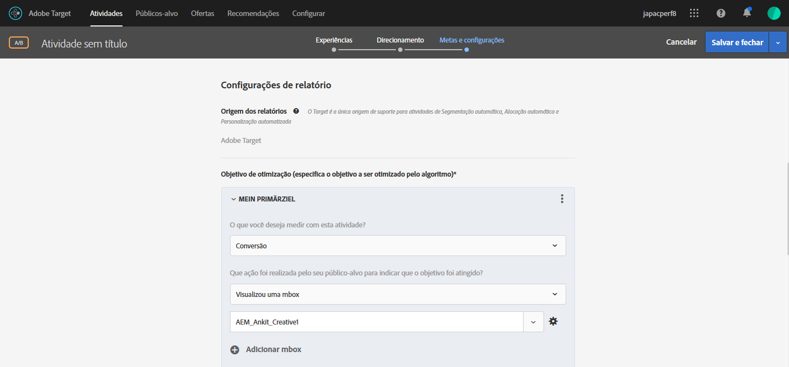
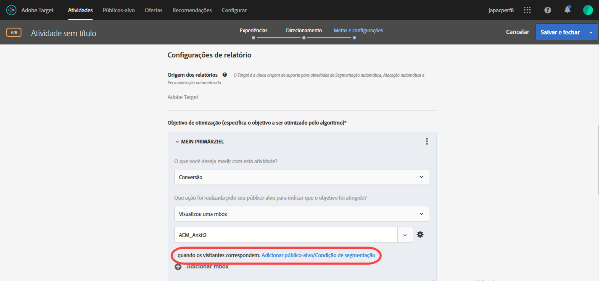
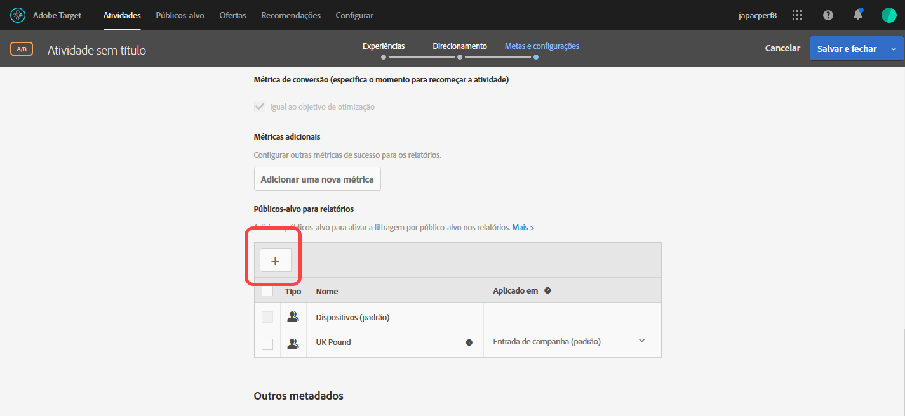

# Combinar vários públicos{#combine-multiple-audiences}

Combine vários públicos-alvo (incluindo públicos-alvo da Adobe Experience Cloud e do Target) rapidamente para criar públicos-alvo ad hoc. Também é possível criar regras de exclusão e excluir públicos-alvo de uma regra.

Suponha que você tenha um público-alvo de &quot;Novos visitantes&quot; e um público-alvo de &quot;Usuários do Chrome&quot;. Para uma atividade específica, convém combinar esses públicos-alvo existentes para segmentar novos visitantes usando os navegadores Chrome. Em vez de criar um terceiro público-alvo e armazená-lo na biblioteca de [!UICONTROL Públicos-alvo], você pode combinar esses dois públicos-alvo durante a criação da atividade ou ao editar uma atividade existente.

Como outro exemplo, você pode direcionar todos os clientes de fidelidade incluindo um segmento específico do [!DNL Audience Manager] para o status de fidelidade e combinando-o com um segmento do [!DNL Target] composto por pessoas que se inscreveram no programa de fidelidade durante a sessão atual, em vez de criar um terceiro público-alvo permanente.

Você pode combinar até dez públicos-alvo usando operadores AND e OR.

Você pode criar e usar públicos-alvo combinados em vários locais na interface do usuário do [!DNL Target].

## Criar um público-alvo combinado ao criar uma atividade {#section_2F1CE9434CC04174B4BA2BFC89B85D77}

Você pode criar um público-alvo ad hoc combinado na página do [!UICONTROL Target] da atividade durante o fluxo de trabalho guiado de três etapas.

1. Ao criar uma [atividade](../c-activities/activities.md#concept_D317A95A1AB54674BA7AB65C7985BA03), na página **[!UICONTROL Target]** , clique nos sinal de três pontos verticais e clique em **[!UICONTROL Substituir público]**.

   

1. Na página [!UICONTROL Escolher público-alvo], marque as caixas de seleção ao lado dos públicos-alvo desejados que você deseja usar como blocos de construção para o público-alvo combinado.

   

1. Clique em **[!UICONTROL Combinar vários públicos-alvo]** no canto superior direito.

   

1. (Condicional) Editar o novo público-alvo combinado como desejado.

   A caixa de diálogo [!UICONTROL Editar público-alvo] permite arrastar e soltar blocos adicionais de público-alvo do lado esquerdo para o novo público-alvo combinado, além de adicionar regras de exclusão e excluir audiências.

   1. Você pode usar a funcionalidade de arrastar e soltar para adicionar públicos-alvo dentro de uma seção existente como um bloco de construção de nível 2. Para adicionar um bloco de construção de nível 1, marque a caixa de seleção ao lado do público-alvo desejado e clique em **[!UICONTROL Adicionar às regras]**.

      Por exemplo, suponha que, no exemplo anterior, você queira incluir usuários do Safari no público-alvo combinado. Pesquise e arraste o público-alvo &quot;Navegador Safari &quot; para a caixa &quot;Navegador Firefox&quot; à direita, como no exemplo a seguir:

      

      Observe que o operador entre os dois públicos-alvo do tipo de navegador é &quot;E&quot;. Selecione a lista suspensa e altere para &quot;OU&quot; para criar um novo público-alvo combinado para os novos visitantes que usam o Safari ou o Firefox. Tenha cuidado para evitar criar regras que excluem todos membros em potencial do público-alvo. Por exemplo, não é possível alguém visitar sua página usando o Firefox e o Safari simultaneamente.

      >[!NOTE]
      >
      >O operador (E ou) deve permanecer o mesmo ao combinar públicos. Não é possível mesclar e combinar os operadores.

   1. Para adicionar uma exclusão à uma regra, clique em **[!UICONTROL Exclusão]** > **[!UICONTROL Adicionar exclusão]**.

      

      Arraste e solte um público-alvo na caixa:

      

      Por exemplo, para excluir visitantes dos Estados Unidos de novos visitantes, você pode arrastar o público-alvo de Mercado: Estados Unidos para a caixa, conforme mostrado abaixo:

      

      Esse público-alvo combinado inclui todos os novos visitantes do seu site (excluindo os de São Francisco) usando o Safari ou o Firefox.

   1. Para excluir um público-alvo de uma regra, clique em **[!UICONTROL Exclusão]** > **[!UICONTROL Excluir este público-alvo]**.

      Por exemplo, você pode criar um público-alvo combinado que inclua todos os novos visitantes do seu site, exceto aqueles que usam o Firefox. A exclusão de visitantes usando o Firefox é mais fácil e rápida do que a criação de um público-alvo combinado que inclui explicitamente vários navegadores (Safari, Chrome e Internet Explorer), mas não inclui o Firefox.

1. Forneça um nome descritivo para o público-alvo combinado e clique em **[!UICONTROL Salvar]**.

## Criar um público-alvo combinado para uso no direcionamento por métrica {#section_A42E795AFCBD4575809C5942039910F0}

Você pode criar um público-alvo combinado ad hoc na página [!UICONTROL Metas e configurações] da atividade para ser usado na segmentação de métrica. Por exemplo, para criar segmentação com base na conversão usando um público-alvo combinado:

1. Ao editar ou criar uma  [atividade](../c-activities/activities.md#concept_D317A95A1AB54674BA7AB65C7985BA03), na página **[!UICONTROL Metas e configurações]**, selecione **[!UICONTROL Conversão]** para a métrica de sucesso e, em seguida, selecione **[!UICONTROL Uma Mbox visualizada]** como ação.
1. Selecione a mbox desejada no campo **[!UICONTROL Pesquisar mbox]**.

   

1. Clique no ícone de engrenagem e, em seguida, clique em **[!UICONTROL Adicionar segmentação de público-alvo]**.
1. Clique no link **[!UICONTROL Adicionar público-alvo/condição de segmentação]** para exibir a caixa de diálogo [!UICONTROL Escolher público-alvo].

   

1. Prossiga com o [Passo 2](../c-target/combining-multiple-audiences.md#section_2F1CE9434CC04174B4BA2BFC89B85D77) em &quot;Criar um público-alvo combinado ao criar uma atividade&quot; para criar o público-alvo combinado.

## Criar um público-alvo combinado para uso na geração de relatórios  {#section_4682D342EFBB43C38E54B99B3A1E14CD}

Você pode criar um público-alvo combinado ad hoc na página [!UICONTROL Metas e configurações] da atividade para ser usado na geração de relatórios.

1. Ao editar ou criar uma  [atividade](../c-activities/activities.md#concept_D317A95A1AB54674BA7AB65C7985BA03), na página **[!UICONTROL Metas e configurações]**, clique no ícone **[!UICONTROL Adicionar público-alvo]** em [!UICONTROL Públicos-alvo para geração de relatórios] para exibir a página [!UICONTROL Escolher público-alvo].

   

1. Prossiga com o [Passo 2](../c-target/combining-multiple-audiences.md#section_2F1CE9434CC04174B4BA2BFC89B85D77) em &quot;Criar um público-alvo combinado ao criar uma atividade&quot; para criar o público-alvo combinado.

## Criar um público-alvo combinado ao editar uma atividade {#section_364A12CE96E04B61B7C18113AA586C2C}

Você pode criar um público-alvo ad hoc combinado ao editar uma atividade existente.

1. Na página [!UICONTROL Atividades], passe o mouse sobre a atividade desejada, depois clique no ícone **[!UICONTROL Editar.]**

   Ou

   Clique na atividade desejada para abri-la, depois clique em **[!UICONTROL Editar atividade]**.

1. Click the **[!UICONTROL Configure]** > **[!UICONTROL Audiences]** > **[!UICONTROL Multiple Audiences]**.

   

1. Clique no ícone de mais opções (três elipses verticais) ao lado do público-alvo atual da atividade, depois clique em **[!UICONTROL Alterar público-alvo]**.

   

1. Prossiga com o [Passo 2](../c-target/combining-multiple-audiences.md#section_2F1CE9434CC04174B4BA2BFC89B85D77) em &quot;Criar um público-alvo combinado ao criar uma atividade&quot; para criar o público-alvo combinado.