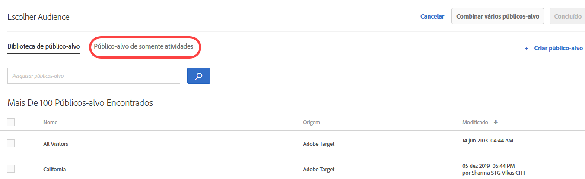

# Criar um público-alvo com apenas uma atividade

Crie públicos-alvo somente de atividades dentro do [!DNL Adobe Target] fluxo de trabalho guiado de três etapas ao criar uma atividade. Esses públicos podem ser usados em outros locais na mesma atividade, mas não são armazenados na [!UICONTROL Biblioteca de público] para uso em outras atividades.

Públicos-alvo somente atividade proporcionam os seguintes benefícios:

* Públicos somente atividade são úteis para criar um público-alvo que você deseje usar somente uma vez e não deseje armazenar na [!UICONTROL Biblioteca de públicos-alvo]. Públicos somente atividade ajudam a impedir que a [!UICONTROL Biblioteca de públicos] seja desorganizada com públicos que você nunca deseja usar novamente.
* Públicos somente atividade não estão visíveis na [!UICONTROL Biblioteca de públicos]. Como esses públicos-alvo não estão visíveis na biblioteca, eles são protegidos contra alterações indesejadas por outras pessoas em sua organização.

1. Ao criar uma [atividade](/help/c-activities/activities.md#concept_D317A95A1AB54674BA7AB65C7985BA03), na página **[!UICONTROL Direcionamento]**, clique nos três elipses verticais e clique em **[!UICONTROL Substituir público]**.

   

1. Clique em **[!UICONTROL Criar público-alvo]**.

1. Clique em **[!UICONTROL Esta atividade apenas]**.

   

1. Digite um nome de público-alvo descritivo.
1. Arraste e solte os atributos desejados no construtor de público-alvo.

   As regras possibilitam limitar o público-alvo a um subconjunto de visitantes do site. Cada tipo de regra tem seus próprios parâmetros. Consulte [Categorias para públicos-alvo](/help/c-target/c-audiences/c-target-rules/target-rules.md#concept_E3A77E42F1644503A829B5107B20880D) para obter mais informações sobre a configuração de cada tipo de regra de público-alvo.

1. Clique em **[!UICONTROL Concluído]**.

## Considerações

Tenha em mente as informações a seguir enquanto você trabalha com públicos somente-atividades:

* Você pode criar públicos-alvo somente atividade no [!UICONTROL Visual Experience Composer] (VEC) ou no [!UICONTROL Experience Composer baseado em formulário]. Esta funcionalidade substitui regras de refinamento em versões anteriores do [!DNL Target].
* É possível criar uma atividade para armazenar na [!UICONTROL Biblioteca de público-alvo] para reutilização em outras atividades, ou criar um público somente atividade. Depois de salvar o público-alvo, não é possível mudar o tipo de público-alvo.
* Os refinamentos das atividades existentes são migrados para públicos-alvo somente atividade.
* Públicos somente atividade terão status [!UICONTROL Utilizado] ou [!UICONTROL Não utilizado]. Públicos-alvo somente atividade não utilizados são exibidos até que a atividade seja salva. Se deixados não utilizados e você tentar salvar a atividade, uma mensagem de alerta é exibida informando que públicos-alvo somente atividade não utilizados serão excluídos.
* É possível ver os detalhes da definição de público-alvo em um cartão pop-up acessado do seletor de público-alvo sem abrir o público-alvo.
* Você pode [combinar vários públicos](/help/c-target/combining-multiple-audiences.md#concept_A7386F1EA4394BD2AB72399C225981E5) para criar públicos somente atividade.
