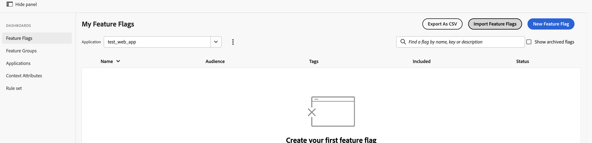

# Importar sinalizadores de recursos {#import-feature-flags}

Os sinalizadores permitem importar sinalizadores de recursos de uma sandbox (por exemplo, sandbox 1) para outra sandbox (por exemplo, sandbox 2). Isso evita a necessidade de recriar configurações de sinalizador manualmente e reduz o risco de descompasso de configuração entre as sandboxes.

## Etapa 1: Ir para a sandbox e o aplicativo de destino {#step-1}

Faça logon no console da sandbox **destino** — a sandbox para a qual você deseja importar sinalizadores. Clique em **Importar Sinalizadores de Recursos** e selecione o aplicativo para o qual deseja importar sinalizadores no menu suspenso do aplicativo.

>[!IMPORTANT]
>
>Sua sandbox atual e o aplicativo selecionado devem ser o **destino** — não a origem. Por exemplo, para importar um sinalizador da sandbox 1 para a sandbox 2, faça logon no console da sandbox 2 e selecione o aplicativo sandbox 2.

## Etapa 2: abrir a caixa de diálogo de importação {#step-2}

Selecione **Importar Sinalizadores de Recursos**. Uma caixa de diálogo é aberta mostrando a sandbox de origem e o aplicativo, pré-preenchidos com base nos aplicativos disponíveis. Se necessário, é possível alterar a sandbox de origem e o aplicativo nos menus suspensos na caixa de diálogo.

## Etapa 3: Selecionar os sinalizadores de recurso a serem importados {#step-3}

Na lista de sinalizadores de recursos na sandbox de origem, selecione os sinalizadores que deseja importar. Você pode selecionar um, vários ou todos os sinalizadores de uma só vez.

## Etapa 4: selecionar o estado dos sinalizadores de recursos a serem importados {#step-4}

Use a lista suspensa para escolher como os sinalizadores de recursos devem ser importados — **Habilitado**, **Desabilitado** ou em seu **Estado atual**. Por padrão, os sinalizadores de recursos são importados no estado **Desabilitado**.

## Observações importantes {#important-notes}

Lembre-se do seguinte ao importar sinalizadores de recursos:

* Se um sinalizador de recurso com a mesma chave já existir na sandbox de destino, ele não será importado.

## Consulte também {#see-also}

* [Recursos e grupos de recursos](../feature-flags/features-feature-groups-releases.md)
* [Criar o primeiro sinalizador de recurso](../feature-flags/create-your-first-feature-flag.md)

<!-- -->
