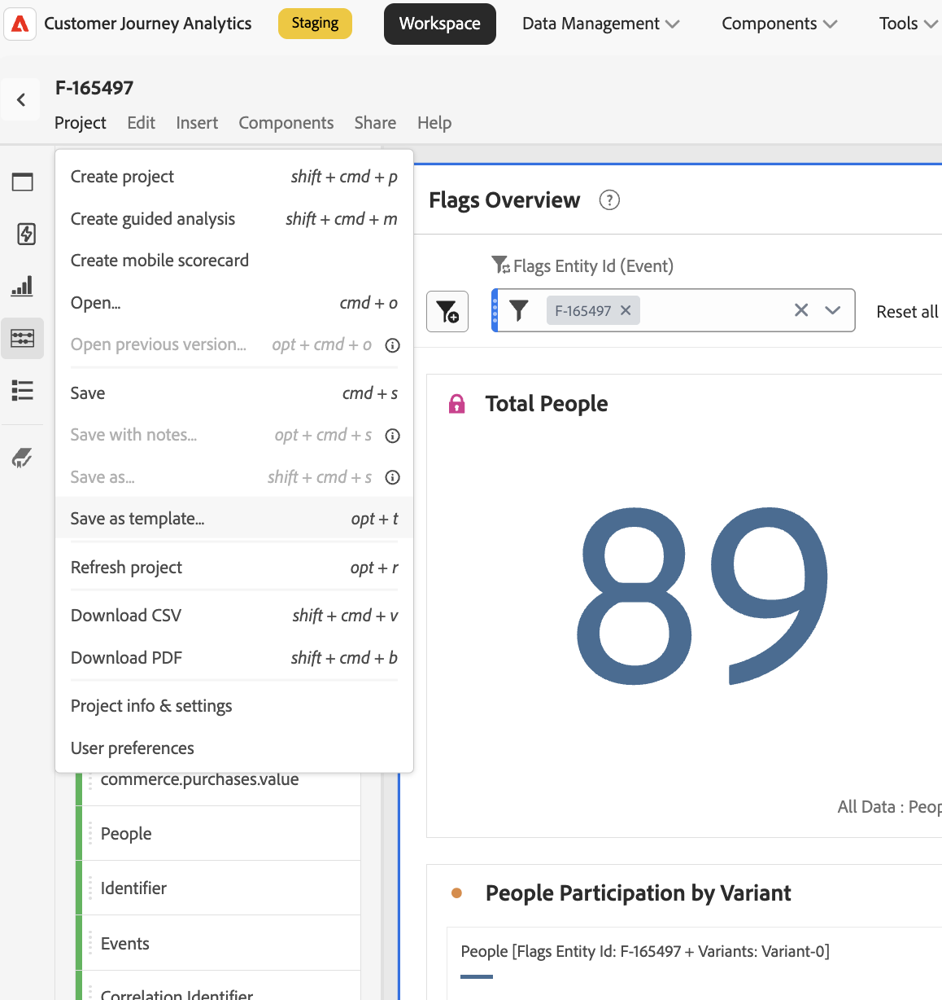

# Relatório {#reporting}

Os sinalizadores fornecem relatórios por meio do **Customer Journey Analytics (CJA)**. A guia **Relatório** está disponível em todas as páginas de detalhes de sinalizadores e grupos de recursos. Ele permite exibir um relatório do CJA com escopo para esse sinalizador ou grupo específico, incorporado diretamente na página.

>[!NOTE]
>
>Por padrão, os relatórios são abertos com uma janela de relatórios de **30-day**. É possível ajustar o intervalo no cabeçalho do painel.

## Pré-requisitos {#prerequisites}

Antes de visualizar os relatórios, verifique se:

1. Os relatórios estão configurados para seu aplicativo — consulte [Configurar relatórios com o Customer Journey Analytics](#setup).
1. Seu sinalizador de recurso ou grupo de recursos está ativo e tem dados acumulados.

## Exibir um relatório {#view-report}

### Abra a guia Relatório e escolha uma visualização de dados {#open-report-tab}

1. Abra um sinalizador de recurso ou grupo de recursos e selecione a guia **Relatório**.
1. Uma caixa de diálogo **Selecionar Exibição de Dados** é aberta, listando as exibições de dados do CJA disponíveis para você. O primeiro é selecionado por padrão.
1. Escolha a exibição de dados desejada e selecione **Exibir Relatório**. Selecione **Cancelar** para fechar a caixa de diálogo sem carregar um relatório.
1. O relatório é carregado dentro da guia com escopo para esse sinalizador ou ID de entidade do grupo.

>[!NOTE]
>
>A caixa de diálogo lista somente as visualizações de dados às quais você tem acesso na sandbox atual. Se nenhum estiver disponível, a caixa de diálogo mostrará uma mensagem e o **Exibir Relatório** permanecerá desabilitado — verifique suas permissões de visualização de dados ou alterne a sandbox.

### Exibir o relatório de desempenho {#view-performance-report}

O painel **Visão Geral dos Sinalizadores** inserido exibe:

* **Total de Pessoas**, **Participação de Pessoas por dia** e **Participação de Pessoas por Variante** (grupo de controle vs. IDs de Variante)
* Uma tabela **Visão geral** listando cada variante com sua contagem de pessoas e porcentagem de participação

Ajuste o intervalo de datas do cabeçalho do painel para replotar para uma janela diferente (padrão de 30 dias).

### Explorar resultados de experimentação {#explore-experimentation-results}

1. No painel **Experimentação**, o **Experimento** (sinalizador ou ID de entidade de grupo) e a **Variante de controle** são pré-selecionados.
1. Adicione uma **métrica de sucesso** usando **Adicionar métrica** e escolha uma **métrica de normalização** (padrão **Pessoas**) com base no gráfico que você deseja plotar.
1. Habilite opcionalmente **Incluir limites superior/inferior de confiança**.
1. Selecione **Build** para calcular **Lift**, **Confidence** e **Conversion rate** por variante para a métrica selecionada.

Consulte a [Documentação do painel de experimentação](https://experienceleague.adobe.com/pt-br/docs/analytics-platform/using/cja-workspace/panels/experimentation) para obter mais detalhes sobre como essas métricas são calculadas.

### Analisar no CJA (opcional) {#analyze-in-cja}

Depois que um relatório é carregado, o botão **Analisar no CJA** é exibido na parte superior direita da guia Relatório. Selecionar essa opção abre o mesmo relatório de página inteira no Customer Journey Analytics em uma nova guia do navegador, onde você tem o conjunto completo de ferramentas do CJA para análise ad hoc mais profunda.

>[!IMPORTANT]
>
>O relatório é aberto como um projeto temporário e não salvo. Se você o personalizar no CJA (adicionar métricas, alterar painéis, ajustar filtros e assim por diante) e quiser manter essas alterações, salve-o usando **Projeto > Salvar como modelo**. Caso contrário, suas edições serão perdidas quando você fechar o relatório.

## Configurar relatórios com o Customer Journey Analytics {#setup}

Os relatórios exigem um conjunto de dados do Customer Journey Analytics conectado ao aplicativo Sinalizadores. Entre em contato com o suporte a Sinalizadores ou com o representante da Adobe para habilitar os relatórios do seu aplicativo.

>[!NOTE]
>
>A identidade transmitida na solicitação de recurso não precisa ser vinculada a um perfil. A avaliação acontece no tempo de execução e o evento é enviado para a Customer Journey Analytics.

## Consulte também {#see-also}

* [Criar o primeiro sinalizador de recurso](create-your-first-feature-flag.md)
* [Teste A/B com sinalizadores de recursos](a-b-testing.md)
* [Criar um grupo de recursos](create-a-feature-group.md)

<!-- -->
