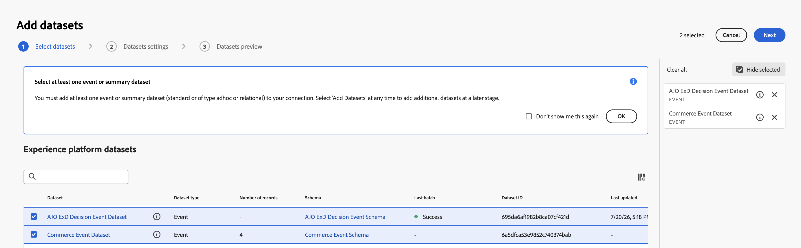
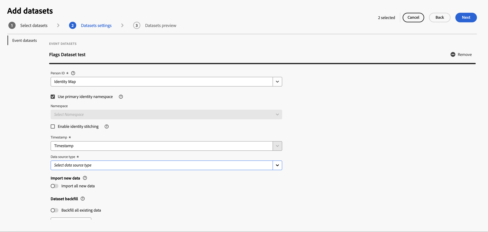

# Configurar o CJA para relatórios de sinalizadores de recursos {#set-up-cja-reporting}

A integração entre o Flags e o Adobe Customer Journey Analytics (CJA) fornece uma maneira unificada de medir o impacto comercial das variantes de sinalizadores de recursos. Aplique as métricas de sucesso do CJA aos relatórios de Sinalizadores a qualquer momento e aproveite os recursos do Customer Journey Analytics, como o [painel de Experimentação](https://experienceleague.adobe.com/en/docs/analytics-platform/using/cja-workspace/panels/experimentation), para avaliar o desempenho do experimento e entender como as variantes de recursos influenciam o comportamento do cliente.

## Considerações {#considerations}

Considere as seguintes informações antes de usar a integração do Customer Journey Analytics e dos Sinalizadores:

* Você e sua organização devem ter acesso ao Adobe Customer Journey Analytics (CJA).
* O **Conjunto de Dados de Eventos de Decisão ExD do AJO** deve ser provisionado na sandbox para eventos de exposição de sinalizadores.
* Um conjunto de dados contendo os eventos de conversão bem-sucedidos que você deseja usar como métricas de sucesso deve estar disponível.

## Configurar um fluxo de dados {#set-up-datastream}

>[!NOTE]
>
>Este guia usa um conjunto de dados de Evento de experiência do Commerce e `commerce.purchases.value` apenas como exemplos. Selecione o esquema e o campo de métrica de sucesso mapeado apropriado para o seu caso de uso.

1. Em Coleção de dados, vá para **Datastreams** e crie ou abra a sequência de dados de exposição de sinalizadores.
1. Defina seu esquema de mapeamento como **Esquema de Evento de Decisão ExD do AJO**.
1. Abra a sequência de dados e selecione **Adicionar Serviço**.
1. Selecione o **Conjunto de Dados de Eventos de Decisão ExD do AJO** existente como o conjunto de dados do evento e salve.

>[!NOTE]
>
>A ID da sequência de dados que você acabou de criar é usada para configurar a extensão Sinalizadores nas tags de Coleção de dados.

## Configurar uma conexão do Customer Journey Analytics {#set-up-connection}

Se você já tiver uma conexão configurada, poderá usar sua conexão existente e pular para a etapa 3 abaixo. A conexão permite que o Customer Journey Analytics inicie a extração de dados do conjunto de dados para os relatórios.

1. No Customer Journey Analytics, na página **Conexões**, selecione **Criar uma nova conexão**.
1. Defina suas [configurações de conexão e dados](https://experienceleague.adobe.com/en/docs/analytics-platform/using/cja-connections/overview) com as informações corretas.
1. Adicione o conjunto de dados do evento ExD usado ao configurar o fluxo de dados.
1. Adicione o conjunto de dados que você deseja que seja usado como eventos de conversão e selecione **Avançar**.
1. Defina as [configurações para cada um dos conjuntos de dados selecionados](https://experienceleague.adobe.com/en/docs/analytics-platform/using/cja-connections/create-connection#dataset-settings), uma por uma, na caixa de diálogo **Adicionar conjuntos de dados**.

## Configurar a visualização de dados {#set-up-data-view}

Configure uma visualização de dados no Customer Journey Analytics. Uma visualização de dados garante que os dados da sua conexão possam ser usados corretamente.

1. Configure sua visualização de dados e certifique-se de que ela aponta para a conexão criada acima. Para obter mais informações, consulte [Criar ou editar uma visualização de dados](https://experienceleague.adobe.com/en/docs/analytics-platform/using/cja-dataviews/create-dataview) no *Guia do Adobe Customer Journey Analytics*.
1. Vá para **Data management** > **Data views**.
1. Selecione **Criar nova visualização de dados** e escolha a conexão CJA de sinalizadores.
1. Insira um nome de visualização de dados e uma ID externa estável.
1. Confirme as configurações de fuso horário e calendário e continue em **Componentes**.

### Configurar dimensões de experimento e variante {#configure-experiment-variant-dimensions}

1. Adicione `_experience.decisioning.propositions.scopeDetails.activity.id` (mapeado para **ID de entidade de sinalizadores**) a Dimensões e renomeie-o para &quot;ID de entidade de sinalizadores&quot; ou outro nome amigável ao analista.
1. Defina o rótulo de contexto como &quot;Experimento de experimentação&quot;.
1. Adicionar `_experience.decisioning.propositions.scopeDetails.experience.id` (mapeado para a variante dos sinalizadores de recursos ou grupo de recursos) às Dimensões.
1. Defina o rótulo de contexto como &quot;Variante de experimentação&quot;.

>[!WARNING]
>
>Sem ambos os rótulos de contexto de experimentação, o painel Experimentação do CJA não pode identificar experimentos e variantes de sinalizadores.

### Configurar persistência e atribuição {#configure-persistence-attribution}

Configure as dimensões e métricas para que uma exposição possa receber crédito por uma conversão posterior. Sem a persistência ou atribuição apropriada, o CJA pode associar somente resultados que ocorram no mesmo evento que a exposição.

1. Adicione o campo de conversão necessário, como `commerce.purchases.value`, em Métricas.
1. Dê um nome claro à métrica, como **Valor de compras**.
1. Ative a atribuição e selecione o modelo necessário para a análise: Último contato, Primeiro contato, Participação ou Mesmo contato. Consulte [Componentes de atribuição](https://experienceleague.adobe.com/en/docs/analytics-platform/using/cja-workspace/attribution/models) para obter mais informações sobre modelos de atribuição, contêineres e janelas de retrospectiva.
1. Selecione um container e uma janela de retrospectiva que correspondam à estratégia do experimento. Um contêiner Pessoa com uma retrospectiva de visita ou sessão é um ponto de partida comum, mas o valida para o seu caso de uso.
1. Salve a visualização de dados.

## Consulte também {#see-also}

* [Relatório](reporting.md)

<!-- -->
