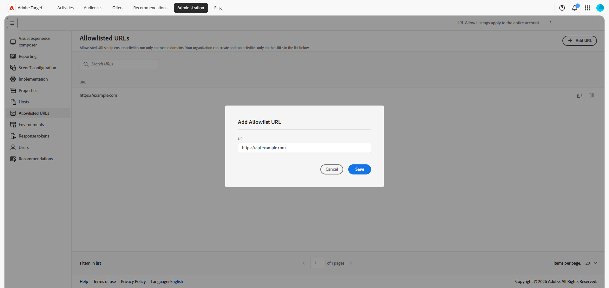

# ➡ URLs Incluídos na lista de permissões

As URLs resolvidas definem padrões de URL confiáveis em que sua organização pode criar e executar experiências do [!DNL Adobe Target], inclusive quando você usa ofertas remotas ou de redirecionamento. A lista funciona com o [gerenciamento de hosts](/help/main/administrating-target/hosts.md) e com os [ambientes](/help/main/administrating-target/environments.md), mas se aplica especificamente aos padrões de URL de oferta remota permitidos e validações relacionadas.

Para gerenciar URLs migrados, clique em **[!UICONTROL Administration]** > **[!UICONTROL Allowlisted URLs]**.

## Gerenciar URLs ➡ {#add-url}

A tabela principal lista cada padrão classificado em uma única coluna. As entradas compatíveis podem incluir URLs exatos, caminhos curingas ou formatos de padrão aceitos por sua organização para experiências remotas.

1. Clique em **[!UICONTROL Add URL]**.

   

1. Na caixa de diálogo, insira o URL ou padrão que sua organização deve permitir.

   

1. Salve as alterações.

   Depois que o padrão é criado, os usuários podem criar ou executar atividades e ofertas que dependem dessa URL, sujeitas às outras regras do [!DNL Target].

1. Use o campo **[!UICONTROL Search URLs]** para filtrar a tabela.

1. Para excluir uma URL, encontre a linha para o padrão que você não precisa mais e clique no ícone .

   

