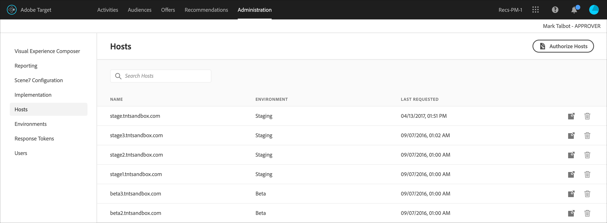

# Hosts

Organize seus sites e ambientes de pré-produção para fácil gerenciamento e geração de relatórios separados no [!DNL Adobe Target].

O objetivo principal do gerenciamento de hosts é assegurar que nenhum conteúdo inativo seja exibido acidentalmente nos sites. O gerenciamento de hosts também permite que você separe os dados do relatório por [ambiente](/help/main/administrating-target/environments.md).

Um host é qualquer domínio do qual um [!DNL Target] é feita. Em um site, geralmente é o `location.hostname` propriedade do URL que faz a variável [!DNL Target] solicitação.

Por padrão, [!DNL Target] não limita um host que pode criar [!DNL Target] solicitações e recepção [!DNL Target] respostas. Quando novos hosts fazem solicitações, elas funcionam automaticamente. Esse processo também permite testes em domínios diferentes que você não sabe ou não pode antecipar. Se quiser substituir esse comportamento padrão, você pode configurar uma  lista de permissões ou lista de bloqueios para limitar com quais hosts [!DNL Target].

Para gerenciar hosts, clique em **[!UICONTROL Administração]** > **[!UICONTROL Hosts]**.

## Reconhecimento de hosts {#concept_0D4B43E23AA9408F8B28A57ED754BF65}

Para reconhecer um host e adicioná-lo ao [!UICONTROL Hosts] , as seguintes condições devem ser atendidas:

* Pelo menos um [!DNL Target] deve existir no host
* Uma página no host deve ter  o seguinte:

   * Uma referência precisa à at.js
   * A [!DNL Target] ou uma solicitação global gerada automaticamente [!DNL Target] solicitação

* A página com o [!DNL Target] deve ser exibida em um navegador

Após a visualização de uma página, o host é adicionado na [!UICONTROL Hosts] , permitindo que você gerencie em um ambiente, e visualize e inicie atividades e testes.

>[!NOTE]
>
>Isso inclui quaisquer servidores de desenvolvimento pessoal.

Após adicionar um host na lista de [!UICONTROL Host], certifique-se de que o host seja reconhecido.

1. Clique em **[!UICONTROL Administração]** > **[!UICONTROL Hosts]**.
1. Se o seu host não estiver listado, atualize seu navegador. 

   Por padrão, um novo host reconhecido é colocado no [!UICONTROL Produção] ambiente. O [!UICONTROL Produção] o ambiente é o ambiente mais seguro porque não permite que atividades inativas sejam visualizadas a partir desses hosts.

1. (Condicional) Clique no botão **[!UICONTROL Mover]** ícone (  ) para mover o host para o [!UICONTROL Desenvolvimento], [!UICONTROL Estágios]ou outro ambiente.

>[!NOTE]
>
>O [!UICONTROL Produção] ambiente não pode ser excluído, mesmo que você o renomeie. Pressupõe-se que esse ambiente seja o local em que você disponibiliza atividades ativas e testes finais. O ambiente padrão não permite que campanhas inativas sejam visualizadas.

## Classificar ou pesquisar a lista de Hosts {#section_068B23C9D8224EB78BC3B7C8580251B0}

Para classificar a variável [!UICONTROL Hosts] clique em qualquer cabeçalho da coluna ([!UICONTROL Nome], [!UICONTROL Ambiente]ou [!UICONTROL Última solicitação]) para classificar a lista em ordem crescente ou decrescente.

Para pesquisar o [!UICONTROL Hosts] digite um termo de pesquisa na [!UICONTROL Pesquisar hosts] caixa.

## Crie listas de permissões que especifiquem hosts autorizados a enviar [!DNL Target] solicitações para [!DNL Target]. {#allowlist}

Você pode criar uma  de lista de permissões que especifica hosts (domínios) autorizados a enviar [!DNL Target] solicitações para [!DNL Target]. Todos os outros hosts que geram solicitações recebem uma resposta comentada do erro de autorização. Por padrão, qualquer host que contenha uma [!DNL Target] registros de solicitação com [!DNL Target] no [!UICONTROL Produção] e tem acesso a todas as atividades ativas e aprovadas. Se essa abordagem não for desejada, você poderá usar a  de lista de permissões para gravar hosts específicos que sejam elegíveis para [!DNL Target] solicitações e recepção [!DNL Target] conteúdo. Todos os hosts continuam a ser exibidos no [!UICONTROL Hosts] lista e os ambientes ainda podem ser usados para agrupar esses hosts e atribuir níveis diferentes a cada um, como se o host pode ver atividades ativas e/ou inativas.

Para criar uma  lista de permissões:

1. No [!UICONTROL Hosts] listar, clique em **[!UICONTROL Autorizar hosts]**.
1. Ative o **[!UICONTROL Ativar hosts autorizados para entrega de conteúdo]** alternar.
1. Adicione os hosts desejados no **[!UICONTROL Host contém]** , conforme desejado.

   Vários hosts podem ser listados, cada um na própria linha.

1. Adicione os hosts desejados no **[!UICONTROL O host não contém]** , conforme desejado.

   Vários hosts podem ser listados, cada um na própria linha.

1. Clique em **[!UICONTROL Salvar]**.

Se uma [!DNL Target] for feita em um host não autorizado, a chamada responderá com `/* no display - unauthorized mbox host */`.

>[!IMPORTANT]
>
>**Práticas recomendadas de segurança**: Se você usar a funcionalidade de ubox de [!DNL Target], essa lista de permissões também controla a lista de domínios para os quais a [redirecionadores](https://developer.adobe.com/target/implement/email/working-with-redirectors/) pode navegar. Certifique-se de adicionar quaisquer domínios aos quais deseja redirecionar quando usar a ubox como parte da implementação. Se a  lista de permissões for deixada não especificada, [!DNL Adobe] O não pode verificar os URLs de redirecionamento e se proteger de possíveis redirecionamentos mal-intencionados.
>
>A  de lista de permissões tem precedência sobre os ambientes. Limpe todos os hosts antes de usar o recurso de  de lista de permissões e, em seguida, somente os hosts permitidos pela lista de permissões serão exibidos na lista de hosts. Em seguida, você poderá mover os hosts para o ambiente desejado.

Em algumas ocasiões, domínios de outros sites podem ser exibidos em seus ambientes. Um domínio é exibido na lista se ele chamar at.js. Por exemplo, se alguém copiar uma de suas página da Web para outro servidor, o domínio será exibido em seu ambiente. Você também poderá ver domínios de mecanismos spiders, sites de tradução ou unidades de disco locais.

Nos casos em que `mboxHost` é passada na chamada de API, a conversão é registrada para o ambiente que é transmitido. Se nenhum ambiente for transmitido, o host na chamada assumirá como padrão [!UICONTROL Produção].

Você também pode criar uma  de lista de bloqueios que especifica hosts (domínios) que não podem enviar [!DNL Target] solicitações para [!DNL Target] ao adicionar os hosts desejados no [!UICONTROL O Host Não Contém] caixa.

>[!NOTE]
>
>O [!UICONTROL Hosts autorizados] é usada para ambos [!DNL Target] hosts e hosts de redirecionamento padrão. Adicione todos os domínios existentes aprovados para usar a variável [!DNL Adobe Target] SDK do JavaScript (at.js) *E* todos os domínios usados nos URLs de redirecionamento padrão da ubox. Adicione novos domínios semelhantes à lista de permissões no futuro.

## Excluir um host {#section_F56355BA4BC54B078A1A8179BC954632}

Você pode excluir um host quando ele não é mais necessário.

1. No [!UICONTROL Hosts] clique no botão **[!UICONTROL Excluir]** ícone .
1. Clique em **[!UICONTROL Excluir]** para confirmar a exclusão.

>[!NOTE]
>
>O host é listado novamente se alguém navegar para uma página que contém um [!DNL Target] no host.

## Solucionar problemas dos hosts {#concept_B3D7583FA4BB480382CC7453529FE1B7}

Tente as dicas de solução de problemas a seguir se tiver dificuldade com seus hosts:

**O host não é exibido na lista de sua conta.**

* Atualize a página [!UICONTROL Hosts] no seu navegador.
* Confirme se a variável [!DNL Target] está correta, incluindo a referência da at.js.
* Tente navegar para uma das [!DNL Target] solicitações no host. É possível que não [!DNL Target] A solicitação no host já foi renderizada em um navegador.

**Domínios aleatórios ou desconhecidos são exibidos nas listas de grupo de [!UICONTROL Hosts].**

Um domínio é exibido nessa lista se uma solicitação para [!DNL Target] é feito do domínio . Frequentemente, é possível ver domínios de mecanismos spider, sites de tradutor de idiomas ou unidades de discos locais. Se o domínio listado não for o domínio utilizado pela sua equipe, clique em [!UICONTROL Excluir] para removê-lo.

**My [!DNL Target] retornos de solicitação /&#42; sem exibição - host mbox não autorizado &#42;/.**

Se uma [!DNL Target] for feita em um host não autorizado, a solicitação responderá com /&#42; sem exibição - host mbox não autorizado &#42;/.
