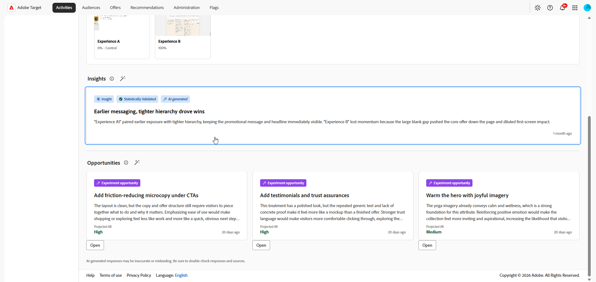
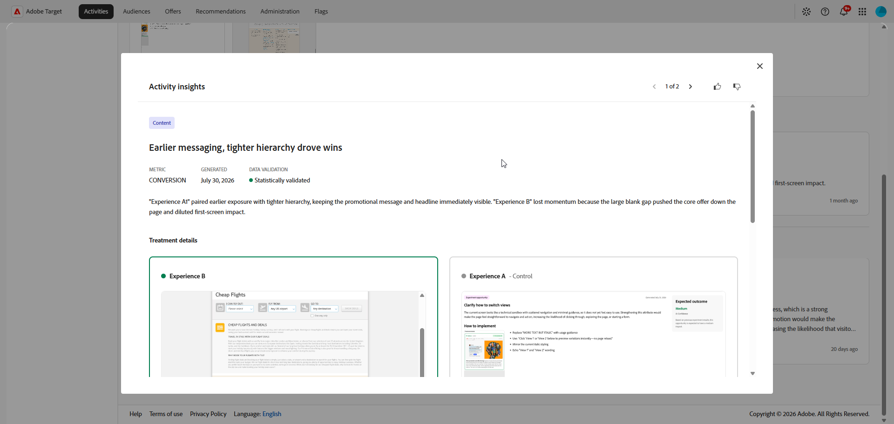
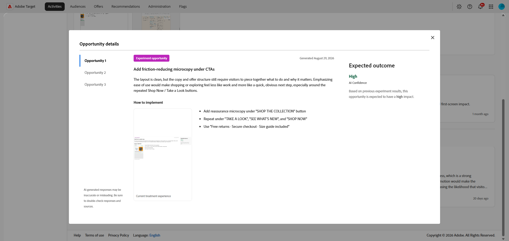

# Insights de IA

>[!AVAILABILITY]
>
>O recurso de insights de IA está disponível atualmente como um recurso beta.
> 
>A seção **[!UICONTROL Insights de IA]** está disponível apenas para atividades de **[!UICONTROL Teste A/B]** com alocação de tráfego **[!UICONTROL Manual]**.

O menu **[!UICONTROL Insights de IA]** em sua **[!UICONTROL Visão geral da atividade]** fornece acesso a insights e oportunidades de otimização. Use esta guia para revisar os aprendizados dos experimentos, comparar tratamentos e identificar alterações que possam melhorar as taxas de conversão.

## Configuração de insights e oportunidades de IA

>[!CONTEXTUALHELP]
>id="target_ai_insights_primary_metric"
>title="Métrica principal"
>abstract="A métrica principal é obtida automaticamente das configurações de relatórios. Para fazer alterações, modifique a métrica de meta em Metas e configurações."

>[!CONTEXTUALHELP]
>id="target_ai_insights_hypothesis"
>title="Hipótese"
>abstract="A hipótese é uma declaração que você define que explica o resultado esperado do experimento. Inclua uma descrição do que está sendo alterado e onde, em seguida, indique qual métrica você espera alterar e como."

>[!CONTEXTUALHELP]
>id="target_ai_insights_treatment_details"
>title="Detalhes da experiência"
>abstract="Os detalhes da experiência mostram imagens da aparência de uma experiência quando um usuário se qualifica para ela. É possível revisar essas imagens em todos os experimentos. Alguns experimentos podem solicitar a confirmação da imagem ou a sua substituição, se necessário."

Antes de acessar insights e oportunidades geradas por IA, primeiro é necessário configurar a atividade confirmando as capturas de tela da métrica primária, hipótese e experiência.

A métrica primária é retirada automaticamente das configurações de relatórios e depende de como você configura suas Metas e configurações. Você deve criar a hipótese no painel de insights de IA. [Saiba mais](../c-activities/t-test-ab/t-test-create-ab/ab-goals-and-settings.md)

1. Abra sua atividade no [!DNL Adobe Target].

1. Selecione o menu **[!UICONTROL Insights de IA]** para abrir o painel de configuração.

1. Clique em  para criar uma hipótese para seu experimento.

   

1. Digite sua hipótese descrevendo as alterações feitas e como elas afetarão a métrica primária.

   Clique em **[!UICONTROL Salvar]**.

1. Em **[!UICONTROL Detalhes da experiência]**, clique em um cartão para adicionar uma captura de tela para suas Experiências.

   >[!NOTE]
   >Algumas imagens podem já ter sido capturadas automaticamente. Em caso afirmativo, confirme a captura de tela clicando em **[!UICONTROL Confirmar]**.

   

1. Selecione **[!UICONTROL Carregar imagem]** para carregar uma captura de tela preferencial de seus arquivos locais para cada Experiência.

   

1. Copie o link de visualização ou abra-o diretamente para visualizar a experiência.

1. Assim que cada experiência tiver uma captura de tela, analise os detalhes e clique em **[!UICONTROL Confirmar]** para concluir a instalação.

Após a conclusão da configuração, sua atividade estará pronta para gerar oportunidades. Os insights ficam disponíveis depois que a experiência tem dados suficientes para validação estatística e os detalhes necessários da experiência foram confirmados.

## Insights

>[!CONTEXTUALHELP]
>id="target_ai_insights"
>title="Insights"
>abstract="Os insights do experimento são os aprendizados encontrados pela IA quando os dados do experimento alcançam significância estatística."

Os insights do experimento são aprendizados gerados por IA derivados desse experimento. Esses insights ficam disponíveis assim que o experimento atinge significância estatística e fornecem contexto sobre o que contribuiu para seu sucesso. Eles destacam os principais atributos presentes na experiência vencedora que são distintos do controle e provavelmente influenciam o resultado.

1. Clique no cartão para acessar o menu **[!UICONTROL Insights]**.

   

1. Navegue pelos insights gerados pela IA para revisar o aprendizado do experimento e comparar a experiência vencedora com o controle.

   

1. Em **[!UICONTROL O que fez esta Experiência vencer?]**, analise os detalhes explicando por que esta Experiência superou o controle.

## Oportunidades

>[!CONTEXTUALHELP]
>id="target_ai_insights_opportunities"
>title="Oportunidades"
>abstract="As oportunidades de experimento são ideias de experiência sugeridas por IA com base em padrões que a IA encontra em suas capturas de tela e resultados de experimento."

O painel **[!UICONTROL Oportunidades]** mostra recomendações geradas por IA projetadas para melhorar o desempenho do teste e se alinhar a objetivos de negócios mais amplos e KPIs.

1. Navegue pelas oportunidades sugeridas e selecione aquela que deseja revisar.

   

1. Selecione uma oportunidade para abrir a janela Detalhes da oportunidade, que descreve uma experiência ou variação específica. Essa visualização inclui:

   * A imagem da experiência atual usada para gerar a oportunidade.

   * Uma hipótese gerada por IA que explica o resultado esperado da experiência sugerida e por que ela pode melhorar o desempenho.

   * Orientação sobre como implementar a recomendação na sua experiência e medir o efeito na métrica selecionada.

   

