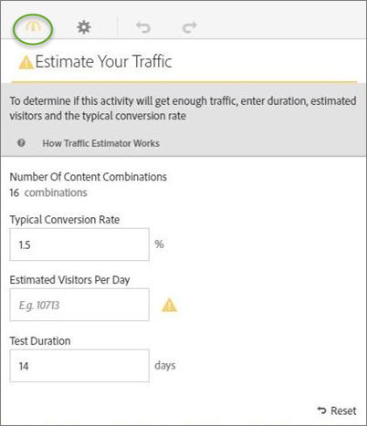
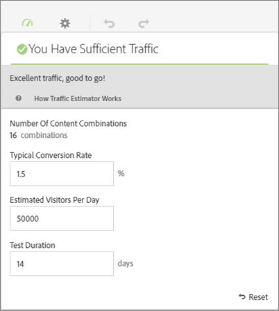

# Estimar o tráfego necessário para um bem-sucedido [!UICONTROL Teste multivariado] atividade

Como o teste multivariado compara várias experiências, é importante saber qual é a quantidade de tráfego necessária para oferecer resultados significativos. O Avaliador de tráfego usa estatísticas sobre a página e a quantidade de experiências que estão sendo testadas para estimar a quantidade de tráfego e a duração do teste necessárias para que o teste seja bem-sucedido.

O Avaliador de tráfego prevê o tamanho da amostra necessária para assegurar o seguinte:

* 95% de confiança. Essa estatística significa que a chance de relatar um falso positivo se não houver aumento real é de 5% (100% - nível de confiança).
* 80% de poder estatístico. Essa estatística significa que o teste tem uma probabilidade de 80% de detectar um aumento real de 25% ou mais.
* 25% no mínimo de elevação detectável confiável. [!DNL Target]O calcula a quantidade de tráfego necessária para ter uma possibilidade de 80% de detectar uma elevação verdadeira de 25% ou mais.

O teste usa a correção de Bonferroni para corrigir para várias comparações. Esse método é conhecido por ser conservador, pois é balanceado pela aplicação de uma elevação mínima detectável confiável grande.

O Avaliador de tráfego também fornece um feedback que informa se você tem tráfego suficiente para que o teste que criou seja bem-sucedido.

1. No [!UICONTROL Visual Experience Composer], clique no link **[!UICONTROL Tráfego]** ícone.

   O Avaliador de tráfego é aberto. Você pode clicar no ícone **[!UICONTROL Tráfego]** novamente para ocultar o Estimador de tráfego.

   

1. Forneça a taxa de conversão típica, os visitantes estimados por dia e a duração do teste.

   * **[!UICONTROL Número de combinações de conteúdo]**: calculado automaticamente com base no número de experiências que estão sendo criadas como parte da atividade após as exclusões.
   * **[!UICONTROL Taxa de conversão típica]**: a taxa de conversão é expressa como uma porcentagem, com base na estimativa ou dados anteriores do sistema de análise 
   * **[!UICONTROL Visitantes estimados por dia]**: essa é a quantidade de visitantes que provavelmente visualizarão essa página com base nos critérios de direcionamento. Isso pode se basear nos dados da análise.
   * **[!UICONTROL Duração do teste]**: a quantidade de dias de duração da execução da atividade.

   O Avaliador de tráfego usa essas estatísticas para determinar quais ajustes são necessários para executar um teste bem-sucedido.

   Próximo da parte superior do Avaliador de tráfego, os valores inseridos são calculados, e os resultados são exibidos.

   

   A estimativa muda, à medida que você muda os números. Por exemplo, se você estiver testando muitas experiências e sua taxa de conversão e impressões estiverem muito baixas, o Avaliador de tráfego mostrará por quanto tempo o teste deve ser executado para ser bem-sucedido. Ou, se o tráfego for baixo, o Avaliador de tráfego poderá sugerir um número mais baixo de experiências para você poder executar o teste durante o número desejado de dias.

   Caso não tenha tráfego suficiente, você pode fazer uma ou ambas as opções a seguir:

   * Reduza o número de combinações de ofertas e o número de locais.
   * Aumente a duração do teste.

   Ajuste os números até que o Avaliador de tráfego indique que você tem tráfego suficiente, então, crie seu teste de acordo.

   
