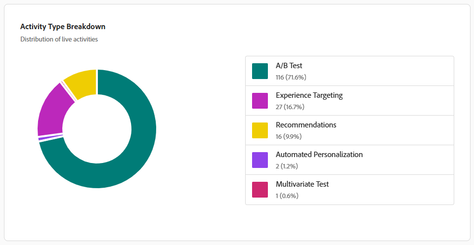

# Painel do Adobe Target Insights

O [!UICONTROL Painel do Adobe Target] fornece uma visão geral de alto nível de como sua organização usa o [!DNL Adobe Target] ao longo do tempo. Ele ajuda as equipes a entender rapidamente a adoção, o volume de atividades e o uso de experimentação.

O painel foi criado para profissionais e participantes que desejam visibilidade rápida do uso do [!DNL Target] sem a necessidade de pesquisar relatórios de atividades individuais.

Ao revisar esse painel, lembre-se do seguinte:

* As métricas podem incluir atividades iniciadas antes ou encerradas após o intervalo de tempo selecionado.
* Uma atividade pode ser contada em várias métricas dependendo de seu ciclo de vida (por exemplo, publicadas e concluídas).
* O painel de controle se concentra no uso e na adoção, não nos resultados de desempenho.

Para obter resultados detalhados, aumento ou desempenho estatístico, consulte os [relatórios de atividades individuais](../c-reports/reports.md) em [!DNL Adobe Target].

## [!UICONTROL Experimentation Accelerator]

O banner no seu painel fornece acesso direto ao **[!UICONTROL Experimentation Accelerator]**, um ponto de entrada leve para ferramentas que simplificam os fluxos de trabalho de experimentação e simplificam a configuração, a análise e a tomada de decisões do experimento.

## Seleção do intervalo de tempo

Para definir o escopo dos dados mostrados no painel, selecione um intervalo de tempo, por exemplo, a última semana, o último ano ou o tempo todo. O intervalo de tempo selecionado se aplica de forma consistente em todas as métricas e gráficos no painel.

Lembre-se do seguinte ao interpretar métricas no intervalo de tempo selecionado:

* Algumas métricas refletem atividades que estavam ativas em qualquer ponto durante o intervalo de tempo.

* Outros refletem atividades que foram criadas, publicadas ou concluídas dentro do intervalo de tempo.

* Como resultado, os totais nas métricas podem não corresponder exatamente. Por exemplo, muitas atividades podem ser iniciadas e concluídas no mesmo período de tempo.

Você também pode exportar um instantâneo do painel selecionando **[!UICONTROL Baixar como PNG]** no menu avançado.

## Métricas

O painel organiza suas métricas em quatro exibições complementares, cada uma respondendo a uma pergunta diferente sobre o uso do [!DNL Target]: [KPIs](#kpis) fornecem um resumo rápido das contagens de atividades, o [Detalhamento do tipo de atividade](#activity-type-breakdown) mostra em quais recursos você mais depende, [Métricas de teste A/B](#ab-testing-metrics) dão zoom no uso de experimentação e [Atividades ao longo do tempo](#activities-over-time) revelam tendências ao longo do intervalo de tempo selecionado.

### KPIs

Os cartões KPI na parte superior da página resumem rapidamente as contagens das principais atividades para o intervalo de tempo selecionado. Cada cartão se concentra em um estágio diferente do ciclo de vida da atividade, ativo, modificado, encerrado ou publicado, para que você possa avaliar rapidamente o uso e o momentum gerais.

A métrica **Total de atividades ativas** detalha o número de atividades ativas em qualquer ponto durante o intervalo de tempo selecionado. Uma atividade é considerada ativa se estava veiculando ativamente o tráfego, mesmo se tiver começado antes ou terminado após o período selecionado. Use essa métrica para:

* Entenda como o [!DNL Target] foi usado ativamente durante o período.
* Avalie a escala geral de seus esforços de personalização e teste.

A métrica **Atividades ativas ou modificadas** representa o número total de atividades em sua organização que foram ativas, criadas ou modificadas dentro do período selecionado. Use essa métrica para:

* Entenda o tamanho geral da biblioteca de atividades do [!DNL Target] e quantas atividades estão em uso.

* Rastreie o crescimento de longo prazo de seus programas de experimentação e personalização.

A métrica **Atividades encerradas** representa o número de atividades que atingiram uma data de conclusão ou de término durante o intervalo de tempo selecionado. Use essa métrica para:

* Entenda quantas atividades foram concluídas durante o período.
* Rastrear o volume de conclusão ao longo do tempo.

A métrica **Atividades publicadas** detalha o número de atividades publicadas durante o intervalo de tempo selecionado. Uma atividade é considerada publicada quando é disponibilizada pela primeira vez. Se uma atividade for ativada, interrompida e ativada novamente, somente a primeira ocorrência será contada nessa métrica. Use essa métrica para:

* Meça quantas novas atividades foram iniciadas.
* Entenda a velocidade de criação e publicação de atividades.

### Detalhamento do tipo de atividade

O gráfico [!UICONTROL Tipo de Atividade] mostra a distribuição de atividades ativas por tipo durante o intervalo de tempo selecionado, incluindo:

* [!UICONTROL Teste A/B]
* [!UICONTROL Direcionamento de experiência]
* [!UICONTROL Recomendações]
* [!UICONTROL Personalização automatizada]
* [!UICONTROL Teste multivariado]

Use este gráfico para identificar em quais recursos do [!DNL Target] sua organização mais depende e para detectar oportunidades para ampliar a combinação de tipos de atividades executadas.

### Métricas de teste A/B

{align="center"}

Esta seção destaca o uso especificamente relacionado às atividades de **[!UICONTROL Teste A/B]**.

A métrica **[!UICONTROL Total de atividades de Teste A/B online]** mostra o número de **[!UICONTROL atividades de Teste A/B]** que estavam online em qualquer ponto durante o intervalo de tempo selecionado.

O **[!UICONTROL Total de Testes A/B publicados]** mostra o número de **[!UICONTROL atividades de Teste A/B]** publicadas durante o intervalo de tempo selecionado.

Use essas métricas para entender com que frequência os testes A/B estão sendo usados e para rastrear o volume de experimentação e a adoção ao longo do tempo.

### Atividades ao longo do tempo

{align="center"}

O gráfico **[!UICONTROL Atividades ao longo do tempo]** rastreia o número de atividades criadas, modificadas e publicadas no intervalo de tempo selecionado, facilitando a identificação de tendências, picos ou períodos silenciosos em seu programa de experimentação.

