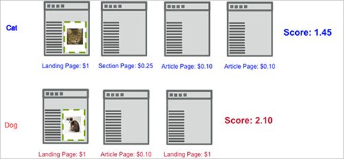

# Pontuação de captura

A métrica de envolvimento Pontuação de captura em [!DNL Adobe Target] O calcula uma pontuação agregada com base no valor atribuído às páginas visitadas no site, a partir do momento em que o visitante exibe a primeira campanha [!DNL Target] solicitação.

O exemplo a seguir mostra como o envolvimento da pontuação é calculado em uma campanha que testa duas experiências, uma com uma imagem de um gato e outra com a imagem de um cão.

Nesse exemplo, o primeiro visitante acessa a experiência do gato. Suponha que um [!DNL Target] passa em uma pontuação de página com base no valor da página. Se o comerciante tiver capturado o envolvimento de contagem de páginas em uma métrica de sucesso associada a `**any Target request**`, a pontuação de visita é acumulada para qualquer solicitação vista após a solicitação de exibição ao redor da imagem do gato.

A primeira página adiciona 1 à pontuação, a segunda página 0,25, a terceira 0,10, e a quarta 0,10 para um total de 1,45. Isto poderia ser interpretado como moeda ou pontos. Em uma visita separada, um visitante acessou a experiência do cão e, embora o visitante tenha visualizado um número menor de páginas, a pontuação é 2.10, maior do que a outra visita porque o visitante visualizou páginas com valor mais alto.

Você pode levar em consideração os custos de aquisição e receita de links associados ao enviar adboxes e redirecionadores, conforme demonstrado no fluxo da página a seguir. Observe que, neste exemplo, ambos [!DNL Target] as solicitações na página do artigo passam uma pontuação, possivelmente representando um CPM conhecido.

## Atribuição de uma pontuação de página

Você pode atribuir um valor à qualquer página em seu site, com base no quão valiosa é a página para você. Por exemplo, um site sobre culinária pode vender anúncios por valores mais altos nas páginas de artigo em destaque do que na seção de experiências. Logo, os artigos em destaque são mais valiosos do que a seção de experiências. A pontuação da página permite desenvolver um valor &quot;geral&quot; de uma visita, de forma que a pessoa que ler mais artigos em destaque obtenha mais &quot;pontos&quot; do que alguém que simplesmente navegue pela seção de experiências.

Existem dois métodos para atribuir uma pontuação a uma página:

* No [!DNL Target] criar um parâmetro chamado `mboxPageValue`.

   Exemplo: `('global_mbox', 'mboxPageValue=10');`

   O valor especificado é adicionado à pontuação sempre que a página com esse valor [!DNL Target] é exibida. Se várias solicitações na página incluírem valores de pontuação, a pontuação da página será o total de todos os valores da solicitação. `mboxPageValue` é um parâmetro reservado usado para transmitir valores em uma solicitação do Target para capturar uma pontuação de envolvimento. Valores positivos e negativos podem ser enviados. A soma é calculada no fim de cada visita para calcular a pontuação total para a visita.

* Passe o parâmetro `?mboxPageValue=n` no URL da página.

   Exemplo: `https://www.mydomain.com?mboxPageValue=5`

   Usando esse método, o valor especificado é adicionado à pontuação de cada [!DNL Target] na página. Por exemplo, se você passar o parâmetro `?mboxPageValue=10`e há três [!DNL Target] na página, a pontuação da página é 30.

>[!NOTE]
>
>Solicitações do Target localizadas acima da primeira exibição da atividade [!DNL Target] não será incluída na pontuação.

A prática recomendada é atribuir valores na variável [!DNL Target] solicitação. Isso permite que você seja preciso nos valores medidos, dependendo do conteúdo de cada solicitação.

>[!NOTE]
>
>Para obter uma manutenção mais simples, você pode configurar as atribuições de valor de pontuação do site no [!DNL at.js] com um pouco de lógica condicional JavaScript. Isso elimina a necessidade de adicionar mais código às suas páginas. Entre em contato com um consultor para obter ajuda.

Você pode combinar os dois métodos, mas isso pode resultar em uma pontuação maior do que a esperada. Por exemplo, se você atribuir um valor de 10 para cada três [!DNL Target] solicitações e sem pontuação para uma quarta solicitação, em seguida, passe o parâmetro do URL `?mboxPageValue=5`, sua pontuação de página será 50, 30 para as três solicitações com valores atribuídos e 5 para cada uma das quatro solicitações na página.

O contador é iniciado com a primeira solicitação de exibição, não com a solicitação de entrada. Por exemplo, se você inserir a atividade na página inicial que não tem uma solicitação de exibição, em seguida, vincular a página de catálogo que contém uma solicitação de exibição, o contador será iniciado quando você mover para a página de catálogo.

Você também pode enviar valores negativos em páginas específicas que custam dinheiro ou não são boas para os visitantes visualizarem. Os valores negativos afetam a pontuação geral também. Essa técnica também pode ser utilizada em uma página que os visitantes acessam uma publicidade, para que você saiba qual foi o CPC. Isso também pode ser utilizado para uma página de suporte ou contato, onde você sabe que os visitantes podem ligar ou solicitar ajuda a partir dessa página.
