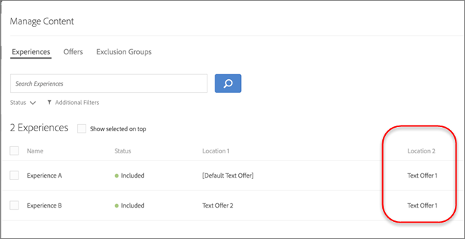

# Gerenciar exclusões

Gerencie exclusões excluindo ofertas duplicadas, experiências específicas e o conteúdo padrão nas atividades de [!UICONTROL Automated Personalization] (AP) em [!DNL Adobe Target].

## Excluir ofertas duplicadas {#concept_4EF78013F80E48EFA024AE0274C9F037}

Evite que as ofertas da biblioteca de ofertas sejam duplicadas quando usadas em locais diferentes nas atividades [!UICONTROL Automated Personalization].

Você pode ter uma atividade, por exemplo, seis locais na página com 12 ofertas. Há uma chance de que a mesma oferta possa ser colocada em um ou mais locais na atividade. Esse recurso evita a exibição e ofertas duplicadas ao mesmo tempo em locais diferentes, dentro da mesma atividade.

Clique no ícone **[!UICONTROL Configure]** > **[!UICONTROL Duplicate Offers]** e clique em **[!UICONTROL Allow Duplicates]** ou **[!UICONTROL Disallow Duplicates]**.

## Excluir experiências específicas {#task_C17D36EF58AF4908B17A3D84CA6DE85A}

Exclua experiências específicas se quiser excluir determinadas combinações de ofertas da atividade [!UICONTROL Automated Personalization].

Pode haver determinadas combinações que não funcionam juntas ou você pode estar limitando o número de experiências testadas para diminuir os requisitos de tráfego para sua atividade.

1. Ao [criar ou editar uma atividade de AP](/help/main/c-activities/t-automated-personalization/create-ap-activity.md), clique em **Gerenciar conteúdo** na barra de cabeçalho.

   

   A lista [!UICONTROL Experiences] mostra cada experiência gerada com permutas de todas as opções de conteúdo e locais.

1. Exclua as experiências, conforme desejado.

   Você pode excluir as experiências específicas ao passar o mouse sobre a experiência desejada e clicar no ícone de exclusão.

   

   Ou você pode excluir em lote as experiências marcando a caixa de seleção das experiências relevantes e, em seguida, clicando no ícone **[!UICONTROL Exclude]** no canto superior direito da caixa de diálogo. O ícone [!UICONTROL Exclude] é exibido quando uma ou mais experiências são verificadas.

   

   É possível filtrar essa exibição de lista para ver apenas as atividades excluídas ou incluídas, clicando na lista suspensa [!UICONTROL Status].

   As experiências agora são excluídas da atividade e seus [!UICONTROL Status] são exibidos como [!UICONTROL Excluded].

   

## Excluir conteúdo padrão {#task_DCB4528989DF4C05A3A4729E5891D18F}

Às vezes, você pode não querer incluir seu conteúdo padrão como parte de sua atividade [!UICONTROL Automated Personalization]. A maneira pela qual você acessa essa configuração é diferente da criação de grupos de exclusão. Você pode usar esse método para ter somente uma oferta (diferente do conteúdo padrão) em uma localização, como parte da sua atividade de AP.

Excluir o conteúdo padrão é uma excelente maneira de alterar a aparência do restante da página, a fim de adequar as ofertas que você estiver testando com a atividade de AP. Por exemplo, pressuponha que você deseja corresponder a paleta de cores das ofertas que está testando, poderia alterar a cor do fundo da sua página e excluir a cor do fundo padrão.

**Para excluir o conteúdo padrão usando o [!UICONTROL Visual Experience Composer] (VEC):**

1. Ao [criar ou editar uma atividade de AP](/help/main/c-activities/t-automated-personalization/create-ap-activity.md), selecione o conteúdo que deseja substituir e clique para acessar **[!UICONTROL Change Text/HTML]**, **[!UICONTROL Change Image]** ou **[!UICONTROL Change Background Color]**.
1. Na caixa de diálogo, crie seu novo conteúdo e desmarque **Incluir** à direita do conteúdo padrão (ou desmarque Imagem/Vídeo padrão na tela [!UICONTROL Select Content]).

   Dependendo do tipo de conteúdo ou oferta, a caixa de seleção [!UICONTROL Include] está em um local um pouco diferente.

   Para conteúdo de texto/HTML:

   

   Para conteúdo de imagem/vídeo:

   

   Para cor do fundo:

   

1. Clique em **[!UICONTROL Save]**.

   Você pode ver as experiências criadas com base nas ofertas especificadas em [!UICONTROL Manage Content]. Você observou que nenhuma experiência é criada em [!UICONTROL Manage Content] usando a oferta padrão excluída.

   

**Para excluir o conteúdo padrão usando o [!UICONTROL Form-Based Experience Composer]:**

1. Ao criar ou editar uma atividade de AP, clique em **[!UICONTROL Change Text/HTML]** ou **[!UICONTROL Change Image Offer]** em **[!UICONTROL Content]**.
1. Na caixa de diálogo, crie seu novo conteúdo e desmarque **[!UICONTROL Include]** à direita do conteúdo padrão (ou desmarque Imagem/Vídeo padrão na tela [!UICONTROL Select Content]).

   Dependendo do tipo de conteúdo ou oferta, a caixa de seleção [!UICONTROL Include] está em um local um pouco diferente.

   Para conteúdo de texto/HTML:

   

   Para conteúdo de imagem/vídeo:

   

1. Clique em **[!UICONTROL Save]**.

   Você pode ver as experiências criadas com base nas ofertas especificadas em [!UICONTROL Manage Content]. Você observou que nenhuma experiência é criada em [!UICONTROL Manage Content] usando a oferta padrão excluída.

   
