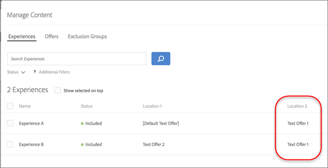

# Gerenciar exclusões

Assuma o controle da sua estratégia de [!UICONTROL Automated Personalization] (AP) dominando as exclusões. Independentemente de você estar evitando ofertas duplicadas, refinando combinações de experiências ou removendo conteúdo padrão, as exclusões permitem que você forneça experiências mais claras e relevantes que se alinham às suas metas e expectativas de público-alvo.

## Permitir ou não ofertas duplicadas {#concept_4EF78013F80E48EFA024AE0274C9F037}

Evite que as ofertas da biblioteca de ofertas sejam duplicadas quando usadas em locais diferentes nas atividades AP.

Você pode ter uma atividade, por exemplo, seis locais na página com 12 ofertas. Há uma chance de que a mesma oferta possa ser colocada em um ou mais locais na atividade. Esse recurso permite impedir que ofertas duplicadas sejam exibidas ao mesmo tempo em locais diferentes na mesma atividade.

1. Ao [criar ou editar uma atividade de AP](/help/main/c-activities/t-automated-personalization/create-ap-activity.md), clique no ícone **[!UICONTROL Configure]** (  ) > clique no **[!UICONTROL Allow Duplicate Offers]** para ativar ou desativar este recurso, dependendo das suas necessidades.

## Excluir experiências específicas {#task_C17D36EF58AF4908B17A3D84CA6DE85A}

Exclua experiências específicas se desejar excluir determinadas combinações de ofertas da atividade de AP.

Pode haver determinadas combinações que não funcionam juntas ou você pode estar limitando o número de experiências testadas para diminuir os requisitos de tráfego para sua atividade.

1. Ao [criar ou editar uma atividade de AP](/help/main/c-activities/t-automated-personalization/create-ap-activity.md), clique no ícone **Gerenciar conteúdo** (  ).

   A lista [!UICONTROL Experiences] mostra cada experiência gerada com permutas de todas as opções de conteúdo e locais.

1. Exclua as experiências, conforme desejado.

   Você pode excluir experiências específicas clicando no ícone [!UICONTROL **Mais Ações**] (  ) e clicando em [!UICONTROL **Excluir**].

   Ou você pode excluir experiências em lote marcando a caixa de seleção das experiências relevantes e, em seguida, clicando em **[!UICONTROL Exclude]**. O ícone [!UICONTROL Exclude] é exibido quando uma ou mais experiências são verificadas.

   

   As experiências agora são excluídas da atividade e seus [!UICONTROL Status] são exibidos como [!UICONTROL Excluded].

## Excluir conteúdo padrão {#task_DCB4528989DF4C05A3A4729E5891D18F}

Às vezes, você pode não querer incluir seu conteúdo padrão como parte da atividade de AP. Você pode usar esse método para ter apenas uma oferta (diferente do conteúdo padrão) em um local como parte da atividade.

Excluir o conteúdo padrão é uma excelente maneira de alterar a aparência do restante da página, a fim de adequar as ofertas que você estiver testando com a atividade de AP. Por exemplo, pressuponha que você deseja corresponder a paleta de cores das ofertas que está testando, poderia alterar a cor do fundo da sua página e excluir a cor do fundo padrão.

**Para excluir o conteúdo padrão usando o [!UICONTROL Visual Experience Composer] (VEC):**

1. Ao [criar ou editar uma atividade de AP](/help/main/c-activities/t-automated-personalization/create-ap-activity.md), selecione o conteúdo que deseja substituir e clique para acessar **[!UICONTROL Change Text/HTML]**, **[!UICONTROL Change Image Offer]** ou **[!UICONTROL Change Background Color]**. As opções disponíveis variam, dependendo do tipo de conteúdo.

   
1. Crie seu novo conteúdo.

1. Clique no ícone **[!UICONTROL More Actions]** (  ) e no botão de alternância **Excluir oferta padrão/Incluir oferta padrão**/ para excluir ou incluir a oferta padrão.

   <!-- Depending on the content or offer type, the [!UICONTROL Include] checkbox is in a slightly different place. 

   For Text/HTML content: 

   

   For Image/Video content: 

   

   For background color: 

   -->

<!-- 1. Click **[!UICONTROL Save]**.

   You can see the experiences created from the offers you specified under [!UICONTROL Manage Content]. You notice that no experiences are created in [!UICONTROL Manage Content] using the default offer you excluded. 

   

**To exclude default content using the [!UICONTROL Form-Based Experience Composer]:** 

1. While creating or editing an AP activity, click **[!UICONTROL Change Text/HTML]** or **[!UICONTROL Change Image Offer]** under **[!UICONTROL Content]**. 
1. In the dialog box, create your new content and uncheck **[!UICONTROL Include]** to the right of the default content (or uncheck the Default Image/Video in the [!UICONTROL Select Content] screen). 

   Depending on the content or offer type, the [!UICONTROL Include] checkbox is in a slightly different place. 

   For Text/HTML content: 

   

   For Image/Video content: 

   

1. Click **[!UICONTROL Save]**. 

   You can see the experiences created from the offers you specified under [!UICONTROL Manage Content]. You notice that no experiences are created in [!UICONTROL Manage Content] using the default offer you excluded. 

   -->
