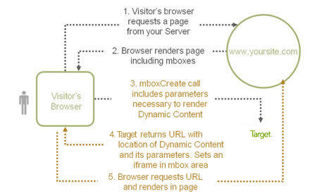

# Criar ofertas remotas

Para hospedar conteúdo fora do [!DNL Adobe Target], use ofertas remotas, que o [!DNL Target] faz referência e entrega aos sites do usuários. Esse conteúdo pode estar em um gerenciamento de conteúdo (CMS) ou outro sistema, seja para facilidade de uso ou por motivos de segurança.

>[!NOTE]
>
>Este artigo contém informações sobre atualizações na interface do usuário do [!DNL Target] que atualmente faz parte de um programa do Beta. A equipe do [!DNL Adobe Target] geralmente habilita novos recursos para clientes selecionados para fins de teste e feedback. Após a conclusão do período de teste, esses recursos serão habilitados para todos os clientes em versões futuras do [!DNL Target Standard/Premium] e anunciados nas notas de versão.

As ofertas remotas podem ser criadas na página [!UICONTROL Offers] > [!UICONTROL Code Offers] ou no [Experience Composer baseado no Forms](/help/main/c-experiences/form-experience-composer.md). Não é possível criar ou aplicar ofertas remotas no [!UICONTROL Visual Experience Composer] (VEC). O conteúdo é inserido nos locais de solicitação [!DNL Target], portanto, esses locais provavelmente não são apropriados para uma solicitação global [!DNL Target].

Alguns exemplos de ofertas remotas incluem:

* Diferentes versões de vendas casadas
* Mensagens do carrinho de compras dinâmico
* Formulários
* Calculadoras
* Atualizações de taxa de juros
* E-mails
* Quiosques
* Assistentes de voz

## Práticas recomendadas para usar ofertas remotas {#section_7718512D08E14121B6F6B8C38134F4BC}

Práticas recomendadas para usar ofertas remotas em suas atividades:

* Se a sua oferta estiver no mesmo domínio que as solicitações [!DNL Target], o uso da opção [!UICONTROL Cached] permitirá que você use URLs relativas na descrição da sua localização de oferta.

  Isso significa que quando você move sua atividade dos servidores de preparo para a produção, o conteúdo é acessível automaticamente sem precisar alterar o URL manualmente.

* Se o teste envolve dados gerados dinamicamente pelo servidor, a opção [!UICONTROL Dynamic] pode ser a escolha certa.
* Se você planeja testar somente a aparência do conteúdo de oferta remota existente, use o [!UICONTROL Visual Experience Composer] para alterar a aparência do conteúdo retornado do sistema de gerenciamento de conteúdo.
* Use a [Matriz de seleção de oferta remota](#reference_B23BEDD29DDD47709A7651AFD27E776B) (abaixo) para ajudá-lo a escolher a oferta mais adequada ao seu caso específico. Entre em contato com seu representante de conta caso tenha dúvidas.

## Criar uma oferta remota da página [!UICONTROL Code Offers]

1. Clique em **[!UICONTROL Offers]** e selecione a guia **[!UICONTROL Code Offers]**.

   

1. Clique em **[!UICONTROL Create Offer]** > **[!UICONTROL Remote Offer]**.

   

1. Forneça um nome descritivo para a oferta.

   Um nome descritivo ajuda você e outras pessoas a encontrar rapidamente a oferta na biblioteca [!UICONTROL Assets].

1. (Condicional) Se você tiver uma [conta do Target Premium](/help/main/c-intro/intro.md#premium), selecione o [espaço de trabalho](/help/main/administrating-target/c-user-management/property-channel/properties-overview.md##section_B82EB409B67C4D9D9D20CE30E48DB1DC) desejado.

1. Especifique o tipo de URL de redirecionamento.

   Consulte [Tipo de URL de Redirecionamento: Em Cache ou Dinâmico](#url-type) abaixo para obter mais informações.

1. Especifique o URL remoto absoluto para a oferta remota.

1. Clique em **[!UICONTROL Create]**.

## Criar uma oferta remota usando o [!UICONTROL Form-Based Experience Composer]

1. Ao criar uma atividade usando o [Experience Composer baseado em formulário](/help/main/c-experiences/form-experience-composer.md), selecione o local para exibir a seção **[!UICONTROL Content]**.

   

1. Clique na lista suspensa **[!UICONTROL Default Content]** e em **[!UICONTROL Change Remote Offer]**.

   

1. Clique em **[!UICONTROL Create]** > **[!UICONTROL Remote Offer]**.

   

1. Forneça um nome descritivo para a oferta.

   Um nome descritivo ajuda você e outras pessoas a encontrar rapidamente a oferta na biblioteca [!UICONTROL Assets].

1. Especifique o tipo de URL de redirecionamento.

   Consulte [Tipo de URL de Redirecionamento: Em Cache ou Dinâmico](#url-type) abaixo para obter mais informações.

1. Especifique o URL remoto para a oferta remota.

1. Clique em **[!UICONTROL Save]**.

## Tipo de URL de redirecionamento: em cache ou dinâmico {#url-type}

As informações a seguir ajudam a entender as diferenças entre as duas opções:

### URL em cache

O conteúdo de uma oferta remota em cache é distribuído de [!DNL Target].

A cada duas horas, [!DNL Target] busca o conteúdo na URL remota e, em seguida, armazena o conteúdo dentro de [!DNL Target]. Quando os visitantes carregam um site com uma experiência que inclui uma oferta remota, o [!DNL Target] entrega a oferta.

As ofertas remotas em cache fornecem segurança aprimorada porque alguém conectado no [!DNL Target] não pode alterar o conteúdo. Para alterar o conteúdo, alguém precisaria registrar o ou outro sistema e alterar o conteúdo lá.

Você pode especificar um URL absoluto ou relativo para uma oferta remota em cache.

### URL dinâmico

Uma oferta remota dinâmica é servida a partir do gerenciamento de conteúdo ou outro sistema, em vez de [!DNL Target].

Talvez você não queira que o conteúdo seja armazenado em cache periodicamente e entregue por [!DNL Target] sempre que os visitantes carregarem um site com uma experiência que inclua uma oferta remota. Em vez disso, você deseja chamar o sistema que hospeda o conteúdo, possivelmente transmitir informações específicas para que a oferta retornada possa ser dinâmica (ou diferente) para cada usuário. Por exemplo, se um usuário fizer login em um site para um cartão de crédito que inclua uma experiência com uma oferta remota dinâmica, você poderá passar parâmetros para o URL das informações da conta do usuário. Em seguida, o site pode fornecer informações específicas do usuário, como o saldo da conta.

Você pode clicar em **[!UICONTROL Add Parameter]** para adicionar uma ou mais [!DNL Target] solicitações ou parâmetros de solicitação.

## Usar ofertas remotas em atividades

Você deve aplicar ofertas remotas usando o [!UICONTROL Form-Based Experience Composer]. No momento, não é possível aplicar ofertas remotas usando o [!UICONTROL Visual Experience Composer] (VEC).

O [!DNL Adobe Target] [!UICONTROL Form-Based Experience Composer] é uma experiência não visual e uma interface de criação de ofertas útil para criar experiências para uso nas atividades do [!UICONTROL A/B Tests], [!UICONTROL Experience Targeting] (XT), [!UICONTROL Automated Personalization] (AP) e [!UICONTROL Recommendations] quando o [!UICONTROL Visual Experience Composer] não está disponível ou é prático para uso. Por exemplo, você pode usar o [!UICONTROL Form-Based Experience Composer] para criar experiências que usam ofertas remotas.

1. Crie ou edite uma atividade no [!UICONTROL Form-Based Experience Composer].

   Consulte o [Experience Composer baseado em formulário](/help/main/c-experiences/form-experience-composer.md) para obter instruções detalhadas passo a passo.

1. Especifique o local desejado e adicione os refinamentos de público-alvo, conforme necessário.

1. Clique na lista suspensa na seção **[!UICONTROL Content]** e depois clique em **[!UICONTROL Change Remote Offer]**.

   

1. Selecione a oferta remota desejada na caixa de diálogo [!UICONTROL Select Remote Offer] e clique em **[!UICONTROL Done]**.

1. Termine configurando a atividade.

## Como funcionam as ofertas dinâmicas remotas {#concept_CC2A969420B34364A9FA78C1CE251818}

Ofertas dinâmicas remotas utilizam tecnologia de página dinâmica para enviar os valores para a oferta.

A oferta é executada após a página ser renderizada. Um iFrame invisível reúne os dados, copia os dados do quadro e insere na página, carregando os valores passados.

1. O navegador do visitante solicita uma página do seu servidor.

2. O navegador renderiza a página, incluindo mboxes.

3. A chamada `mboxCreate` inclui parâmetros necessários para renderizar conteúdo dinâmico.

4. [!DNL Target] retorna a URL com o local do conteúdo dinâmico e seus parâmetros. Define um iFrame na área da mbox.

5. O navegador solicita o URL e é renderizado na página.

## Matriz de seleção de oferta remota {#reference_B23BEDD29DDD47709A7651AFD27E776B}

A Matriz de Seleção de Oferta Remota ajuda você a decidir qual tipo de oferta remota escolher: [!UICONTROL Cached] ou [!UICONTROL Dynamic].

| Recurso | Armazenado em cache | Dinâmico |
|--- |--- |--- |
| Atualizado sempre que o usuário faz uma solicitação. | Não | Sim |
| Atualizações de conteúdo | Armazenado em cache a cada duas horas | Atualizado imediatamente após cada solicitação |
| Tempo de carregamento | Mais rápido | Mais lento devido ao processamento do pedido |
| JavaScript pode ser visto na página | Sim | Não, mas pode enviar via URL |
| As ofertas podem incluir JavaScript | Sim | Sim |
| URL de oferta | Absoluto ou Relativo | Relativo |
| Computador solicitante | Servidores da Adobe | O computador do visitante, que armazena os cookies do visitante |

## Vídeo de treinamento: criador baseado em formulário 

Este vídeo fornece uma demonstração do [!UICONTROL Form-Based Experience Composer], que você pode usar para criar ofertas remotas.

* Criar uma atividade usando o [!UICONTROL Form-Based Experience Composer]
* Entenda quando usar [!UICONTROL Form-Based Experience Composer] vs. [!UICONTROL Visual Experience Composer]
* Use refinamentos para direcionar um local

>[!VIDEO](https://video.tv.adobe.com/v/17390)
