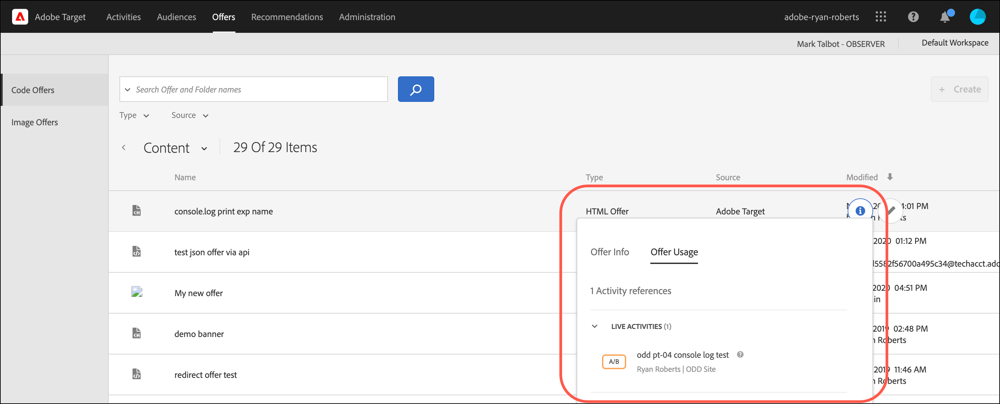

# Ofertas

Use a biblioteca do [!UICONTROL Offers] no [!DNL Adobe Target] para gerenciar o código e o conteúdo da oferta de imagem.

>[!NOTE]
>
>Este artigo contém informações sobre atualizações na interface do usuário do [!DNL Target] que atualmente faz parte de um programa do Beta. A equipe do [!DNL Adobe Target] geralmente habilita novos recursos para clientes selecionados para fins de teste e feedback. Após a conclusão do período de teste, esses recursos serão habilitados para todos os clientes em versões futuras do [!DNL Target Standard/Premium] e anunciados nas notas de versão.

Clique na guia **[!UICONTROL Offers]** na parte superior da interface do usuário do [!DNL Target] para exibir a biblioteca [!UICONTROL Offers].

A biblioteca [!UICONTROL Offers] contém ofertas que foram configuradas via [!DNL Target Standard/Premium], [!DNL Target Classic], [!DNL Adobe Experience Manager] (AEM), [!DNL Adobe Mobile Services] (AMS) e APIs. As ofertas criadas em [!DNL Target Classic] ou outras soluções são editáveis [!DNL Target Standard/Premium].

A biblioteca de Ofertas fornece uma visão geral de todas as ofertas de código e imagem e permite executar várias ações:

| Elemento | Descrição |
|--- |--- |
| Painel de navegação esquerdo | Alternar entre a listagem [!UICONTROL Code Offers] ou [!UICONTROL Image Offers]. |
| Ícone do [!UICONTROL Show filters]
 | Clique no ícone **[!UICONTROL Show filters]** para filtrar ofertas de [!UICONTROL Type], [!UICONTROL Source] e [!UICONTROL AEM Type]
Para obter mais informações, consulte [Aplicar filtros à lista de Ofertas](#filters) abaixo. |
| Pesquisar campos | Use os campos **[!UICONTROL Search in]** para localizar rapidamente uma oferta ou reduzir o número de ofertas exibidas na biblioteca [!UICONTROL Offers]. Você pode pesquisar por [!UICONTROL Offer Name], [!UICONTROL AEM Paths] ou [!UICONTROL AEM Tags]. |
| [!UICONTROL Create Folder] | Clique em Criar Pasta para criar pastas na biblioteca [!UICONTROL Offer] para conter ofertas de código, ofertas de imagem, bem como outras pastas para criar uma estrutura de subpastas. Para obter mais informações, consulte [Criar pastas de ofertas](/help/main/c-experiences/c-manage-content/create-content-folder.md). |
| [!UICONTROL [!UICONTROL Create Offer]] | Crie uma oferta. Para obter mais informações sobre como criar os vários tipos de oferta, consulte: <ul><li>Oferta HTML</li><li>[Oferta JSON](/help/main/c-experiences/c-manage-content/create-json-offer.md)</li><li>[Oferta de redirecionamento](/help/main/c-experiences/c-manage-content/offer-redirect.md)</li><li>[Oferta remota](/help/main/c-experiences/c-manage-content/about-remote-offers.md)</li></ul> |
| Caixas de seleção de operações em massa | Executar operações em massa em todas as atividades ou em atividades selecionadas.
Para obter uma lista de ações disponíveis (dependendo das suas permissões e do status da oferta), consulte [Executar ações rápidas](#quick-actions) abaixo. |
| [!UICONTROL Name] | O nome de cada oferta.
Clique no ícone **[!UICONTROL Quick Info]** ao lado de cada nome de oferta para exibir mais informações sobre essa oferta em um cartão pop-up, incluindo a ID da oferta, o tipo, a data da última modificação da oferta, por quem e muito mais.
Clique no ícone **[!UICONTROL More actions]** (as reticências horizontais) ao lado de cada nome de oferta para abrir um menu que permite executar ações rápidas em uma atividade. As seguintes ações estão disponíveis (dependendo das suas permissões e do status da oferta): [!UICONTROL Edit], [!UICONTROL Copy], [!UICONTROL Delete] e [!UICONTROL Move]. Para obter mais informações sobre cada ação, consulte [Executar ações rápidas](#quick-actions) abaixo.
Clique no cabeçalho da tabela para classificar a lista alfabeticamente em ordem crescente ou decrescente por nome. |
| [!UICONTROL Type] | O tipo de oferta: HTML Offers, [Ofertas de redirecionamento](/help/main/c-experiences/c-manage-content/offer-redirect.md), [Ofertas remotas](/help/main/c-experiences/c-manage-content/about-remote-offers.md) e [Ofertas JSON](/help/main/c-experiences/c-manage-content/create-json-offer.md). |
| [!UICONTROL Source] | Mostra onde a oferta foi criada: [!DNL Adobe Target], [!DNL Adobe Target Classic] e [!DNL Adobe Experience Manager]. |

## Aplicar filtros à biblioteca de ofertas {#filters}

Clique no ícone **[!UICONTROL Show filters]** (  ) para filtrar ofertas por [!UICONTROL Type], [!UICONTROL Source] e [!UICONTROL AEM Type].

O ícone **[!UICONTROL Show filters]** permite filtrar ofertas pelas seguintes categorias:

* **Tipo**: HTML, [Oferta JSON](/help/main/c-experiences/c-manage-content/create-json-offer.md), [Oferta De Redirecionamento](/help/main/c-experiences/c-manage-content/offer-redirect.md), [Oferta Remota](/help/main/c-experiences/c-manage-content/about-remote-offers.md).

* **Source**: [!DNL Adobe Target], [!DNL Adobe Target Classic] e [!DNL Adobe Experience Manager].

* **Tipo de AEM**: [Fragmentos de conteúdo](/help/main/c-integrating-target-with-mac/aem/content-fragments-aem.md) e [Fragmentos de experiência](/help/main/c-integrating-target-with-mac/aem/experience-fragments-aem.md). Para obter mais informações sobre os diferentes tipos de fragmentos, consulte [Visão geral dos Fragmentos de experiência e Fragmentos de conteúdo do AEM](/help/main/c-integrating-target-with-mac/aem/aem-experience-and-content-fragments.md).

## Executar ações rápidas {#quick-actions}

Você pode executar as seguintes ações rápidas clicando no ícone apropriado:

### Informações rápidas

Clique no ícone **[!UICONTROL Quick Info]** ao lado de cada nome de oferta para exibir mais informações sobre essa oferta em um cartão pop-up, incluindo a ID da oferta, o tipo, a data da última modificação da oferta, por quem e muito mais. As opções disponíveis dependem do tipo de oferta: HTML Offer, [JSON Offer](/help/main/c-experiences/c-manage-content/create-json-offer.md), [Redirect Offer](/help/main/c-experiences/c-manage-content/offer-redirect.md), [Remote Offer](/help/main/c-experiences/c-manage-content/about-remote-offers.md).

### Mais ações

As ações disponíveis para Ofertas de código e Ofertas de imagem são ligeiramente diferentes. As seguintes seções contêm mais informações:

#### [!UICONTROL Code Offer] opções

Clique no ícone **[!UICONTROL More actions]** (as reticências horizontais) ao lado de cada nome de oferta para abrir um menu que permite executar ações rápidas em uma atividade. As seguintes ações estão disponíveis (dependendo das suas permissões e do status da oferta): [!UICONTROL Edit], [!UICONTROL Copy], [!UICONTROL Delete] e [!UICONTROL Move].

* Editar
* Copiar 
* Excluir
* Mover (por exemplo, para mover um ou mais itens para uma pasta, clique no ícone **[!UICONTROL Move]** do item desejado, clique na pasta desejada e, em seguida, clique em **[!UICONTROL Drop]**.)

Dependendo das suas permissões, talvez você não veja ícones para todas as opções. Por exemplo, um usuário com permissões [!UICONTROL Observer] não tem direitos para usar a opção [!UICONTROL Copy].

Para obter informações detalhadas sobre as tarefas que você pode executar em ofertas e pastas, consulte [Trabalhar com conteúdo na biblioteca de Ativos](/help/main/c-experiences/c-manage-content/assets-working.md).

#### [!UICONTROL Image Offer] opções

Execute tarefas adicionais passando o cursor do mouse sobre a oferta de imagem ou pasta desejada na guia [!UICONTROL Image Offers] e clicando no ícone desejado.

As opções incluem:

* Selecionar
* Baixar
* Propriedades da exibição
* Editar
* Anotar
* Copiar 

Para obter informações detalhadas sobre as tarefas que você pode executar em ofertas e pastas, consulte [Trabalhar com conteúdo na biblioteca de Ativos](/help/main/c-experiences/c-manage-content/assets-working.md).

>[!NOTE]
>
>As ofertas de imagem não fazem parte do modelo [Permissões de Usuário Corporativo](/help/main/administrating-target/c-user-management/property-channel/property-channel.md).

## Exibição de definições de oferta {#section_6B059DD121434E6292CAB393507D010E}

Você pode exibir os detalhes da definição de oferta em um cartão pop-up na biblioteca [!UICONTROL Offers] sem abrir a oferta.

Por exemplo, o cartão de definição de oferta a seguir para uma oferta HTML é acessado ao passar o mouse sobre uma oferta na lista [!UICONTROL Content] e clicar no ícone de informações:

As informações a seguir estão disponíveis:

* Nome
* Fonte
* Tipo
* ID da oferta
* Caminho da oferta
* Última modificação

Clique na guia [!UICONTROL Offer Usage] para exibir as atividades que fazem referência a uma oferta de código no cartão pop-up de definição de cada oferta. Esta funcionalidade não se aplica às ofertas de imagem. Dessa forma, é possível evitar um impacto nas outras atividades ao editar as ofertas. As informações incluem [!UICONTROL Live Activities] e [!UICONTROL Inactive Activities].

A seguir, um cartão de definição de oferta para uma Oferta de redirecionamento:

As informações a seguir estão disponíveis:

* Nome
* Fonte
* Tipo
* ID da oferta
* Caminho da oferta
* Última modificação
* Redirecionar url
* Incluir todos os parâmetros de URL (Ligado ou Desligado)
* Envio da ID de sessão da mbox (Ativado ou Desativado)

A seguir, um cartão de definição de oferta para uma Oferta remota:

As informações a seguir estão disponíveis:

* Nome
* Fonte
* Tipo
* ID da oferta
* Caminho da oferta
* Última modificação
* Redirecionar tipo de URL
* URL absoluto ou relativo

## Vídeo de treinamento: o repositório de conteúdo 

Este vídeo inclui informações sobre o gerenciamento de ofertas.

* Conexão entre a [biblioteca de ativos da Experience Cloud](https://experienceleague.adobe.com/docs/core-services/interface/assets/creative-cloud.html) e a biblioteca de conteúdo do Target
* Ofertas HTML personalizadas
* Ofertas HTML personalizadas no Visual Experience Composer

>[!VIDEO](https://video.tv.adobe.com/v/17387)
