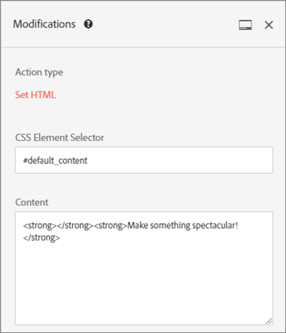
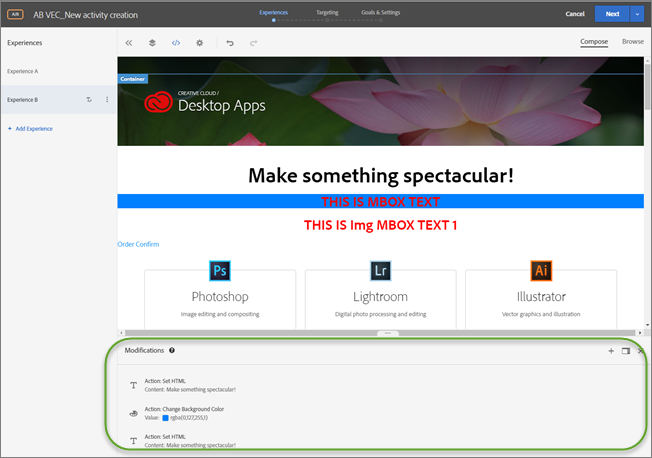

# Modificações

Informações sobre a página [!UICONTROL Modifications] no [!DNL Adobe Target] que permite exibir modificações na sua página e adicioná-las (Seletor de CSS, Mbox e Código personalizado).

A página [!UICONTROL Modifications] mostra todas as alterações feitas em sua página no Visual Experience Composer (VEC) e permite que você faça alterações adicionais clicando em cada elemento da página e [selecionando uma ação](/help/main/c-experiences/c-visual-experience-composer/viztarget-options.md#reference_3BD1BEEAFA584A749ED2D08F14732E81). Cada alteração feita aparece como uma ação ou elemento separado na lista [!UICONTROL Modifications]. Além disso, é possível adicionar modificações, incluindo os seguintes tipos de modificação: Seletor CSS, Mbox. e Código personalizado.

## Visão geral das Modificações {#section_EE27E7572AA74397BBDED563B2B3D509}

A página [!UICONTROL Modifications] mostra todas as alterações feitas em sua página no VEC. Cada alteração feita aparece como uma ação ou elemento separado na lista [!UICONTROL Modifications].


Use a página de Modificações para fazer pequenas alterações no seletor escolhido pelo Target quando você usa o VEC para configurar como o conteúdo será entregue. Você pode alterar o conteúdo ou um atributo de HTML. Você também pode editar o código para criar o equivalente a uma oferta HTML dentro de uma mbox.

Use a página de Modificações para:

* Exibir uma ação realizada no visual composer.

  

* Editar uma ação existente. Passe o mouse sobre a modificação desejada, em seguida, clique no ícone **[!UICONTROL Edit]**.

  

  Faça as alterações.

  

* Excluir uma ação existente. Passe o mouse sobre a modificação desejada, em seguida, clique no ícone **[!UICONTROL Delete]**.

  

* Adicione uma nova modificação. Clique em **[!UICONTROL Add Modification]** ou no ícone + e especifique as alterações, conforme descrito abaixo.

  

  Observe que após a criação de uma modificação o Target exibe um ícone + na parte superior do painel Modificações em vez do botão Adicionar modificação, na parte inferior do painel.

* Fixe o painel Modificações verticalmente na interface do Target ou horizontalmente na parte inferior. Clique no ícone [!UICONTROL Dock] para alternar entre as duas configurações.

  

  A ilustração a seguir mostra o painel Modificações fixado na parte inferior da tela:

  

## Adicionar modificações {#section_C7ABCD5731A048CB8F90EDC31A32EDF9}

1. Para exibir a página [!UICONTROL Modifications] de uma experiência selecionada, no VEC, clique no ícone **[!UICONTROL Modifications]** &lt;/>.

   

   >[!NOTE]
   >
   >Para abrir o painel de Modificações no Experience Composer baseado em formulário, crie ou edite uma oferta HTML. Para obter mais informações, consulte [Experience Composer baseado em formulário](/help/main/c-experiences/form-experience-composer.md#task_FAC842A6535045B68B4C1AD3E657E56E).

   A página [!UICONTROL Modifications] é aberta, dividindo a tela entre o modo visual, à esquerda, e o painel Modificações, à direita. Clique no ícone [!UICONTROL Dock] para fixar o painel Modificações verticalmente na interface de usuário do Target ou horizontalmente na parte inferior. Observe que a experiência A na ilustração a seguir não tem modificações anteriores.

   

   A Experiência B mostra as modificações anteriores no painel [!UICONTROL Modifications] à direita.

   

1. Para adicionar uma modificação:

   * Se não houver modificações anteriores na experiência, clique no botão **[!UICONTROL Add Modification]**, na parte inferior do painel [!UICONTROL Modifications] à direita.
   * Se houver modificações anteriores na experiência, clique no ícone + na parte superior do painel [!UICONTROL Modifications], no lado direito.

   O painel Modificações é exibido:

   

1. Na lista suspensa **[!UICONTROL Modifications Type]**, escolha o tipo desejado:

   | Tipo de modificações | Detalhes |
   |--- |--- |
   | Seletor de CSS | Na caixa Seletor de elemento CSS, especifique o elemento CSS que deseja modificar, selecione um tipo de ação (Definir Conteúdo ou Definir atributo) e, em seguida, preencha com as informações necessárias e o conteúdo desejado. |
   | Mbox | Especifique o nome da mbox e o conteúdo desejado.<p>**Observação**: as mboxes não são mais compatíveis com o VEC em páginas que usam o at.js 2.*x*.<p>Como soluções alternativas:<ul><li>Se estiver usando a at.js 2.*x*, adicione uma modificação do Seletor de CSS em vez de uma modificação da Mbox e adicione o conteúdo no seletor que sua mbox estava usando. </li><li>Usar atividades baseadas em formulário (funciona com mboxes e at.js 1.*x* e at.js 2.*x*).</li><li>Use at.js 1.*x* no VEC.</li></ul> |
   | Código personalizado | Especifique um nome opcional, marque ou desmarque a caixa de seleção [!UICONTROL Add Code in the `<HEAD>` Seção &#x200B;], conforme desejado, e em seguida adicione seu código personalizado.<p>Se você selecionar Seção [!UICONTROL Add Code in the `<HEAD>` &#x200B;], o código personalizado será adicionado à seção `<head>` e sua execução não dependerá dos eventos body ou page-load. Adicionar apenas os elementos `<script>` e `<style>`. Adicionar tags `<div>` e outros elementos pode fazer com que os elementos `<head>` restantes apareçam em `<body>`. Se estiver usando at.js, todas as ofertas serão entregues de forma assíncrona.<p> Se você desmarcar a Seção [!UICONTROL Add Code in the `<HEAD>` &#x200B;], o código personalizado será executado imediatamente após a marca `<body>`. Vincule todo o código em um único `<div>` para preservar a estrutura DOM. Se estiver usando at.js, todas as ofertas serão entregues de forma assíncrona.<p>Se o HTML para `<BODY>` contiver `<SCRIPT>` e `<DIV>`, então `<DIV>` será acrescentado a `<BODY>` e `<SCRIPT>` será executado em `<HEAD>`. Além disso, `<SCRIPT>` que carrega um arquivo externo está anexado a `<HEAD>`.<p>**Observação**: scripts são executados de forma assíncrona. Isso significa que você não pode, por exemplo, usar `document.write` ou métodos de script semelhantes.<p>O código personalizado oferece uma interface não visual para exibir,editar e adicionar novas ações no VEC, no Experience Composer baseado em formulário e no editor de ofertas HTML. O painel oferece uma visualização de código de uma experiência para ajudá-lo a criar experiências mais complexas, experiências de ajuste fino existentes e solução de problemas.<p>O código personalizado destina-se a usuários avançados familiarizados com HTML, JavaScript e CSS. A exibição do código pode ajudá-lo a ajustar alterações ou corrigir problemas do seletor. Ela também pode ser usada para adicionar novos códigos e ações personalizadas. É possível adicionar mais de um código personalizado e nomear cada um deles.<p>**Observação**: o código personalizado está disponível somente para atividades A/B e de Direcionamento de experiência (XT). O código personalizado está desabilitado para sobreposição e se outra oferta de redirecionamento for aplicada.<p>O código personalizado oferece suporte aos seguintes casos de uso: <ul><li>Adicionar JavaScript, HTML ou CSS personalizado para ser executado na parte superior da página</li><li>Exibir ou editar o código gerado pelo VEC após realizar as modificações</li><li>Definir o conteúdo HTML para um seletor (apenas seletores CSS)</li><li>Definir um atributo em um elemento HTML</li><li>Adicionar um conteúdo de oferta para ser entregue em uma mbox regional</li><li>Ative o DOM pronto usando jQuery</li><li>Trocar para modo pronto para DOM, sem jquery (não suporta Internet Explorer 8)</li><li>Trocar com o modo de consulta de DOM por meio do plug-in &quot;elementOnLoad&quot;</li><li>Redirecionamento personalizado</li></ul>O código personalizado fornece:<ul><li>Números de linha para melhorar a usabilidade.</li><li>O realce da sintaxe ajuda a evitar o uso de uma sintaxe incorreta para as ofertas HTML.</li><li>A capacidade de criar vários códigos personalizados e fornecer um nome opcional para cada um deles. Criar vários códigos personalizados facilita futuras depurações. Por exemplo, em vez de criar um único código personalizado para executar várias modificações, você pode criar um código personalizado separado para cada modificação com um nome descritivo. Ter códigos personalizados separados torna suas modificações mais modulares e gerenciáveis. Observe que a execução de vários códigos personalizados em uma atividade pode não acontecer na sequência em que foram criados.</li></ul>O painel Modificações divide a tela entre o modo visual e o modo de código. Ambos os modos permanecem sincronizados. Todas as modificações feitas visualmente têm uma linha correspondente na exibição do código. Da mesma forma, todas as alterações executadas na exibição de código são exibidas na experiência visual. Clicar em qualquer linha na exibição do código seleciona o elemento correspondente na página visual.<p>O código personalizado oferece suporte a HTML, scripts e estilos. Qualquer código ou script HTML válido pode ser adicionado ou editado. |

1. Adicione modificações adicionais conforme necessário.

## Casos de uso do código personalizado {#section_26CB3360097D400FB02E20AE5FDBA352}

O painel **[!UICONTROL Custom Code]** contém o código executado no início do carregamento da página.

É possível executar o código JavaScript na tag `<head>`. A execução do código não espera que a tag `<body>` esteja presente no DOM.

Os seletores para ações visuais subsequentes dependem dos elementos HTML adicionados nessa guia.

O painel Código personalizado geralmente é usado para adicionar o JavaScript ou o CSS à parte superior da página.


Use a guia **[!UICONTROL Custom Code]** para:

* Usar JavaScript em linha ou vincular a um arquivo JavaScript externo

  Por exemplo, para alterar a cor de um elemento:

  ```javascript
  <script type="text/javascript"> 
  document.getElementById("element_id").style.color = "blue"; 
  </script> 
  ```

* Configurar um estilo em linha ou vincular a uma folha de estilo externa

  Por exemplo, para definir uma classe para um elemento de sobreposição:

  ```html
  <style> 
  .overlay 
  { position: absolute; top:0; left: 0; right: 0; bottom: 0; background: red; } 
  </style> 
  ```

* Adicionar trechos de HTML para definir novos elementos

  Por exemplo, use o seguinte trecho HTML para criar uma sobreposição `<div>` usando a classe CSS definida acima:

  ```html
  <div class="overlay"></div>
  ```

* Ative o DOM pronto usando jQuery

  O exemplo a seguir usando a Consulta JQ presume que o site do cliente tem o jQuery disponível na página quando [!DNL Target] executa as ofertas.

  ```javascript
  <style>#default_content {visibility:hidden;}</style> 
  <script> 
  jQuery( document ).ready(function() { 
      jQuery("#default_content").html( "<span style='color:red'>Hello <strong>Again</strong></span>" ); 
      jQuery("#default_content").css("visibility","visible"); 
  }); 
  </script> 
  ```

* Trocar para modo pronto para DOM, sem jQuery (não suporta Internet Explorer 8)

  ```javascript
  <style>#default_content {visibility:hidden;}</style> 
  <script> 
  document.addEventListener("DOMContentLoaded", function(event) {  
      document.getElementById("default_content").innerHTML = "<span style='color:red'>Hello <strong>Again</strong></span>"; 
      document.getElementById("default_content").style.visibility="visible"; 
  }); 
  </script> 
  ```

* Personalizar o redirecionamento transmitindo os parâmetros existentes, o parâmetro `s_tnt` (para integração herdada ao Analytics), o parâmetro de referenciador e a sessão da mbox

  ```javascript
  <style type="text/css">body{display:none!important;}</style> 
  <script type="text/javascript"> 
   var qs='';window.location.search?qs=window.location.search+'&':qs='?'; 
   window.location.replace('//www.mywebsite.com/'+qs+'s_tnt=${campaign.id}:${campaign.recipe.id}:${campaign.recipe.trafficType}&s_tntref='+encodeURIComponent(document.referrer)+'&mboxSession='+mboxFactoryDefault.getSessionId().getId()+''+window.location.hash+''); 
  </script> 
  ```

* Adicionar Modelos de experiência do Adobe Target para uso no código personalizado. Os Modelos de experiência do Target são amostras pré-codificadas com entradas configuráveis a serem usadas para executar casos de uso de profissionais de marketing comuns. Estes Modelos de experiência são fornecidos gratuitamente para desenvolvedores e profissionais de marketing como ponto de partida para executar casos de uso comuns, seja via VEC ou Experience Composer baseado em formulário. Os casos de uso incluem lightboxes, galerias, contagens regressivas e muito mais.

  Para obter mais informações, consulte [Modelos de experiência](/help/main/c-experiences/c-visual-experience-composer/c-vec-code-editor/experience-templates.md#concept_109BBD7EABC04DD39E6B7B1687786652).

## Práticas recomendadas do código personalizado {#section_10DFFD9FB92A43C1BB444A45E0272B28}

**Sempre envolva o código personalizado em um elemento.**

Por exemplo:

```html
<div id="custom-code"> 
// My Code goes here 
</div>
```

No caso de serem necessárias modificações, faça as alterações dentro deste contêiner.

Se não precisar mais do código personalizado, deixe esse contêiner vazio, mas não o remova. Isso garante que outras modificações da experiência não sejam afetadas.

**Não use a ID de elemento &quot;CDQID&quot; para modificações na página feitas no Editor de códigos.**

O Target aplica uma nova ID de elemento com o valor &quot;CDQID&quot; a qualquer elemento na página modificada pelo Target. Como essa ID é aplicada pelo Target, ela não deve ser usada para nenhuma outra modificação ou ajustes no Editor de códigos.

**Não execute ações de document.write em scripts de código personalizado.**

Os scripts são executados de modo assíncrono. Isso frequentemente faz com que as ações `document.write` apareçam no lugar errado na página. Não é recomendado o uso de `document.write` em scripts criados no código personalizado.

**Se você criar um elemento e depois modificá-lo, não exclua o elemento original.**

Cada alteração cria um novo elemento no painel Modificações. Como a segunda ação modifica o Elemento 1, se você o excluir, a ação não terá mais nada para modificar e a alteração não funcionará mais. Consulte &quot;Soluções de problemas&quot; abaixo para obter mais informações.

**Tenha cuidado se usar o recurso de código personalizado para duas atividades que direcionam o mesmo URL.**

Se você usar o recurso de código personalizado para duas atividades que direcionam o mesmo URL, o JavaScript será injetado na página de ambas as atividades. O Target determina automaticamente a ordem do conteúdo entregue. Verifique se o código não depende de posicionamento. Cabe a você verificar se não há conflitos no código.

## Resolução de problemas do código personalizado  {#section_6C965CBC31C348D7AA5B57B63DAB9E7F}

**O código personalizado não é executado ao usar `triggerView`.**

As ofertas de Code personalizado no VEC não são renderizadas novamente quando `triggerView()` é chamado com `{page: false}` como a opção.

**Recebi um aviso de que uma ação não pode ser aplicada devido a alterações estruturais em uma página. O que isso significa?**

Essa mensagem indica que a estrutura da sua página foi alterada desde que a atividade foi salva pela última vez.

Os seletores ausentes podem ser acessados usando o modo de Navegação. É recomendável que você exclua e recrie cada experiência para garantir que o seu conteúdo seja exibido conforme o esperado, como indicado na mensagem de aviso.

Imagem 

***Quando excluo um elemento, vejo um aviso que diz &quot;Excluir esta ação pode afetar as ações subsequentes&quot;. O que isso significa?***

Por exemplo, se você realizou duas ações:

* Adicionou uma classe ao Elemento 1
* Editou o HTML do Elemento 1

Cada alteração cria um novo elemento no painel Modificações. Como a segunda ação modifica o Elemento 1, se você o excluir, a segunda ação não terá mais nada para modificar, e a alteração não funcionará mais.

Em outras palavras, se adicionar um elemento com texto e, em uma ação separada, editá-lo com um texto diferente, o painel Modificações mostrará as duas ações como elementos distintos. Ao editar o elemento, você criou um novo elemento que modifica o elemento original que você criou, contendo o texto editado. Se você então excluir o elemento original, o texto editado não poderá encontrar o elemento que foi editado e não será exibido. O segundo elemento permanece na lista de elementos, mas não afeta a página porque o elemento que ele modifica não existe mais.

***Um elemento que criei usando `document.write` em um script não é exibido onde esperava.***

Os scripts são executados de modo assíncrono. Isso frequentemente faz com que as ações `document.write` apareçam no lugar errado na página. A Adobe não recomenda usar `document.write` em scripts criados no código personalizado.

***Meu JavaScript exibe erros no código personalizado.***

Qualquer JavaScript embutido que não seja um JavaScript válido mostrará erros no código personalizado.

***Não consigo desfazer uma alteração no meu código personalizado.***

Atualmente, a ação de desfazer não é suportada para editar e excluir ações do painel Modificações e no código personalizado. Desfazer um dessas operações pode fazer com que a experiência no VEC pareça incompatível com as ações visíveis no código personalizado. Contudo, as ações no código personalizado estão no estado correto e não há impacto na entrega. Esse é um problema de interface do usuário. Para atualizar a experiência, salve-a e abra-a novamente ou vá para a próxima etapa e volte. Essas ações recarregam a experiência, de forma que ela apareça como esperado e seja consistente com as ações no painel Modificações.

**O código personalizado não produz os resultados esperados no Internet Explorer 8.**

O Target não é mais compatível com o IE8.
