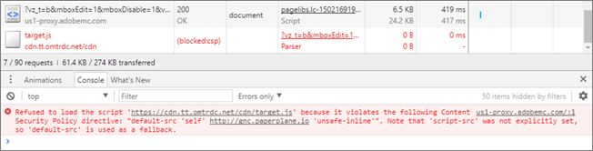

# Solução de problemas relacionados ao [!UICONTROL Visual Experience Composer] e [!UICONTROL Enhanced Experience Composer]

Problemas de exibição e outros problemas ocorrem às vezes no [!DNL Adobe Target] [!UICONTROL Visual Experience Composer] (VEC) e no [!UICONTROL Enhanced Experience Composer] (EEC) sob determinadas condições.

## Como as políticas de imposição de cookie SameSite do Google Chrome afetam o VEC e o EEC? {#samesite}

Esteja ciente das alterações que afetam o VEC e o EEC ao usar as seguintes versões do Chrome:

>[!NOTE]
>
>A alteração a seguir afeta todas as três atualizações descritas abaixo:
>
> * O *não* poderá usar o VEC sem a extensão VEC Helper instalada e habilitada para páginas protegidas por senha de seus sites. Os cookies de logon do site são considerados cookies de terceiros e não são enviados com solicitações de logon no editor do VEC no modo Procurar. A única exceção ocorre quando os cookies de logon do site já têm os atributos `SameSite=None` e `Secure` definidos.

**Chrome 94 (21 de setembro de 2021)**: com as alterações iminentes planejadas para a versão do Chrome 94 (21 de setembro de 2021), a seguinte alteração afetará todos os usuários com versões do navegador Chrome 94+:

* O sinalizador de linha de comando `--disable-features=SameSiteByDefaultCookies,CookiesWithoutSameSiteMustBeSecure` será removido.

**Chrome 91 (25 de maio de 2021)**: com as alterações implementadas para a versão do Chrome 91 (25 de maio de 2021), a seguinte alteração afetará todos os usuários com versões de navegador do Chrome 91+:

* Os sinalizadores `#same-site-by-default-cookies` e `#cookies-without-same-site-must-be-secure` foram removidos de `chrome://flags`. Esse comportamento agora está ativado por padrão.

**Chrome 80 (agosto de 2020)**: com as alterações implementadas em agosto de 2020, todos os usuários com versões do navegador Chrome 80+:

* *não* poderá baixar bibliotecas [!DNL Target] ao editar uma atividade (quando elas ainda não estiverem no site). Isso ocorre porque a chamada de download é feita do domínio do cliente para um domínio [!DNL Adobe] seguro e é rejeitada como não autenticada.
* O EEC *não* funcionará para todos os usuários porque não é possível definir o atributo SameSite para cookies em `adobemc.com domain`. Sem esse atributo, o navegador rejeita esses cookies, causando falha no EEC.

### Determinar quais cookies estão bloqueados

Para determinar quais cookies estão bloqueados devido às políticas de imposição de cookies SameSite, use as Ferramentas do desenvolvedor no Chrome.

1. Para acessar as Ferramentas do desenvolvedor, ao exibir o VEC no Chrome, clique no ícone **[!UICONTROL ellipsis]** no canto superior direito do Chrome > **[!UICONTROL More Tools]** > **[!UICONTROL Developer Tools]**.
1. Clique na guia **[!UICONTROL Network]** > e procure por cookies bloqueados.

   >[!NOTE]
   >
   >Use a caixa de seleção **[!UICONTROL Has blocked cookies]** para facilitar a localização de cookies bloqueados.

   A ilustração a seguir mostra um cookie bloqueado:

   

### [!DNL Adobe Target] Extensão VEC Helper

A partir da versão 0.7.1, a extensão de navegador de ajuda do VEC [!DNL Adobe Target] adiciona os atributos `SameSite=None` e `Secure` a todos os cookies em respostas originadas de páginas da Web editadas no VEC quando a opção &quot;Cookies&quot; está ATIVADA na interface do usuário da extensão:


### Alternativas e soluções

Use uma das seguintes opções para garantir que seu VEC e o EEC continuem funcionando como esperado:

* Baixe e use a [extensão do VEC Helper](https://chrome.google.com/webstore/detail/adobe-target-vec-helper/ggjpideecfnbipkacplkhhaflkdjagak?hl=en) atualizada.
* Use o navegador Mozilla Firefox. O Firefox ainda não está aplicando essa política.
* Use os sinalizadores a seguir para executar o Google Chrome a partir da linha de comando até 21 de setembro de 2021. Após 21 de setembro, os recursos que exigem cookies não funcionarão mais no VEC, como pop-ups de logon ou consentimento de cookies. Se você atualizar para o Chrome 94, deverá gerar cookies manualmente com `SameSite=none` e `Secure` em seus sites.

  ```
  --disable-features=SameSiteByDefaultCookies,CookiesWithoutSameSiteMustBeSecure
  ```

## O [!DNL Target] suporta iframes de vários níveis?

[!DNL Target] não dá suporte a iframes de vários níveis. Se o site carregar um iframe que tenha um iframe secundário, a at.js interagirá somente com o iframe principal. As bibliotecas [!DNL Target] não interagem com o iframe secundário.

Como solução, você pode adicionar uma página na experiência com o URL do iframe secundário.

## Quando eu tento editar uma página, só vejo um ponteiro, em vez da minha página. (VEC e EEC) {#section_313001039F79446DB28C70D932AF5F58}

Essa situação pode acontecer se o URL contiver um caractere #. Para corrigir o problema, alterne para o modo de navegação no Visual Experience Composer e depois alterne de novo para o modo Compor. O ponteiro deverá sumir e a página deverá ser carregada.

## Os cabeçalhos da Política de Segurança de Conteúdo (CSP) bloqueiam as bibliotecas do [!DNL Target] no meu site. (VEC e EEC) {#section_89A30C7A213D43BFA0822E66B482B803}

Se os cabeçalhos de CSP do seu site bloquearem as Bibliotecas do Target e carregarem o site, mas impedirem a edição, verifique se as bibliotecas do Target não estão bloqueadas.

>[!NOTE]
>
>Além das seguintes informações, você pode usar a extensão de navegador [Adobe Target VEC Helper](/help/main/c-experiences/c-visual-experience-composer/r-troubleshoot-composer/vec-helper-browser-extension.md) para Google Chrome.



Como solução alternativa, é possível configurar uma regra do Requestly para remover cabeçalhos de CSP, conforme mostrado abaixo:


É possível configurar uma regra Requestly semelhante para qualquer cabeçalho que faça com que um recurso não seja carregado dentro do VEC.

Para Requestly, sempre que houver a necessidade de remover cabeçalhos, você deve fazer o seguinte:

* Adicione regras de URL ao URL que você deseja abrir no VEC, para que os cabeçalhos sejam removidos apenas para esses URLs.
* Habilite a regra quando estiver editando no VEC e desabilite a regra quando não estiver usando o VEC.

## O VEC ou o EEC aparecem interrompidos ou não inicializam ao editar novamente uma atividade salva. (VEC e EEC) {#section_5AC3BA8F8FBB451EA814F298D0645E54}

Se o site tiver sido alterado fora do Visual Experience Composer após a definição da experiência, os seletores nos quais ações foram executadas antes não poderão ser encontradas quando a atividade for aberta para reedição. A página parece quebrada e nenhum aviso é exibido.

## O VEC ou EEC não exibem meus banners rotativos e outros conteúdos contendo JavaScript. (VEC e EEC) {#section_8B5BE6EB050B42D6A14A054724C41330}

Por padrão, o Visual Experience Composer bloqueia elementos de JavaScript. Você poderá trabalhar com esses elementos se desativar o JavaScript nas configurações do Visual Experience Composer. Dependendo do modo como o site estiver configurado, alguns itens poderão continuar sendo exibidos incorretamente ou permanecer indisponíveis.

## Quando eu altero um elemento na página, vários elementos são alterados. (VEC e EEC) {#section_309188ACF34942989BE473F63C5710AF}

Se a mesma ID de elemento DOM for usada em vários elementos na página, a alteração desses elementos modificará todos os elementos com essa ID. Para evitar que isso aconteça, uma ID só deverá ser usada uma vez em cada página. Esta é uma prática recomendada padrão do HTML. Para obter mais informações, consulte [Cenários de modificação da página](/help/main/c-experiences/c-visual-experience-composer/r-troubleshoot-composer/vec-scenarios.md#concept_A458A95F65B4401588016683FB1694DB).

## Não consigo editar experiências para um site do iFrame. (VEC e EEC) {#section_9FE266B964314F2EB75604B4D7047200}

Esse problema pode ser resolvido ativando o Enhanced Experience Composer. Clique em **[!UICONTROL Administation]** > **[!UICONTROL Visual Experience Composer]** e marque a caixa de seleção que habilita o Enhanced Experience Composer. O Enhanced Experience Composer usa um proxy gerenciado pela Adobe para carregar sua página para edição. Esse proxy permite a edição em sites que impedem o uso de iFrame e permite a edição em sites e páginas nos quais você ainda não adicionou o código Adobe Target. As atividades não são entregues ao site antes de o código ser adicionado. Alguns sites talvez não sejam carregados no Enhanced Experience Composer, nesse caso, você poderá desmarcar essa opção para carregar o Visual Experience Composer via um iFrame. 

>[!NOTE]
>
>As páginas hospedadas localmente ou as páginas que não podem ser acessadas fora da sua rede não podem ser acessadas pelo servidor proxy da Adobe e não podem ser abertas no EEC. Essas páginas podem incluir URLs de preparação, URLs de Teste de aceitação do usuário (UAT) ou páginas hospedadas localmente.

## Quero configurar testes nas páginas que ainda não têm a implementação de mbox/direcionamento. (VEC e EEC) {#section_DE63BCCB5B124E10A71FA579B582A80A}

Consulte &quot;Não consigo editar experiências para um site do iFrame&quot;.

## Os estilos de texto negrito e itálico com Editar texto/HTML ou Alterar texto/HTML não são exibidos na minha página. Às vezes, o texto desaparece após aplicar essas alterações de estilo. (VEC e EEC) {#section_7A71D6DF41084C58B34C18701E8774E5}

Se você usar **[!UICONTROL Edit Text/HTML]** no Visual Experience Composer para atividades A/B ou de Direcionamento de experiência ou **[!UICONTROL Change Text/HTML]** para atividades de Automated Personalization ou Teste multivariado para formatar o texto em negrito ou itálico, esses estilos poderão não ser aplicados na página ou o texto poderá desaparecer da página no Visual Experience Composer. Isso acontece por causa da forma como o editor de rich text aplica esses estilos pode interferir na marcação do site.

Caso veja esse problema:

1. Clique no botão **[!UICONTROL HTML]** no editor de rich text para entrar no modo de edição de origem.
1. Encontre os elementos de texto de estilos.

   * Para texto em negrito, altere os elementos `<strong>` para `<b>`.

   * Para texto em itálico, altere os elementos `<em>` para `<i>`.

## Para atividades de Personalização automatizada, a troca de imagem aparece quebrada no VEC ou no EEC. (VEC e EEC) {#section_88AABFDFE6A3420299B0D508B12A3994}

A adição de uma oferta de imagem a um local obtém a dimensão completa do espaço de imagem original no VEC ou no EEC. Na entrega, a imagem não é expandida e é mostrada como está, de modo que não há impacto na entrega.
